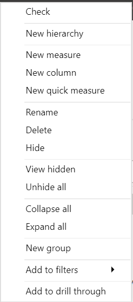
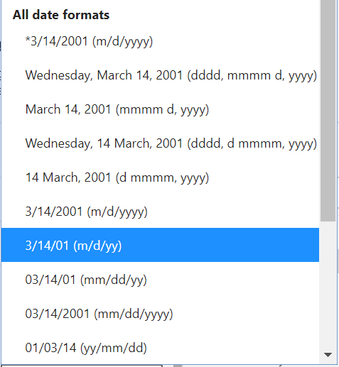

## Overview

The estimated time to complete this lab is 15 minutes.

In this lab, you'll create a hierarchy and bins from a field. You'll also create a Measures table to store future calculations and update fields and tables to make them easier to use.

## Exercise 1: Organize your data

In this exercise, you'll organize and clean up your data for better usage.

### Task 1: Create a hierarchy

In this task, you'll create a product hierarchy.

1. From **FIELDS** section, right-click or select the ellipsis next to **ItemGroup** field from **Product** table. Select **New Hierarchy**.

    > [!div class="mx-imgBorder"]
    > 

1. From **FIELDS** section, right-click on your new Hierarchy and select **Rename**. Rename this field to "Product Hierarchy"

1. From **FIELDS** section, drag and drop **ProductCategory** field from **dbo_Product** onto the "Product Hierarchy" or right-click and select **Add to Hierarchy**.

1. From **FIELDS** section, drag and drop **KitType** field from **Product** onto the "Product Hierarchy" or right-click and select **Add to Hierarchy**.

1. From **FIELDS** section, drag and drop **ProductName** field from **Product** onto the "Product Hierarchy" or right-click and select **Add to Hierarchy**.

### Task 2: Create Bins

1. From **FIELDS** section, right-click or select the ellipsis next to **Wholesale Price** field from **Product** table. Select **New group**

1. From the **Group** window, set the **Bin size** to 50.

    > [!div class="mx-imgBorder"]
    > 

1. From the **Group** window, select OK to close.

### Task 3: Create a Measures table

1. From the **RIBBON** under **Modeling > Calculations**, select **New table**.

1. From the **CALCULATION** section, name the table "Measures Table" and select the checkmark.

    > [!div class="mx-imgBorder"]
    > 

1. You should now see a new table in the **FIELDS** section.

1. From **FIELDS** section, select one of the measures you created in the Calculations Module.

1. From the **RIBBON** under **Measure Tools > Structure > Home Table**, select your new **Measures Table**. This will move your measure.

1. Repeat these last two steps to move your other measures to your new **Measures Table**.

    > [!NOTE] If this process throws an error for any of your calculations, edit them to make sure the reference the new Measures Tables instead of their original table.

1. From the **FIELDS** section, right-click the empty **Column** field from **Measures Table** and select **Hide**.

### Task 4: Clean-up Fields

1. From the left pane, select the **Model**.

1. From the Geography table, select **StateName**. In the **Properties** pane under **General > Name**, rename the field to "State". In the **Properties** pane under **Advanced > Data Category**, set it to "State or Province".

1. From the **Geography** table, right-click on **StateID** and select "Hide in Report View".

1. From the Geography table, select **RegionName**. In the **Properties** pane under **General > Name**, rename the field to "Region".

1. From the **Product** table, select **ProductName**. In the **Properties** pane under **General > Name**, rename the field to "Product". In the **Properties** pane under **Advanced > Sort by column**, change it to "ProductID".

1. From the **Measures Table** table, select **Discount %**. In the **Properties** pane under **Formatting > Percentage format**, set to Yes.

1. From the **Sales** table, select **DiscountAmount**. In the **Properties** pane under **General > Name**, rename the field to "Discount Amount". In the **Properties** pane under **Formatting > Format**, change it to "currency" and set **Decimal places** to 0.

1. From the **Sales** table, select **OrderDate**. In the **Properties** pane under **General > Name**, rename the field to "Order Date". In the **Properties** pane under **General > Description**, write "Date the order was placed by the customer". In the **Properties** pane under **Formatting > Date Time Format**, select the numeric shorthand (m/d/yy).

    > [!div class="mx-imgBorder"]
    > 

1. From the **Sales** table, right-click on **OriginationStateID** and select "Hide in Report View."

1. From the **Sales** table, right-click on **ProductID** and select "Hide in Report View."

## Summary

In this lab, you created a new product hierarchy and created bins from a numeric field. You also created a Measures table to store your calculations and cleaned up the tables.
