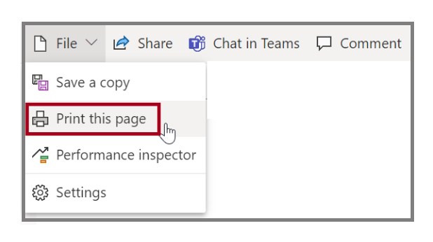
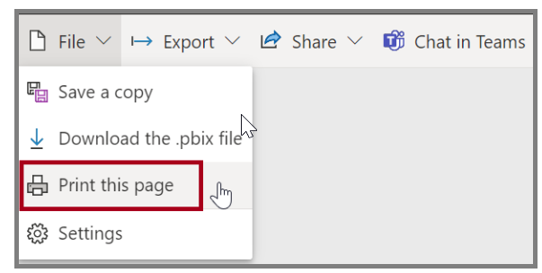

Occasionally, you might want to print a report or dashboard for a meeting or for sharing with others. Power BI provides a few ways for you to make these printouts.

**Video**: Print reports
> [!VIDEO https://www.microsoft.com/videoplayer/embed/RE3x4jI]

In the Power BI service, select **Export** in the top-left side of the service and then select **Print this page** to open a print dialog box. 

## Export data from a visual
You can also export the data from any visual in the Power BI service. Select the ellipsis on any visual and then select **Export data**. You can save to a Microsoft Excel file or a .CSV file.

You can also print or export directly from a report. When you are viewing a report in the Power BI service, select **Export > Print** to open the print dialog box.

## Manually republish and refresh your data

To update reports and datasets that you've already published from Power BI Desktop to the Power BI service, select **Publish** on the **Home** tab.

> [!VIDEO https://www.microsoft.com/videoplayer/embed/RE3oQm4]

When you republish a report in the Power BI service, you're prompted to confirm that you want to replace the previous dataset and reports.

When you select **Replace**, the datasets and reports in the Power BI service are overwritten with the new datasets and reports.

For more information, see [Export data from visualizations](https://docs.microsoft.com/power-bi/visuals/power-bi-visualization-export-data).
