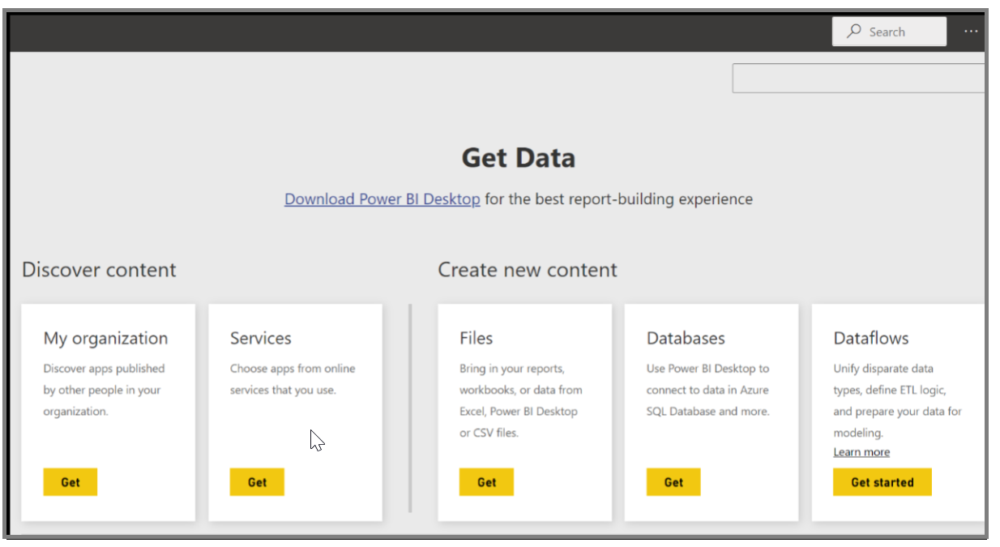
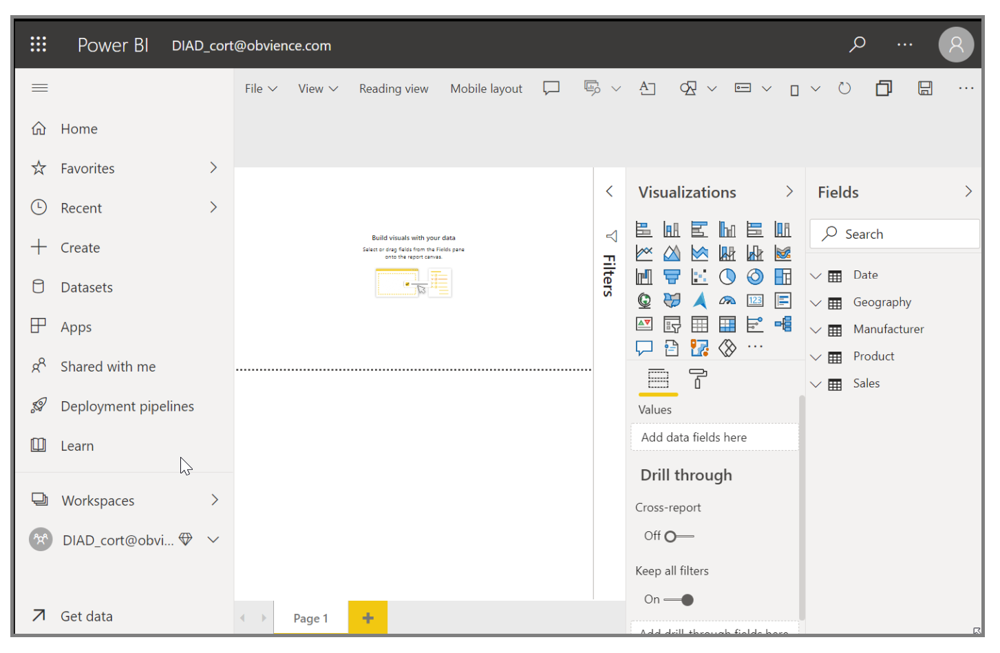

In this lesson, you will create an instance of an app for everyone in a group.

Select the workspace that you previously created.

Power BI imports the dashboards, reports, and datasets that are in the app.

When you select the dataset, Power BI asks if you want to personalize the app. Create a copy of the app that you can use to make changes and keep it disconnected from the published version of the app. By creating a copy, you won't automatically receive updates if the app creator makes changes to the published version of the app. You can edit the dashboard, the report, and even the dataset if you want.

## Update apps

To edit an app that you created previously and see how other people use your app, start in the Power BI Service in **My Workspace**. Anytime that you make changes to the app you can click on **Update app** in the upper right hand side of the screen.  The Update app dialog box will open, you can make your changes and click **Update app**.

Power BI processes those changes and publishes the updated app to the app gallery. If the distribution list is large you may get a notification like the one below.  Anyone who has connected to your app will receive a message that the app has changed, and they will have the option to accept the changes or to keep the older version. As the app owner, you can manage the versions that your colleagues are using.

For more information, see [Change your published app](https://docs.microsoft.com/power-bi/service-create-distribute-apps#change-your-published-app).

