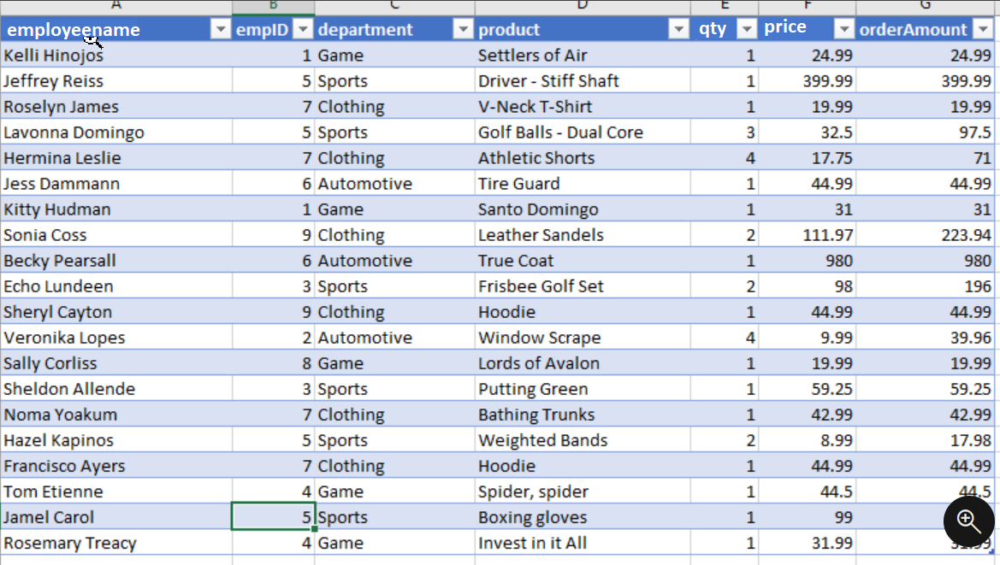
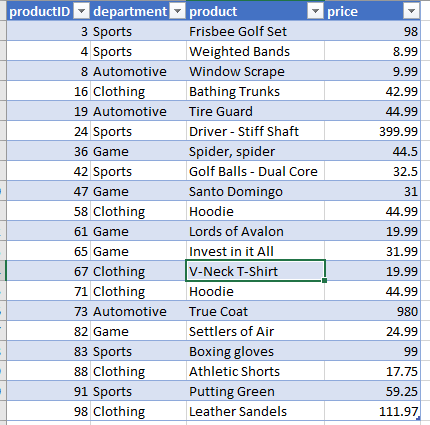

Microsoft Power BI can help you secure reports and workspaces by allowing you to share them to active directory users and groups. You can also share a single report but have users see different data according to their job role.

> [!VIDEO https://www.microsoft.com/videoplayer/embed/RWFJCU]

For example, consider a scenario where you work for Tailspin Traders. You use the following table to track sales.

> [!div class="mx-imgBorder"]
> 

You can also use the following table for employee information.

> [!div class="mx-imgBorder"]
> 

The following table shows the list of products.

> [!div class="mx-imgBorder"]
> 

You want to make one report where employees in a specific department can only see the sales for that department. For instance, Maria Cameron works in the Game department and should only see the sales from that department, not sales from the Sports, Clothing, or Automotive departments.

This data is organized in a star schema. The Sales table contains all attributes of a fact table, while employees and products are dimension tables. The data model is shown in the following screenshot.

> [!div class="mx-imgBorder"]
> 

Two ways of implementing row-level security in Power BI are the static method and the dynamic method.

Row-level security (RLS) uses a DAX filter as the core logic mechanism. This module will demonstrate how you can implement row-level security in Power BI by using DAX to ensure that only the appropriate person can view the appropriate records.
