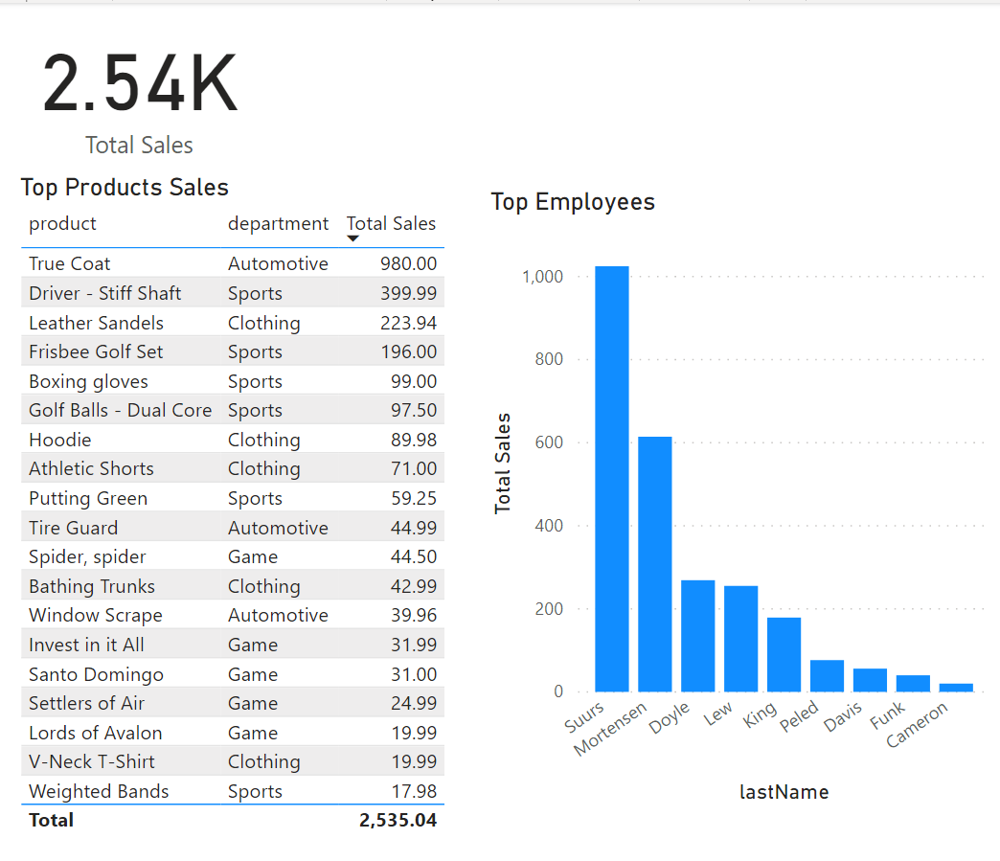
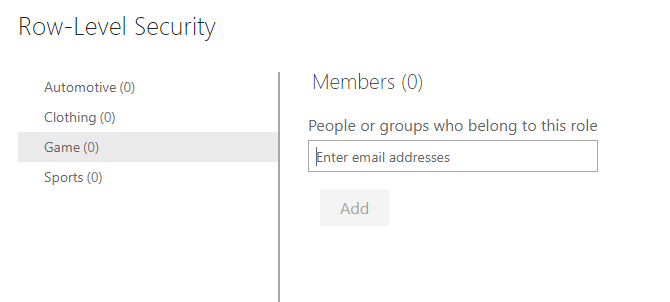

The static method in row-level security (RLS) uses a fixed value in the DAX filter, while the dynamic method uses a DAX function.

RLS involves several configuration steps, which should be completed in the following order:

1. Create a report in Microsoft Power BI Desktop.

    1. Import the data.

    1. Confirm the data model between both tables.

    1. Create the report visuals.

1. Create RLS roles in Power BI Desktop by using DAX.

1. Test the roles in Power BI Desktop.

1. Deploy the report to Microsoft Power BI service.

1. Add members to the role in Power BI service.

1. Test the roles in Power BI service.

## Create a report in Power BI Desktop

Follow the typical steps to create a report in Power BI Desktop. Use Microsoft Power Query to retrieve and clean the data. Then, confirm that the relationship exists between the two tables by using the **Modeling** tab; it should be a one-to-many relationship on the **empID** column.

Your next step is to create a Power BI report.

> [!div class="mx-imgBorder"]
> 

Notice how the preceding table has rows for all sales, including all departments. You will be limiting visibility so that only employees of a specific department can see their own sales.

## Create RLS roles in Power BI Desktop

To create RLS roles in Power BI Desktop, select the **Modeling** tab, and then select **Manage Roles**.

> [!div class="mx-imgBorder"]
> 

On the **Manage roles** page, select **Create**.

> [!div class="mx-imgBorder"]
> 

Power BI row-level security (RLS) uses DAX to control who can see which data. Consider it as always adding another filter to the appropriate users, regardless of the filters, slicers, or interactions that the users choose on a Power BI report.

On the **Manage roles** page, create a role for each department and then add a DAX expression to it. For instance, you can create a role called **Game** and then add the DAX expression **[department] = "Game"**. Then, whenever a member of that role interacts with the report, Power BI will add that filter to their interactions, thus limiting what they see.

A fixed value is used in the filter on the right side of the equal sign (in this case, "Game"). The intention is that, if you ever need to add a category, you will need to create a new role with a new value in the DAX expression.

> [!div class="mx-imgBorder"]
> 

Notice how the DAX filter is applied on the dimension table. Row-level security performs better when the data is organized in a star schema. Apply the DAX filter to a dimension table, as was done with the Products table.

The DAX filter is applied to every interaction, slicer, and filter that the user applies. If you have a DAX filter that performs poorly, the user experience will be negatively impacted. Therefore, keep the DAX filter as simple as possible.

## Test the roles in Power BI Desktop

You can validate that the filter is working by selecting the **Modeling** tab and then selecting **View as Roles**.

> [!div class="mx-imgBorder"]
> 

In the **View as roles** window, select the **Game** role. The report now renders as if you were in that role, and you will only see the records that are included in the Game department.

> [!div class="mx-imgBorder"]
> 

You can undo this filter by selecting **View as roles** again and then selecting **None**.

## Deploy the report to Power BI service

You can deploy the report to Power BI service by selecting the **Publish** button on the **Home** tab and then selecting a workspace.

## Add members to the role in Power BI service

To add members to the role in Power BI service, go to your workspace in Power BI service. Find the dataset that you created with the same name as your report. Select the ellipsis (**...**) button and then select **Security**.

> [!div class="mx-imgBorder"]
> 

In the **Row-Level Security** screen, you can add Microsoft Azure Active Directory (Azure AD) users and security groups to the security role. When members are added to this role, the DAX filter that you previously defined will be applied to them. If members are not added to the role, but they have access to the report, RLS will not apply to them. You can add the three people in the Game department to the **Game** role. Now, when those members sign in, they will only see the report with data that applies to them.

> [!div class="mx-imgBorder"]
> 

## Test the roles in Power BI service

You can test the roles inside Power BI service by selecting the ellipsis (**...**) next to the **Game** role on the **Row-Level Security** screen and then selecting **Test as role**.

> [!div class="mx-imgBorder"]
> 

This selection will display the report as if you were a member of the role in Power BI service.

And there you have it! We've successfully implemented row-level security in Power BI.
