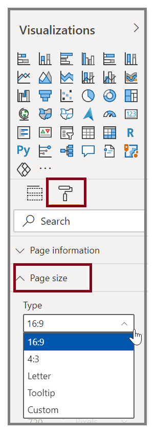
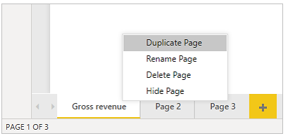

Power BI Desktop gives you the ability to control the layout and formatting of your report pages, such as size and orientation.

**Video**: Format reports
> [!VIDEO https://www.microsoft.com/videoplayer/embed/RE3x6SN]

Use the **Page View** menu from the **View** tab to change the way that your report pages scale. The available options include **Fit To Page** (default), **Fit To Width**, and **Actual Size**.

You can also change the page size. By default, the report page size is set to 16:9. To change the page size, make sure that no visuals are selected, select the paintbrush icon on the Visualizations pane, and then select **Page Size** to expand that section.

Options for page size include 4:3 (more of a square aspect ratio) and Dynamic (the page will stretch to fill the available space). A standard letter size option is available for reports as well. You might need to resize your visuals after changing the page size to ensure that they're completely on the canvas.

You can specify a custom page size, setting the size by inches or pixels, and you can also change the background color of the entire report.

Another option is to select Cortana, which sizes the report so that it can be used as a result for searches that use Cortana.

## Add static elements
Along with data-bound visuals, you can also add static elements such as text boxes, images, and shapes to improve the visual design of your reports. To add a visual element, select **Text Box**, **Image**, or **Shapes** from the **Home** tab.

**Video**: Add a visual element
> [!VIDEO https://www.microsoft.com/videoplayer/embed/RE3p0Ls]

You can display large titles, captions, or short paragraphs in *Text boxes*, which can also include links and URLs. 

Selecting **Image** will open a file browser where you can select the image from your computer or other networked source. By default, resizing an image in your report will maintain its aspect ratio.

You can insert five types of **Shapes**, including rectangles and arrows. Shapes can be opaque or transparent with a colored border. The latter is useful for creating borders around groups of visualizations.

## Manage how elements overlap
When you have several elements on a report, Power BI lets you manage how they overlap with each other. This ordering of layers is known as the *z-order*.

**Video**: Manage the z-order of elements
> [!VIDEO https://www.microsoft.com/videoplayer/embed/RE3oQlS]

To manage the z-order of elements in a report, select an element and use the **Bring forward** and **Send backward** buttons on the **Format** tab.

## Reuse a report layout
Individual pages of a report can be complex, with multiple visualizations that interact in specific ways and have precise formatting. Occasionally, when building a report, you might want to use the same visuals and layouts for two different pages. For example, if you've just put together a report page on gross revenue, you might want an almost identical page on net revenue.

> [!VIDEO https://www.microsoft.com/videoplayer/embed/RE3oVyu]

Recreating all your work would be difficult, but with Power BI Desktop, you can duplicate a report page.

Right-click the tab that you want to copy and then select **Duplicate Page**.

For more information, see [Tutorial: Adding formatting options to a Power BI custom visual](/power-bi/developer/custom-visual-develop-tutorial-format-options/?azure-portal=true).
