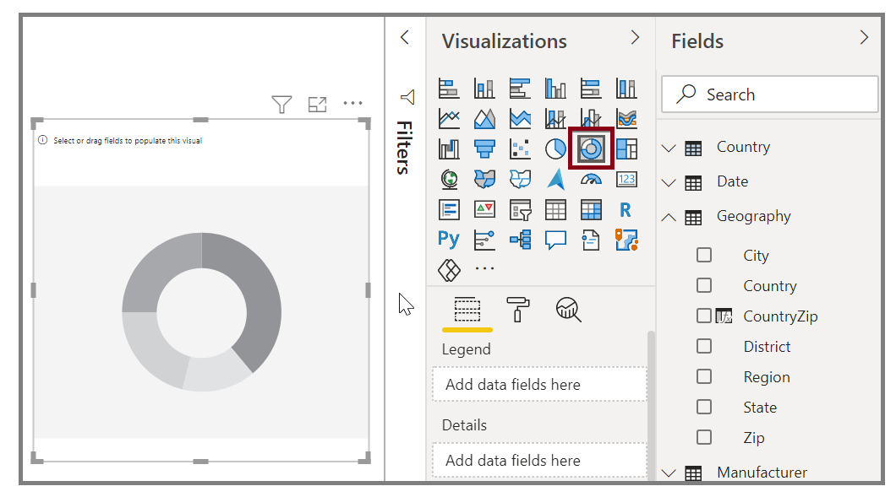
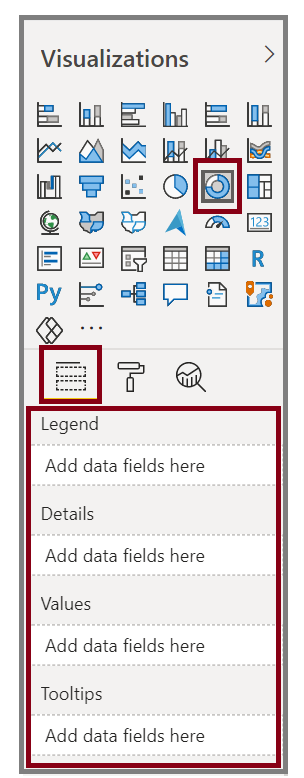
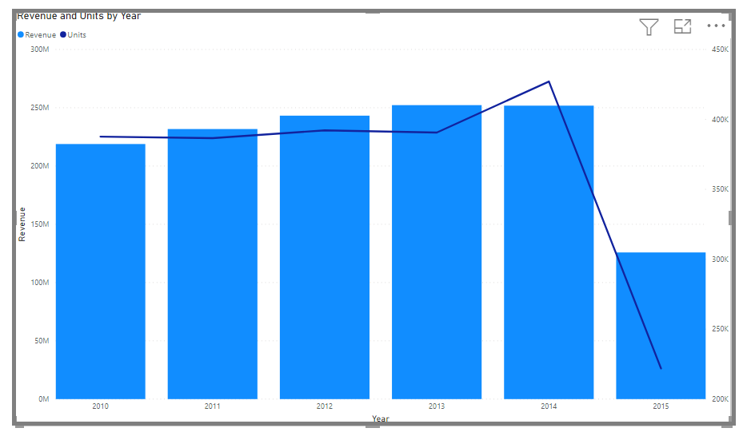

This unit explains how to create new bar charts, pie charts, and tree maps, and how to customize these elements to suit your reports.

**Video**: Create simple visuals
> [!VIDEO https://www.microsoft.com/videoplayer/embed/RE3x1Gm]

Two ways to create a new visualization in Power BI Desktop are:

* Drag field names from the Fields pane and then drop them on the report canvas. By default, your visualization appears as a table of data. 
  
  :::[Drag the "Country" field onto the canvas to create a visual.](../media/02-power-bi-desktop-drag-visual.png):::
* In the Visualizations pane, select the type of visualization that you want to create. With this method, the default visual is a blank placeholder that resembles the type of visual that you selected.
  
  

After you have created your graph, map, or chart, you can begin dragging data fields onto the bottom portion of the Visualization pane to build and organize your visual. The available fields will change based on the type of visualization that you selected. As you drag and drop data fields, your visualization will automatically update to reflect changes.

  

You can resize your visual by selecting it and then dragging the handles in or out. You can also move your visualization anywhere on the canvas by selecting and then dragging it to where you want it. If you want to convert between different types of visuals, select the visual that you want to change and select a different visual from the Visualization pane. Power BI attempts to convert your selected fields to the new visual type as closely as possible.

As you hover over parts of your visuals, you'll receive a tooltip that contains details about that segment, such as labels and total value.

Select the paintbrush icon on the Visualizations pane to make cosmetic changes to your visual. Examples of cosmetic changes include background, alignment, title text, and data colors.

  

The available options for cosmetic changes to your visual vary depending on the type of visual that you've selected.

> [!NOTE] 
> Generally, visuals are used to compare two or more different values. However, sometimes when you are building reports, you might want to track a single metric over time. For more information, see [Radial gauge charts in Power BI](https://docs.microsoft.com/power-bi/visuals/power-bi-visualization-radial-gauge-charts/?azure-portal=true). 

## Create combination charts
*Combination charts* are an effective way to visualize multiple measures that have different scales in a single visualization.

**Video**: Combination charts
> [!VIDEO https://www.microsoft.com/videoplayer/embed/RE3oQlU]

You might want to visualize two measures with different scales, such as revenue and units. Use a combination chart to show a line and a bar with different axis scales. Power BI supports many different types of combination charts by default, including Line and Stacked Columns charts.

You can split each column by category by dragging a category into the **Column Series** field. When you do so, each bar is proportionately colored based on the values within each category.
