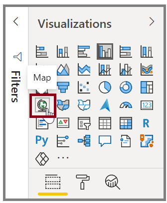
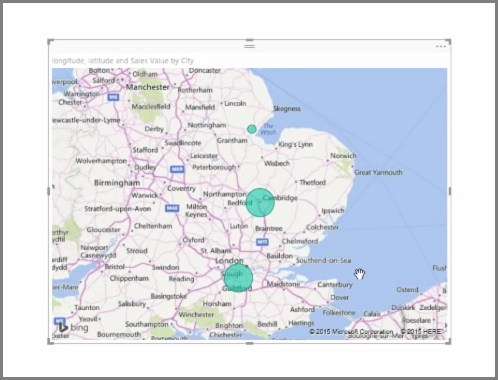

Power BI has two different types of map visualizations: a bubble map that places a bubble over a geographic point, and a shape map that shows the outline of the area that you want to visualize.

> [!VIDEO https://www.microsoft.com/videoplayer/embed/RE3p3lR]

> [!IMPORTANT]
> When you are working with countries or regions, use the three-letter abbreviation to ensure that geocoding works properly. Do *not* use two-letter abbreviations because some countries or regions might not be properly recognized.

If you only have two-letter abbreviations, go to [this external blog post](https://blog.ailon.org/how-to-display-2-letter-country-data-on-a-power-bi-map-85fc738497d6#.yudauacxp) for steps on how to associate your two-letter country and/or region abbreviations with three-letter country and/or region abbreviations.

## Create bubble maps
To create a bubble map, select the **Map** option in the Visualization pane. In the Visualizations options, add a value to the *Location* bucket to use a map visual.

Power BI accepts many types of location values. It recognizes city names, airport codes, or specific latitude and longitude data. Add a field to the **Size** bucket to change the size of the bubble for each map location.

## Create shape maps
To create a shape map, select the **Filled Map** option in the Visualization pane. As with bubble maps, you must add a value to the Location bucket to use this visual. Add a field to the Size bucket to change the intensity of the fill color.

A warning icon in the top-left corner of your visual indicates that the map needs more location data to accurately plot values. This is a common problem when the data in your location field is ambiguous, such as using an area name like *Washington*, which could indicate a state or a district. 

One way to resolve the location data problem is to rename your column to be more specific, such as *State*. Another way is to manually reset the data category by selecting **Data Category** on the **Modeling** tab. From the **Data Category** list, you can assign a category to your data such as "State" or "City."
