**The estimated time to complete the lab is 45 minutes.**

In this lab, you'll create a three-page report. You'll publish it to Power BI, where you can open and interact with the report.

In this lab, you learn how to:

- Design a report

- Configure visual fields and format properties

### Lab story

This lab is one of many in a series of labs that was designed as a complete story from data preparation to publication as reports and dashboards. You can complete the labs in any order. However, if you intend to work through multiple labs, for the first 10 labs, we suggest you do them in the following order:

1. [Prepare data in Power BI Desktop](https://docs.microsoft.com/learn/modules/get-data/lab-prepare/?azure-portal=true)

1. [Load data in Power BI Desktop](https://docs.microsoft.com/learn/modules/clean-data-power-bi/8-lab/?azure-portal=true)

1. [Model data in Power BI Desktop, part 1](https://docs.microsoft.com/learn/modules/design-model-power-bi/8-lab/?azure-portal=true)

1. [Model data in Power BI Desktop, part 2](https://docs.microsoft.com/learn/modules/design-model-power-bi/9-lab/?azure-portal=true)

1. [Create DAX calculations in Power BI Desktop, part 1](https://docs.microsoft.com/learn/modules/create-measures-dax-power-bi/6-lab/?azure-portal=true)

1. [Create DAX calculations in Power BI Desktop, part 2](https://docs.microsoft.com/learn/modules/create-measures-dax-power-bi/8-lab/?azure-portal=true)

1. **Design a report in Power BI Desktop, part 1**

1. [Design a report in Power BI Desktop, part 2](https://docs.microsoft.com/learn/modules/data-driven-story-power-bi/13-lab/?azure-portal=true)

1. [Create a Power BI dashboard](https://docs.microsoft.com/learn/modules/create-dashboards-power-bi/9-lab/?azure-portal=true)

1. [Perform data analysis in Power BI Desktop](https://docs.microsoft.com/learn/modules/ai-visuals-power-bi/5-lab/?azure-portal=true)

1. [Create a Power BI paginated report](https://docs.microsoft.com/learn/modules/create-paginated-reports-power-bi/6-lab/?azure-portal=true)

## Exercise 1: Create a report

In this exercise you-ll create a three-page report named **Sales Report**.

### Task 1: Get started - Sign in

In this task you'll set up the environment for the lab by signing in to Power BI.

> [!Important]
> If you have already signed in to Power BI, continue from the next task.

1. To open Microsoft Edge, on the taskbar, select the Microsoft Edge program shortcut.

1. In the Microsoft Edge browser window, navigate to [Power BI](https://powerbi.com).

    > [!Tip]
    > You can also use the Power BI Service favorite on the Microsoft Edge favorites bar.

1. Select **Sign In** (located at the top-right corner).

1. Enter the account details provided to you.

1. If prompted to update the password, reenter the provided password, and then enter and confirm a new password.

    > [!Important]
    >  Be sure to record your new password.

1. Complete the sign in process.

1. If prompted by Microsoft Edge to stay signed in, select **Yes**.

1. Leave the Microsoft Edge browser window open.

### Task 2: Get started – Open report

In this task you'll set up the environment for the lab by opening the starter report.

> [!Important]
> If you are continuing on from the previous lab (and you completed that lab successfully), do not complete this task; instead, continue from the next task.

1. To open the Power BI Desktop, on the taskbar, select the Microsoft Power BI Desktop shortcut.

1. To close the getting started window, at the top-right corner of the welcome screen, select **X**.

1. To sign in to the Power BI service, at the top right, select **Sign In**.

1. Complete the sign in process using the same account used to sign in to the Power BI service.

1. To open the starter Power BI Desktop file, select the **File** ribbon tab to open the backstage view.

1. Select **Open Report**.

    > [!div class="mx-imgBorder"]
    > 

1. Select **Browse reports**.

1. In the **Open** window, navigate to the **D:\DA100\Labs\design-report-in-power-bi-desktop\Starter** folder.

1. Select the **Sales Analysis** file.

1. Select **Open**.

1. Close any informational windows that may open.

1. To create a copy of the file, select the **File** ribbon tab to open the backstage view.

1. Select **Save As**.

    > [!div class="mx-imgBorder"]
    > 

1. If prompted to apply changes, select **Apply**.

1. In the **Save As** window, navigate to the **D:\DA100\MySolution** folder.

1. Select **Save**.

### Task 3: Design page 1

In this task, you will design the first report page. When you've completed the design, the page will look like the following:

> [!div class="mx-imgBorder"]
> 

1. In Power BI Desktop, to rename the page, at the bottom-left, right-click **Page 1**, and then select **Rename page**.

    > [!TIP]
    > You can also double-click the page name.

1. Rename the page as **Overview**, and then press **Enter**.

    > [!div class="mx-imgBorder"]
    > 

1. To add an image, on the **Insert** ribbon tab, from inside the **Elements** group, select **Image**.

    > [!div class="mx-imgBorder"]
    > 

1. In the **Open** window, navigate to the **D:\DA100\Resources** folder.

1. Select the **AdventureWorksLogo.jpg** file, and then select **Open**.

1. Drag the image to reposition it at the top-left corner, and also drag the guide markers to resize it.

    > [!div class="mx-imgBorder"]
    > 

1. To add a slicer, first de-select the image by selecting an empty area of the report page.

1. In the **Fields** pane, select the **Date | Year** field (not the **Year** level of the hierarchy).

    The labs use a shorthand notation to reference a field. It will look like this: **Date | Year**. In this example, **Date** is the table name and **Year** is the field name.

1. Notice that a table of year values has been added to the report page.

1. To convert the visual from a table to a slicer, in the **Visualizations** pane, select the **Slicer**.

    > [!div class="mx-imgBorder"]
    > 

1. To convert the slicer from a list to a dropdown, at the top-right of the slicer, select the down-arrow, and then select **Dropdown**.

    > [!div class="mx-imgBorder"]
    > [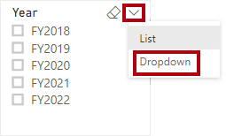](../media/lab-9-ssm.png#lightbox)

1. Resize and reposition the slicer so it sits beneath the image and is the same width as the image.

    > [!div class="mx-imgBorder"]
    > 

1. In the **Year** slicer, select **FY2020**, and then collapse the dropdown list.

    > [!div class="mx-imgBorder"]
    > 

    The report page is now filtered by year **FY2020**.

1. De-select the slicer by selecting an empty area of the report page.

1. Create a second slicer, based on the **Region | Region** field (not the **Region** level of the hierarch).

1. Leave the slicer as a list, and then resize and reposition the slicer beneath the **Year** slicer.

    > [!div class="mx-imgBorder"]
    > 

1. To format the slicer, beneath the **Visualizations** pane, open the **Format** pane.

    > [!div class="mx-imgBorder"]
    > 

1. Expand the **Selection Controls** group.

    > [!div class="mx-imgBorder"]
    > 

1. Set the **Show "Select all" option** to **On**.

    > [!div class="mx-imgBorder"]
    > [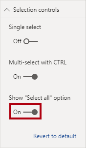](../media/lab-15-ssm.png#lightbox)

1. In the **Region** slicer, notice that the first item is now **Select All**.

    When selected, this item either selects all, or clears all items. It makes it easier for report users to set the right filters.

1. De-select the slicer by selecting an empty area of the report page.

1. To add a chart to the page, in the **Visualizations** pane, select the **Line and Stacked Column Chart** visual type.

    > [!div class="mx-imgBorder"]
    > [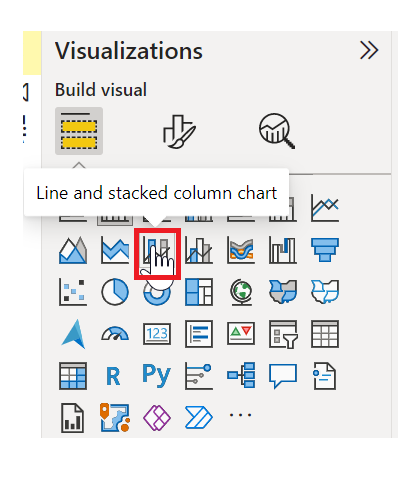](../media/lab-16-ssm.png#lightbox)

1. Resize and reposition the visual so it sits to the right of the logo, and so it fills the width of the report page.

    > [!div class="mx-imgBorder"]
    > 

1. Drag the following fields into the visual:

    - Date | Month

    - Sales | Sales

1. In the visual fields pane (not the **Fields** pane, the visual fields pane is located beneath the **Visualizations** pane), notice that the fields are assigned to the **Shared Axis** and **Column Values** wells.

    > [!div class="mx-imgBorder"]
    > 

    By dragging visuals into a visual, they will be added to default wells. For precision, you can drag fields directly into the wells, as you will do next.

1. From the **Fields** pane, drag the **Sales | Profit Margin** field into the **Line Values** well.

    > [!div class="mx-imgBorder"]
    > [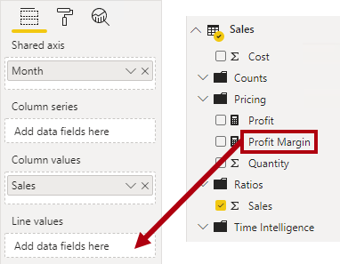](../media/lab-19-ssm.png#lightbox)

1. Notice that the visual has only 11 months.

    The last month of the year, 2020 June, does not have any sales (yet). By default, the visual has eliminated months with BLANK sales. You will now configure the visual to show all months.

1. In the visual fields pane, in the **Shared Axis** well, for the **Month** field, select the down-arrow, and then select **Show Items With No Data**.

    > [!div class="mx-imgBorder"]
    > 

1. Notice that the month **2020 June** now appears.

1. De-select the chart by selecting an empty area of the report page.

1. To add a chart to the page, in the **Visualizations** pane, select the **Map** visual type.

    > [!div class="mx-imgBorder"]
    > [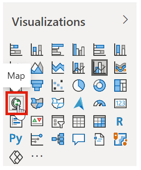](../media/lab-21-ssm.png#lightbox)

1. Resize and reposition the visual so it sits beneath the column/line chart, and so it fills half the width of the report page.

    > [!div class="mx-imgBorder"]
    > 

1. Add the following fields to the visual wells:

    - Location: **Region | Country**

    - Legend: **Product | Category**

    - Size: **Sales | Sales**

1. De-select the chart by selecting an empty area of the report page.

1. To add a chart to the page, in the **Visualizations** pane, select the **Stacked Bar Chart** visual type.

    > [!div class="mx-imgBorder"]
    > [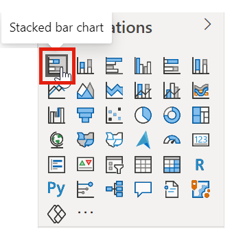](../media/lab-23-ssm.png#lightbox)

1. Resize and reposition the visual so it fills the remaining report page space.

    > [!div class="mx-imgBorder"]
    > 

1. Add the following fields to the visual wells:

    - Axis: **Product | Category**

    - Value: **Sales | Quantity**

1. To format the visual, open the **Format** pane.

    > [!div class="mx-imgBorder"]
    > 

1. Expand the **Data Colors** group, and then set the **Default Color** property to a suitable color (in contrast to the column/line chart).

1. Set the **Data Labels** property to **On**.

1. Save the Power BI Desktop file.

The design of the first page is now complete.

### Task 4: Design page 2

In this task, you will design the second report page. When you've completed the design, the page will look like the following:

> [!div class="mx-imgBorder"]
> [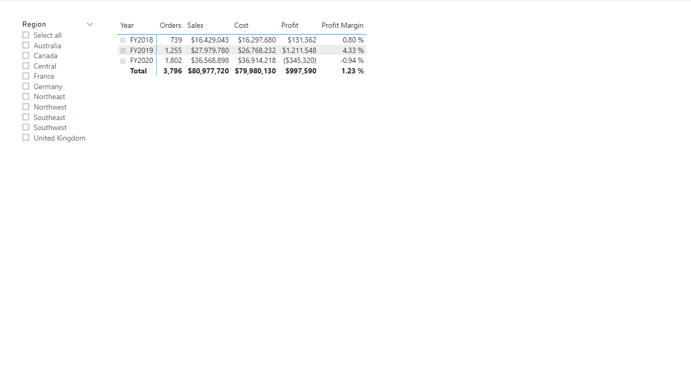](../media/lab-25-ss.png#lightbox)

> [!Important]
> When detailed instructions have already been provided in the labs, the lab steps will provide more concise instructions. If you need the detailed instructions, you can refer back to other tasks in this lab.

1. To create a new page, at the bottom-left, select the plus icon.

1. Rename the page to **Profit**.

1. Add a slicer based on the **Region | Region** field.

1. Use the **Format** pane to enable the **Select All** option (in the **Selection Controls** group).

1. Resize and reposition the slicer so it sits at the left side of the report page, and so it is about half the page height.

    > [!div class="mx-imgBorder"]
    > 

1. Add a matrix visual, and resize and reposition it so it fills the remaining space of the report page

    > [!div class="mx-imgBorder"]
    > 

1. Add the **Date | Fiscal** hierarchy to the matrix **Rows** well.

    > [!div class="mx-imgBorder"]
    > 

1. Add the following five **Sales** table fields to the **Values** well:

    - Orders (from the **Counts** folder)

    - Sales

    - Cost

    - Profit

    - Profit Margin

    > [!div class="mx-imgBorder"]
    > 

1. In the **Filters** pane (located at the left of the **Visualizations** pane), notice the **Filter On This Page** well (you may need to scroll down).

    > [!div class="mx-imgBorder"]
    > 

1. From the **Fields** pane, drag the **Product | Category** field into the **Filter On This Page** well.

1. Inside the filter card, at the top-right, select the arrow to collapse the card.

    > [!div class="mx-imgBorder"]
    > 

    Fields added to the **Filters** pane can achieve the same result as a slicer. One difference is they don't take up space on the report page. Another difference is that they can be configured to achieve more sophisticated filtering requirements.

1. Add each of the following **Product** table fields to the **Filter On This Page** well, collapsing each, directly beneath the **Category** card:

    - Subcategory

    - Product

    - Color

    > [!div class="mx-imgBorder"]
    > 

1. Save the Power BI Desktop file.

The design of the second page is now complete.

### Task 5: Design page 3

In this task, you will design the third and final report page. When you've completed the design, the page will look like the following:

> [!div class="mx-imgBorder"]
> [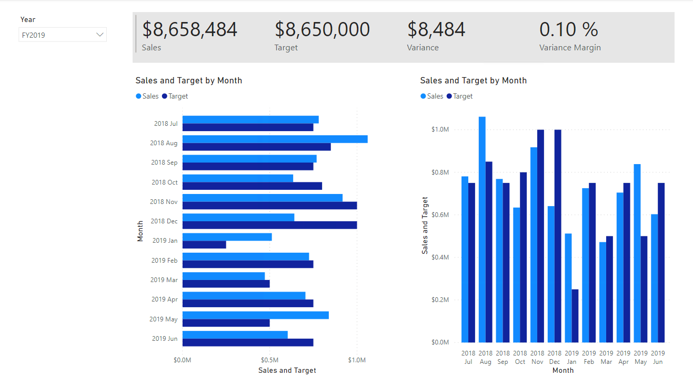](../media/lab-32-ss.png#lightbox)

1. Create a new page, and then rename it as **My Performance**.

    You may recall that row-level security was configured to ensure users only ever see data for their sales regions and targets. When this report is distributed to salespeople, they’ll only ever see their sales performance results.

1. To simulate the row-level security filters during report design and testing, add the **Salesperson (Performance) | Salesperson** field to the **Filters** pane, inside the **Filters On This Page** well.

1. In the filter card, scroll down the list of salespeople, and then check **Michael Blythe**.

    > [!div class="mx-imgBorder"]
    > 

    You’ll be instructed to delete this filter before publishing the report to Power BI.

1. Add a dropdown slicer based on the **Date | Year** field, and then resize and reposition it so it sits at the top-left corner of the page.

    > [!div class="mx-imgBorder"]
    > 

1. In the slicer, set the page to filter by **FY2019**.

1. Add a **Multi-row Card** visual, and then resize and reposition it so it sits to the right of the slicer and fills the remaining width of the page.

    > [!div class="mx-imgBorder"]
    > [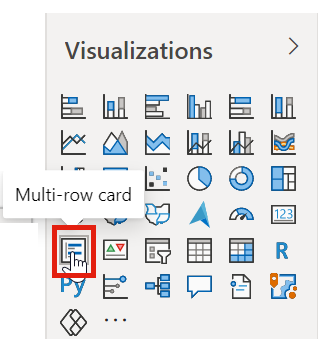](../media/lab-35-ssm.png#lightbox)

    > [!div class="mx-imgBorder"]
    > 

1. Add the following four fields to the visual:

    - Sales | Sales

    - Targets | Target

    - Targets | Variance

    - Targets | Variance Margin

1. Format the visual:

    - In the **Data Labels** group, increase the **Text Size** property to **28pt**

    - In the **Background** group, set the **Color** to a light gray color

    > [!div class="mx-imgBorder"]
    > 

1. Add a **Clustered Bar Chart** visual, and then resize and reposition it so it sits beneath the multi-row card visual and fills the remaining height of the page, and half the width of the multi-row card visual.

    > [!div class="mx-imgBorder"]
    > 

    > [!div class="mx-imgBorder"]
    > [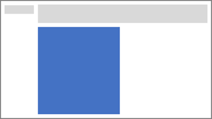](../media/lab-39-ss.png#lightbox)

1. Add the following fields to the visual wells:

    - Axis: **Date | Month**

    - Value: **Sales | Sales** and **Targets | Target**

    > [!div class="mx-imgBorder"]
    > 

1. To create a copy of the visual, press **Ctrl+C**, and then press **Ctrl+V**.

1. Position the copied visual to the right of the original visual.

    > [!div class="mx-imgBorder"]
    > 

1. To modify the visualization type, in the **Visualizations** pane, select **Clustered Column Chart**.

    > [!div class="mx-imgBorder"]
    > [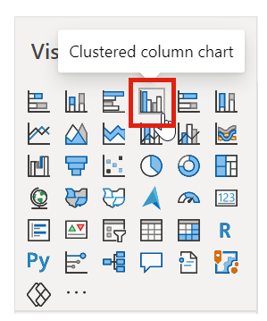](../media/lab-42-ssm.png#lightbox)

It’s now possible to see the same data expressed by two different visualization types. This isn’t a good use of the page layout, however, you’ll improve it in the **Design a report in Power BI Desktop, Part 2** lab by superimposing the visuals. By adding buttons to the page, you’ll allow the report user to determine which of the two visuals is visible.

The design of the third—and final—page is now complete.

### Task 6: Publish the report

In this task, you will publish the report.

1. Select the **Overview** page.

1. Save the Power BI Desktop file.

1. On the **Home** ribbon tab, from inside the **Share** group, select **Publish**.

1. In the **Publish to Power BI** window, notice that **My Workspace** is selected.

1. To publish the report, click **Select**.

1. When the publication has succeeded, select **Got It**.

1. Leave Power BI Desktop open.

You’ll explore the report in the Power BI service in the next exercise.

## Exercise 2: Explore the report

In this exercise, you will explore the report that was published to Power BI.

### Task 1: Explore the report

In this task, you will explore the report in the Power BI service.

1. In the Microsoft Edge browser window, in the Power BI service, in the **Navigation** pane (located at the left, possibly collapsed), expand **My Workspace**.

1. Review the contents of your workspace, noticing the **Sales Analysis** report and dataset.

    When you published the Power BI Desktop file, the data model was published as a dataset.

    If you don’t see it, press **F5** to reload the browser, and then expand the workspace again.

    > [!div class="mx-imgBorder"]
    > 

1. To open the report, select the **Sales Analysis** report.

1. In the **Regions** slicer, while pressing the **Ctrl** key, select multiple regions.

1. In the column/line chart, select any month column to cross filter the page.

1. While pressing the **Ctrl** key, select an additional month.

    By default, cross filtering filters all other visuals on the page.

1. Notice that the bar chart is filtered and highlighted, with the bold portion of the bars representing the filtered months.

1. Hover the cursor over the visual, and then at the top-right, hover the cursor over the filter icon.

    > [!div class="mx-imgBorder"]
    > 

    The filter icon allows you to understand all of the filters that are applied to the visual, including slicers and cross filters from other visuals.

1. Hover the cursor over a bar, and then notice the tooltip information.

1. To undo the cross filter, in the column/line chart, select an empty area of the visual.

1. Hover the cursor over the map visual, and then at the top-right, select the **Focus mode** icon.

    > [!div class="mx-imgBorder"]
    > 

    Focus mode zooms the visual to full page size.

1. Hover the cursor over different segments of the pie charts to reveal tooltips.

1. To return to the report page, at the top-left, select **Back to Report**.

    > [!div class="mx-imgBorder"]
    > 

1. Hover the cursor over the map visual again, and then select the ellipsis (...), and notice the menu options.

    > [!div class="mx-imgBorder"]
    > 

1. Try out each of the options, except **Chat in Teams**.

1. At the left, in the **Pages** pane, select the **Profit** page.

    > [!div class="mx-imgBorder"]
    > 

1. Notice that the **Region** slicer has a different selection than the **Region** slicer on the **Overview** page.

    The slicers are not synchronized. You’ll modify the report design to ensure they sync between pages in the **Design a report in Power BI Desktop, Part 2** lab.

1. In the **Filters** pane (located at the right), expand a filter card, and apply some filters.

    The **Filters** pane allows you to define more filters than could possibly fit on a page as slicers.

1. In the matrix visual, use the plus (+) button to drill into the **Fiscal** hierarchy.

1. Select the **My Performance** page.

    > [!div class="mx-imgBorder"]
    > 

1. At the top-right on the menu bar, select **View**, and then select **Full Screen**.

    > [!div class="mx-imgBorder"]
    > 

1. Interact with the page by modifying the slicer, and cross filtering the page.

1. At the bottom of the window, notice the commands to change page, navigate backwards or forwards between pages, or to exit full screen mode.

1. Press escape or select the Full screen icon to exit full screen mode.

    > [!div class="mx-imgBorder"]
    > 

### Task 2: Finish up

In this task you'll complete the lab

1. To return to the workspace, select **My workspace** in the upper left corner.

1. Leave the Microsoft Edge browser window open.

You will enhance the report design with advanced features in the **Design a report in Power BI Desktop, Part 2** lab.
