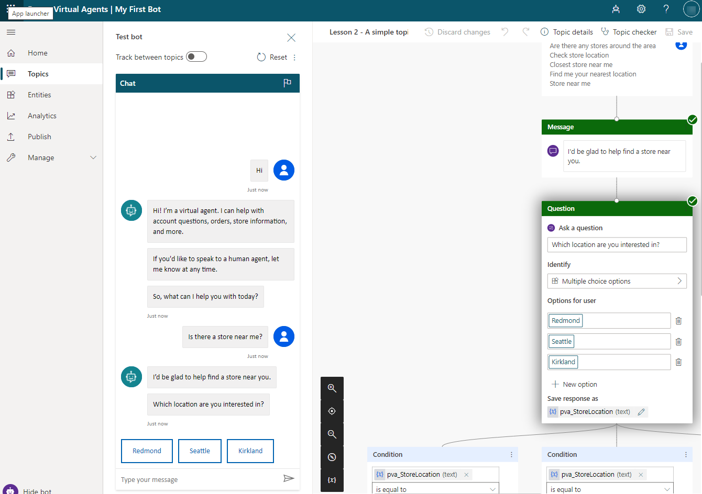

Microsoft provides many options for building chatbots:

- Azure Bot Framework
- Azure Bot Composer
- Power Virtual Agents

## Azure Bot Framework

The Azure Bot Service is part of the Azure Bot Framework, a series of SDKs and tools that allow developers to create and deploy custom bots and virtual assistants using code. The Azure Bot Service is a managed service for developing bots.

A bot communicates by receiving messages and sending responses using an Azure Web App to handle the communications. Bots are like web applications; they take requests and return responses. A bot can perform operations like other applications, they can access databases, call APIs to other services, read files, and perform calculations.

The process of receiving a message and sending a response back to the user is known as a "turn". Think how conversations between humans’ work, each person speaks one at a time that is, in turn. Bots operate the same way, responding to user input in turn.

A developer can connect an Azure Bot Service bot with the Language Understanding Cognitive Service (LUIS) to add language understanding to a bot to allow for a conversational experience. A developer can also enable their bot to use a knowledge base created in QnA Maker.

An advantage of the Azure Bot Service is that once developers have built bot, the bot can be deployed to one or more channels, such as Facebook or Slack, without having to change the bot’s code. The Azure Bot Service takes care of the communication between these channels and your bots. The Azure Bot Service adapts the messages your bot generates to the format of the channel it is connected to.

Bots created with the Azure Bot Framework can be integrated with Power Virtual Agent bots.

### Bot Service templates

The Bot Service includes templates to help developers get started with building bots. If you create a bot in the Azure portal you can select either the Echo bot template that just returns the user input, or the Basic bot template that includes LUIS.

## Bot Framework Composer

The Bot Framework Composer is a tool to build bots. The Bot Framework Composer uses a visual user interface to create the conversational flow and generate responses. Composer is a recent addition to Azure Bot Services and is the subject of ongoing development to add further features. Bot Framework Composer includes:

- A visual editing canvas for conversation flows
- Tools to author and manage language understanding (NLU) and QnA components
- Powerful language generation and templating system
- A ready-to-use bot runtime executable

Bot Framework Composer can be used to build bots without the need to write code and supports both LUIS and QnA Maker.

There are similarities between Power Virtual Agents and Composer; both provide a no-code authoring canvas for users to build bots. However, there are key differences in the functionality and look of both technologies. For instance, topics in Power Virtual Agents are similar to dialogs in Composer.

The Bot Framework Composer is open source and is multi-platform with support for Windows, Linux, and macOS. You can find Bot Composer on GitHub at <https://github.com/microsoft/BotFramework-Composer>.

Bot makers can use Bot Framework Composer to create custom content and add it to Power Virtual Agents.

## QnA Maker

QnA Maker is a service that creates a searchable knowledge base from existing documents and websites. This knowledge base contains built in natural language processing. The QnA Maker knowledge base can then be used in bots and other applications to respond to FAQ type questions.

QnA Maker does not provide a bot itself, but you can easily generate an Azure Bot Service bot from your QnA Maker knowledge base in a few minutes without writing any code.

A knowledge base consists of question-and-answer pairs. You can create the questions and answers in many different ways:

- Extraction from existing documents.
- Extraction from web pages.
- Manual input.

QnA Maker knowledge bases can be integrated with Power Virtual Agent bots with Power Automate.

## Power Virtual Agents

Power Virtual Agents chatbots are chatbots powered by artificial intelligence (AI) that allow users to focus on more complex and higher-value work while the chatbots themselves handle simple repetitive interactions. With Power Virtual Agents, you can create chatbots using an easy to use, no-code graphical interface from within a web browser.

Power Virtual Agents chatbots interact with customers and employees, answer questions, and provide information. You can deploy Power Virtual Agents chatbots to multiple channels, including your own website, Facebook, and Microsoft Teams.

Power Virtual Agents chatbots can be created easily without the need for data scientists or developers.

Power Virtual Agents is built on top of the Azure Bot Framework and uses the capabilities of the Bot Framework in a no-code environment.

Power Virtual Agents can meet many simple requirements for chatbots, both internal and external. Power Virtual Agents is designed to be built with, or by, Subject Matter Experts (SMEs).

Power Virtual Agents is licensed per tenant and are charged based on the number of billed sessions per tenant per month. There is an initial entitlement of 2,000 sessions and more capacity can be purchased

The solution architect needs to determine which bot technology, or combination of technologies to use in the solution. This will depend on the skills available, if there are existing bots already deployed, and the complexity of the bots required.
