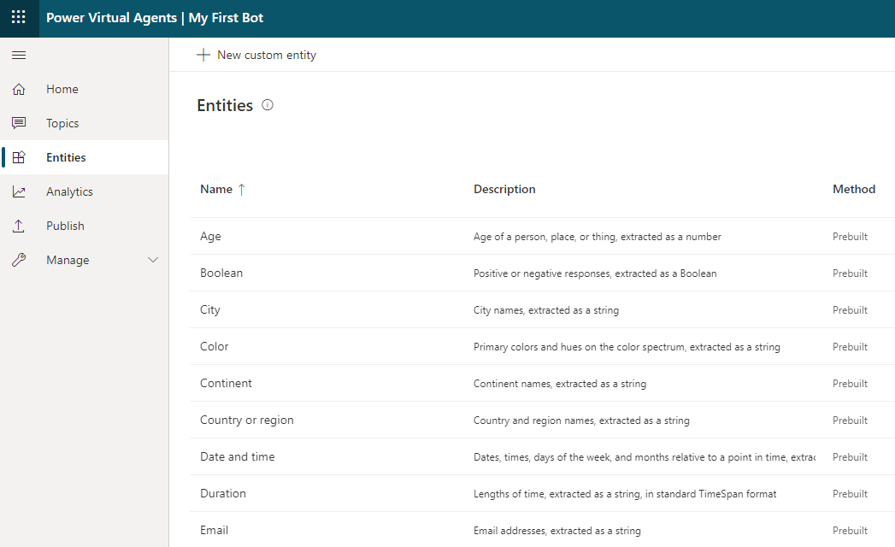

When creating chatbots, there are some import concepts to understand before building your chatbot.

## Language Understanding

When humans interact with a computer application using text or speech, a human should not be expected to use the application’s internal instructions. A computer application must be able to handle language provided in a natural way and be able to react accordingly to the meaning that the human has expressed. Natural Language Processing, an AI capability, bridges the gap between human and computer language, it allows humans and computer applications to work together in a natural way.

Power Virtual Agents hosts multiple AI models and AI capabilities, the core of which is a transformer-based natural language understanding (NLU) model. Power Virtual Agents uses the natural language processing of the Language Understanding service (LUIS) which is part of Azure Cognitive Services.

Power Virtual Agents, employs a language understanding model that uses an example-based approach, powered by a deep neural model. This type of large-scale model only needs to be trained once with large amounts of data, and can then be used for specific tasks with few examples without further training. Specifically for Power Virtual Agents, the use of this model allows for an intuitive way for bot makers to work on their bot content confidently, without having to involve AI experts.

## Topics

Power Virtual Agents works by identifying the subject that the user is asking about and then having a conversation about that subject.

Topics are the main subjects of the conversation. A Power Virtual Agents chatbot can have up to 1,000 topics. Each topic is a separate conversation path. It is the combination of topics in a chatbot that provides a natural conversational flow. You create topics for the tasks or requests that you need your chatbot to respond to.

Topics define the purpose of your chatbot and are the first step in authoring your chatbot. A topic has two parts:

- Trigger phrases: The keywords, phrases, or utterances that the user will enter
- Conversation nodes: How your bot should respond

Each topic has its own conversation flow with the bot. When a bot identifies a trigger for a topic, the conversation for that bot is initiated.

The use of the natural language understanding (NLU) model means that in Power Virtual Agents, when you craft trigger phrases for a topic, you only need to provide a few examples, usually in the range of five to ten phrases for a single topic. Shorter trigger phrases are better, and you should aim for two to 10 words. You just need to make sure trigger phrases are semantically different: changing a single verb or noun could be enough to expand a topic's coverage. Adding things like new articles (changing or adding 'the' or 'a' or 'an'), changing capitalization, adding contractions (you're or don't), or adding plurals won't improve the triggering because contractions are already accounted for in the natural language understanding model.

### Generating topics

Many organizations will have procedures, product information, frequently asked questions, and other information in documents or on websites. Power Virtual Agents can extract information and create topics with trigger phrases using the Suggest topics option.

> [!NOTE]
> If you are using Dynamics 365 Customer Service Insights, you can select the topics from within Customer Service Insights and add the topics and trigger phrases to your Power Virtual Agent chatbot.

## Entities

Power Virtual Agents attempts to extract information from the phrases entered by the user. This extracted information can be used to control the conversation's path. Power Virtual Agents uses entities to identify information in a textual phrase, for instance, names, dates, and numbers. Your chatbot can then use this information to decide on the appropriate next step in the conversation.

Entities are people, places, and things that a chatbot can identify from the phrases entered into a chatbot. Power Virtual Agents includes a set of pre-built entities for the most commonly used objects and you can create custom entities for the domain of the business solution you are building.

## Channels

The Azure Bot Framework separates the logic of the bot from the communication with different services. When you create a bot, the bot is only available for use embedded on websites with the Web Chat channel. You can add channels to your bot to make the bot available on other platforms and services, known as channels.

One of the major benefits of the Azure Bot service is that you develop your bot once and connect to multiple channels without needing to change the code for each channel to handle the specific requirements and formats of that channel. The Azure Bot Service takes care of those requirements and converting the formats.
The following channels are available for connection to bots:

- Alexa
- Direct Line
- Direct Line Speech
- Email
- Facebook
- GroupMe
- Kik
- Line
- Microsoft Teams
- Skype
- Slack
- Telegram
- Telephone
- Twilio (SMS)
- Web Chat

Power Virtual Agents can be deployed to the same channels.
