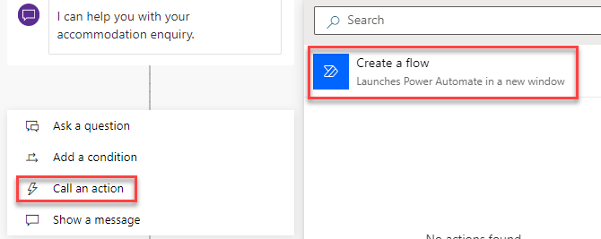
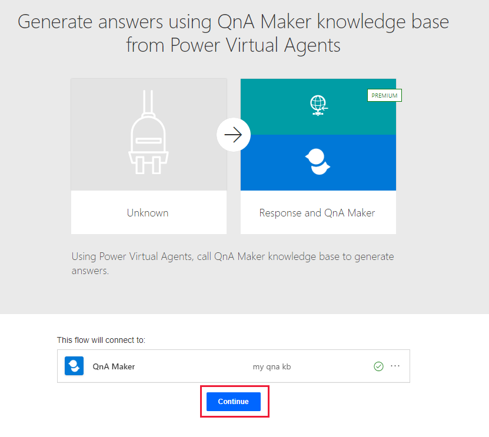

Power Virtual Agent chatbots will often require access to other services and systems to be able to complete their goals. Power Virtual Agents can also be integrated with other Microsoft AI services to create an enhanced customer experience.

## Power Automate

The primary integration for Power Virtual Agent chatbots is through Power Automate cloud flows.

Power Virtual Agents can pass parameters to a Power Automate cloud flow and receive data back from the flow and use that data in the chatbot's conversation flow. For instance, a chatbot may handle customer order updates and so will use a Power Automate cloud flow to fetch the order's status from the relevant system.

Power Automate cloud flows can be initiated from the Call an action node in a topic.

## Skills

Power Virtual Agents enables you to extend your bot using Microsoft Bot Framework skills. If there are existing Azure Bot Framework bots deployed, you can define those bots as a skill and embed the skill within a Power Virtual Agents bot. You can then use the Azure Bot Framework bot from within your Power Virtual Agent chatbot.

A developer can also use a Power Virtual Agent chatbot from an Azure Bot Framework bot. The Power Virtual Agent becomes the skill and the Microsoft Bot Framework dispatcher tool can integrate with the Power Virtual Agents bot.

The solution architect needs to oversee the design of bots and decide when to use existing bots and when to create new bots and with which toolset.

## Bot Composer

Bot makers can use Bot Framework Composer to create custom content and add it to Power Virtual Agents.

For instance, by using Composer with your Power Virtual Agents chatbot you can:

- Show an Adaptive card.
- Use Bing Search as a fallback.

For more information, see [Power Virtual Agents composer](https://docs.microsoft.com/composer/pva/overview-composer-pva/?azure-portal=true) and [Advanced framework composer](https://docs.microsoft.com/power-virtual-agents/advanced-bot-framework-composer/?azure-portal=true).

## QnA Maker

You can extend a Power Virtual Agents chatbot to provide answers from a QnA Maker knowledge base. You need to add a fallback topic that uses Power Automate to run a cloud flow that connects to the QnA Maker via its connectors to respond to questions.

For more information, see [Fallback topics](https://docs.microsoft.com/azure/cognitive-services/qnamaker/tutorials/integrate-with-power-virtual-assistant-fallback-topic/?azure-portal=true).

## Cognitive Services

Azure Cognitive Services can be used by bots for many purposes such as:

- Sentiment analysis
- Image classification
- Form recognition

You can use Azure Cognitive Services with Power Virtual Agents using Power Automate cloud flows and the associated Cognitive Services connector.
