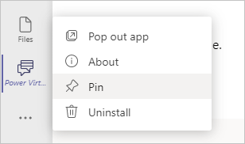
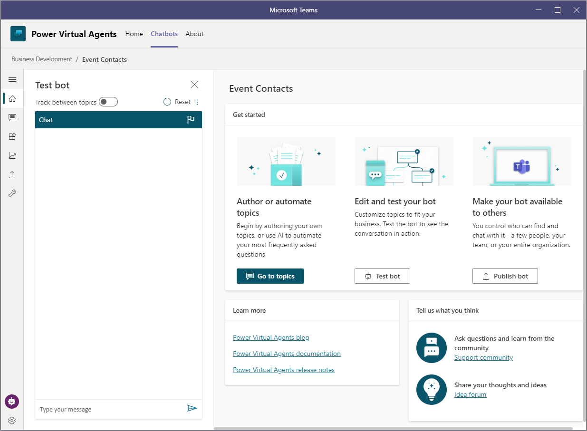

To create chatbots (also referred to as **bots**), first install the Power Virtual Agents app in Microsoft Teams. Power Virtual Agent allows you to:

-   Create and edit chatbots

-   Test the chatbot to see how well it works

-   Publish the chatbot to your team or organization

-   Review the bot's performance over time, see which questions are asked and how well it's answering questions

To install Power Virtual Agent for Teams:

1. Open Teams then select **Apps** from the left navigation bar.
1. Type for **Power Virtual Agents** and then select it from the search results.
    
    > [!div class="mx-imgBorder"]
	> 

1. Select **Add** to have it installed into Teams.

> [!NOTE]
> Pin the **Power Virtual Agent** in Teams to make it easier to access. Select the app by selecting on the **ellipsis** (...) and then select **Power Virtual Agents**. Right-click on **Power Virtual Agents** icon and select **Pin**.

> [!div class="mx-imgBorder"]
> 

## Create a new chatbot

1. Open the Power Virtual Agent for Teams app.

1. Select **Start now**.

1. Select the team to own and manage your chatbot from the pull-down, then select **Continue**.
    
    When creating a new chatbot, Team owners and the bot creator have read/write access by default. Team members only have read access to the chatbot.

    If this is the first time a chatbot or Power App is being created in the team, you will see a notice that it will take a little longer than usual while the system does some setting up. Just select **Close** to continue and wait for teams to notify you that it is ready in a few minutes. Once the setup is complete, open the notification under Teams Activity and select **Next**.
    
	> [!div class="mx-imgBorder"]
	> 

1. Provide a **Name** and select the **Language** for the chatbot. For this example, use "Event Contacts" for the name. Once you set the chatbot's language, it cannot be changed.

1. Select **Create** to complete creating a new chatbot.

From the Power Virtual Agents editor you can manage topics, edit and test your chatbot, and then publish it to the rest of the team or the entire organization. Topics are how chatbot conversations play out and are covered in the next section.

> [!div class="mx-imgBorder"]
> 
