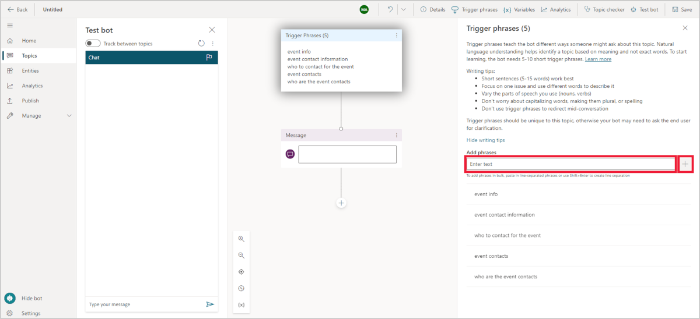

In Power Virtual Agents, chatbot conversations are defined by **topics**. With topics, you define and control the way the conversation plays out. There are two types of topics:

1. **Trigger phrases:** The chatbot needs to detect when the user asks a question that it knows how to respond to. The trigger phases are the phrases, keywords, and questions that the user is likely to type in. Recommended best practice is to have five to 10 trigger phrases of common ways your users would request help on the topic.

1. **Conversation nodes:** Once the chatbot has a question, it needs to know how to handle the request. Conversation nodes define how the chatbot responds and if there are any actions required.

To view and edit topics in your chatbot, select **Topics** from the left-hand column in the Power Virtual Agents editor. Many topics are automatically created for a chatbot.

-   The first four topics are sample **User Topics** that demonstrate various ways of using topics to create conversations.

-   The remaining topics are **System Topics** that are likely needed during a chatbot conversation.

## Change the greeting system topic

System Topics improve the usability of your chatbot with prebuilt topics to handle greeting, escalating, starting over, and saying goodbye. Editing these topics allows you to further personalize the chatbot for your end users and organization.

The system topic **Greeting** provides a welcome message for the end user. It's important to define clearly what the bot is meant to do to set expectations with the user.

1. Select the **Greeting** system topic and then select **Go to authoring canvas**.

    The authoring canvas is where you design the topic's conversation path using **conversation nodes**. Conversation nodes determine how a chatbot responds and what actions it might have to do. There are five different types of conversation nodes that can be added:

	|     Conversation   Node    |     Description                                                           |
	|----------------------------|---------------------------------------------------------------------------|
	|     Ask a   question       |     Have the   chatbot ask a question and get a response from the user    |
	|     Add a   condition      |     Add branching   logic                                                 |
	|     Call an   action       |     Call Power   Automate Flows                                           |
	|     Show a   message       |     Have the   chatbot respond to the user                                |
	|     End with   survey      |     When the   conversation ends, a survey appears                        |
	
	All chatbots start with the trigger phrases and a message conversation node.

1. The text in the first message node doesn't match the purpose of our bot. Change the text to the following. Use the text editing controls in the message node to have the questions appear in italics.
    
    Hi! I'm the virtual agent for the Sales Project Team. For our upcoming sales events, I can help find the event contact for a particular country. Just type in questions like *Who are the event contacts?* or *I need event contacts.* to get started.
    
    > [!div class="mx-imgBorder"]
	> 

1. Save the settings by selecting **Save**.

1. Exit the topic authoring canvas by selecting **Back**.
    
    > [!div class="mx-imgBorder"]
	> 

## Creating a topic

For our "Events Contacts" chatbot, we want the chatbot to respond to the question "Who are the event contacts." From the **Topics** page in Power Virtual Agents in Teams:

1. Select **+ New topic**.

1. Type in "Contacts" for the **Name**.

1. Type in the following **Trigger phrases**. Select **Add** between each one.
    
    `who are the event contacts`
    `event contacts`
    `who to contact for the event`
    `event contact information`
    `event info`
    
    > [!div class="mx-imgBorder"]
	> 

1. Select **Save topic in the upper right-hand corner** to add the topic to the list

1. Select **Go to authoring canvas**. In the **Message** node, type in the following. Use the editing options in the text box to bold the country names.
    
    The event team contacts for North America are:

    **USA**
    Lynne Robbins `LynneR@contoso.com`

	**Canada**
    Lidia Holloway `Lidia@contoso.com`

	> [!div class="mx-imgBorder"]
	> 

1. Select the **+** symbol under the **Message** node to add another conversation node.

1. Select **Go to another topic -> End of Conversation**.
    
    The **End of Conversation** is a **System topic** on how to end the conversation. This system topic asks the user about the accuracy of the results and to rate their experience. All system topics can be edited to customize the experience in the Topics screen.
    
    > [!div class="mx-imgBorder"]
	> 

1. Select **Save**.

1. Select **Test bot** and a new pane appears for testing the chatbot. Type in questions that contains one of the trigger phrases to see how the bot responds.
    
    > [!div class="mx-imgBorder"]
	> 

Congratulations, you have created your first chatbot using Power Virtual Agents for Teams! In the next unit, we expand the chatbot to use inputs, variables, and conditions.