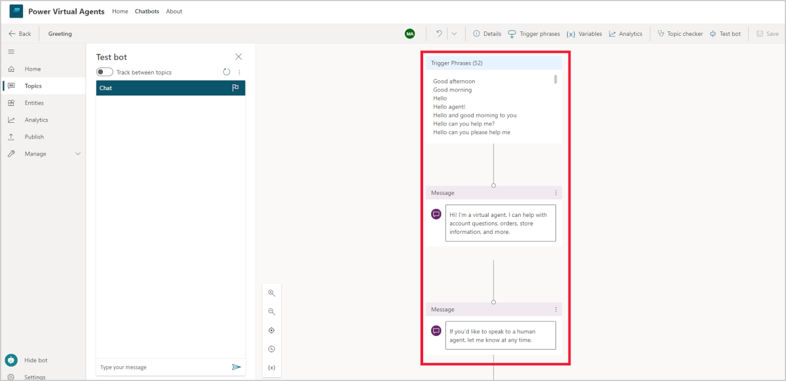
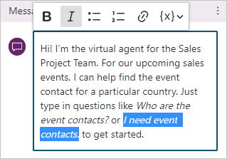
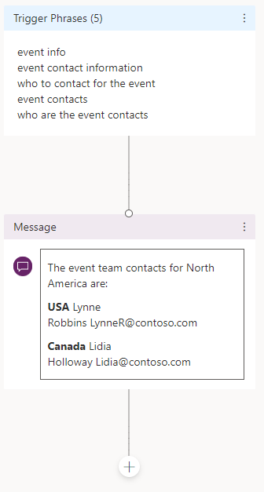

In Power Virtual Agents, chatbot conversations are defined by *topics*. With topics, you can define and control the way that the conversation evolves. 

Two types of topics are:

- **Trigger phrases** - The chatbot needs to detect when the user asks a question that it knows how to respond to. The trigger phases are the phrases, keywords, and questions that the user is likely to enter. We recommend that you have 5 to 10 trigger phrases of common ways that your users would request help on the topic.

- **Conversation nodes** - When the chatbot has a question, it needs to know how to handle the request. Conversation nodes define how the chatbot responds and if actions are required.

To view and edit topics in your chatbot, select **Topics** from the left column in the Power Virtual Agents editor. Many topics are automatically created for a chatbot:

-   The first four topics are sample **user topics** that demonstrate various ways of using topics to create conversations.

-   The remaining topics are **system topics** that are likely needed during a chatbot conversation.

## Change the greeting system topic

System topics improve the usability of your chatbot with prebuilt topics to handle greeting, escalating, starting over, and saying goodbye. Editing these topics allows you to further personalize the chatbot for your users and organization.

The **Greeting** system topic provides a welcome message for the user. It's important to clearly define what the bot is meant to do, which will set expectations with the user.

1. Select the **Greeting** system topic to go to the authoring canvas.  Notice that your authoring canvas includes nodes with trigger phrases and messages.

    > [!div class="mx-imgBorder"]
	> 

    The authoring canvas is where you design the topic's conversation path by using *conversation nodes*. Conversation nodes determine how a chatbot responds and what actions it might have to take. The five different types of conversation nodes that you can add are described in the following table.

	|     Conversation   node    |     Description                                                           |
	|----------------------------|---------------------------------------------------------------------------|
	|     Ask a   question       |     Have the   chatbot ask a question and get a response from the user    |
	|     Add a   condition      |     Add branching   logic                                                 |
	|     Call an   action       |     Call Power   Automate flows                                           |
	|     Show a   message       |     Have the   chatbot respond to the user                                |
	|     End with   survey      |     When the   conversation ends, a survey appears                        |
	
	All chatbots start with the trigger phrases and a message conversation node.

1. If the text in the first message node doesn't match the purpose of your bot, you can change it. You can use the text editing controls in the message node to have the questions appear in italic font, or you can paste italic text into the message node since the node supports rich text.  Change the text to the following example.
    
    Hi! I'm the virtual agent for the Sales Project Team. For our upcoming sales events, I can help find the event contact for a particular country. Just type in questions like *Who are the event contacts?* or *I need event contacts.* to get started.
    
    > [!div class="mx-imgBorder"]
	> 

1. Save the settings by selecting **Save**.

1. Exit the topic authoring canvas by selecting **Back**.
    
    > [!div class="mx-imgBorder"]
	> 

## Create a topic

For the **Event Contacts** chatbot, you want the chatbot to respond to the question, "Who are the event contacts?" From the **Topics** page in Power Virtual Agents in Teams:

1. Select **+ New topic**.

1. To name this topic or add details about it, click on **Details** in the menu at the top of the screen.  Name your topic **Event Contacts** and press **Save**.

    > [!div class="mx-imgBorder"]
	> 

1. Enter the following **Trigger phrases**. Select **Add** between each one.
    
    `who are the event contacts`

    `event contacts`

    `who to contact for the event`

    `event contact information`

    `event info`
    
    > [!div class="mx-imgBorder"]
	> 

1. In the **Message** node just below the **Trigger Phrases** node, enter the following information. Use the editing options in the text box to apply bold formatting to the country names. Remember that the node supports rich text formatting, so you can copy/paste bold text into it.
    
    The event team contacts for North America are:

    **USA** 
	Lynne Robbins `LynneR@contoso.com`

	**Canada**
	Lidia Holloway `Lidia@contoso.com`

	> [!div class="mx-imgBorder"]
	> 

1. Select the plus **+** symbol under the **Message** node to add another conversation node.

1. Select **Redirect to another topic > End of Conversation**.  You can enter “end” in the Search pane to filter the list or scroll to find it.
    
    The **End of Conversation** option is a system topic on how to end the conversation. This system topic asks the user about the accuracy of the results and to rate their experience. All system topics can be edited to customize the experience in the **Topics** screen.
    
    > [!div class="mx-imgBorder"]
	> 

1. Select **Save**.

1. In the **Test bot** pane enter questions that contain one of the trigger phrases to observe how the bot responds. If the Test bot pane is not appearing on the canvas, click on **Test bot** from the menu at the top right of the screen. 
    
    > [!div class="mx-imgBorder"]
	> 

Congratulations, you have created your first chatbot by using Power Virtual Agents for Teams. The next unit expands the chatbot to use inputs, variables, and conditions.
