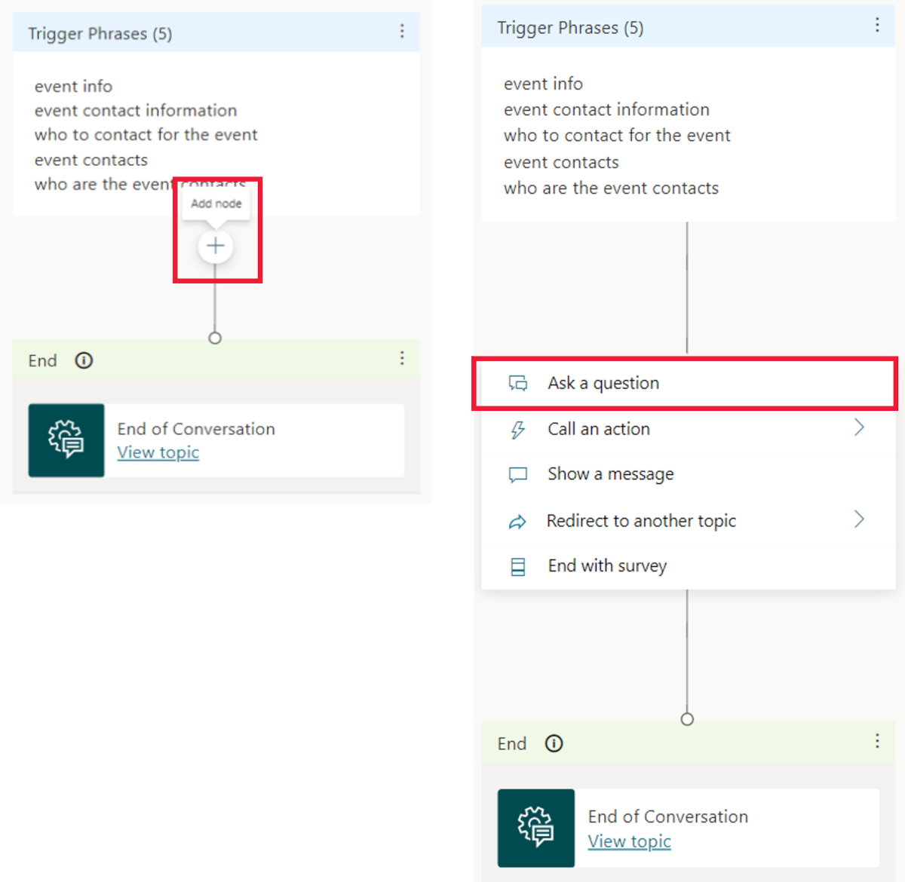
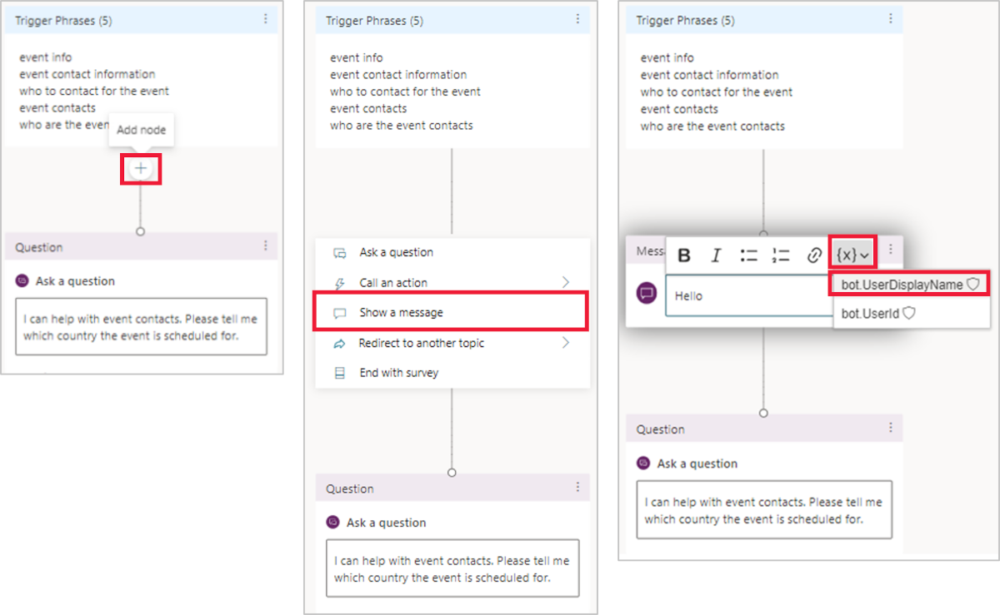
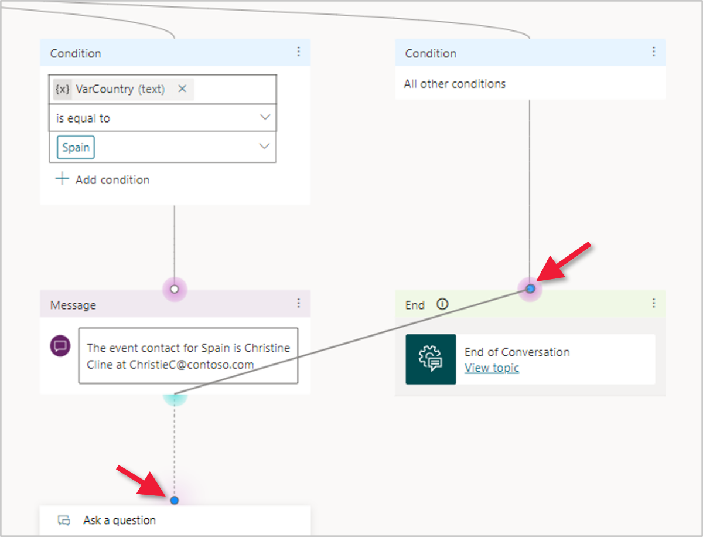

For our event contacts chatbot, we need to expand the number of countries that have contacts. Instead of just listing them all in the message node, we want to ask the user which country they need contact information. To do this, we use inputs, variables, and conditions.

1. **Inputs** are the user's response in the **Ask a question** node.

1. **Variables** store the **Inputs** to use in later conversation nodes.

1. **Conditions** define the branching logic based on **variables**.

For our chatbot, we need to delete the current message node since it will be replaced. Select the options **ellipsis** for the message node and select **Delete**.

> [!div class="mx-imgBorder"]
> 

## Add inputs and variables with the question node

1. Use the mouse to hover over the line that connects the **Trigger Phrases** to the **End** node. Select the **+** sign that appears then select **Ask a question.**
    
    > [!div class="mx-imgBorder"]
	> 

1. Fill out the question node with the following information:

	  **Ask a question**: Type in, "I can help with event contacts. Please tell me which country the event is scheduled for."
	
	  **Identify**: Select **Multiple choice options**
	
	  **Options for user**: Type in "USA", "Canada", "France", and "Spain" using **+ New option** between each word

	> [!div class="mx-imgBorder"]
	> 

	The **Identify** field is where you indicate what type of response the chatbot is listening for. Some of the others you can select are a number or a string. You can even have it detect entities such as state names, phone numbers, or street addresses. To learn more about the different options available, see the links in the Summary unit at the end of this module.

1. To set the **variable** name, select the text under **Save response as** and replace **Var** with **VarCountry.** Select the **X** to close the **Variable Properties** screen. The variable name stores the user's selection and used when configuring the branching logic under the conditions nodes.
    
    > [!div class="mx-imgBorder"]
	> 

There are two variables available by default. The first is **bot.UserDisplayName, which provides the user's name. The second is **bot.UserID, which gives us their login name. By using **bot.UserDisplayName**, the chatbot can call the user by name, which personalizes the experience. You can use **bot.UserID** to create conditions nodes to take actions based on which user the bot is interacting with.

To have the event contacts chatbot greet the user by name, add a new message node at the chatbot's beginning. When typing in the message node, select the **{X} insert variable** pull-down and select **bot.UserDisplayName.**

> [!div class="mx-imgBorder"]
> 

## The conditions node

For each multiple-choice option in the question node, Power Virtual Agents creates a new condition node. Each condition node needs to be configured to provide the next appropriate response in the conversation.

> [!div class="mx-imgBorder"]
> 

For our event contacts chatbot, we need to respond with the event contact for the country. For example, if the user selects "USA", then the chatbot should respond with Lynne Robbins contact information.

|     Country    |     Name                 |     Email                    |
|----------------|--------------------------|------------------------------|
|     USA        |     Lynne Robbins        |     `LynneR@contoso.com`     |
|     Canada     |     Lidia   Holloway     |    `LidiaH@contso.com`       |
|     France     |     Miriam Graham        |     `MiriamG@contoso.com`    |
|     Spain      |     Christie   Cline     |     `ChristieC@contoso.com`  |

For each **Condition** node, add a new message node after the condition providing the correct contact and email address. For example, "The event coordinator for France is Miriam Graham at `MiriamG@contoso.com`."

> [!div class="mx-imgBorder"]
> 

For all four message nodes, we want to use the same system topic **End of Conversation**. Our chatbot already has this defined under the **All other conditions** node. To link the other nodes to this one, perform the following steps:

1. After one of the message nodes, select the **Add node +** symbol.

    > [!div class="mx-imgBorder"]
	> 

1. Press and hold the left mouse on the point where the line connects to the new node and drag it over to the same spot on the **End** node.
    
    > [!div class="mx-imgBorder"]
	> 

1. The editor adjusts the nodes to show that both are connected. Repeat the same steps for the other three message nodes. Your editor should now look like this:
    
    > [!div class="mx-imgBorder"]
	> 

To test the chatbot, first select **Save.** Select **Test bot** if the chatbot testing pane isn't visible.
