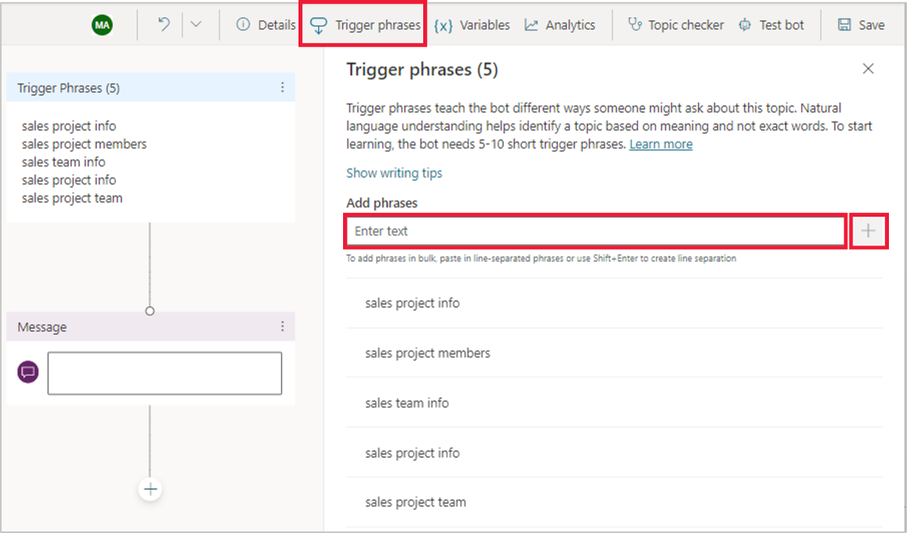
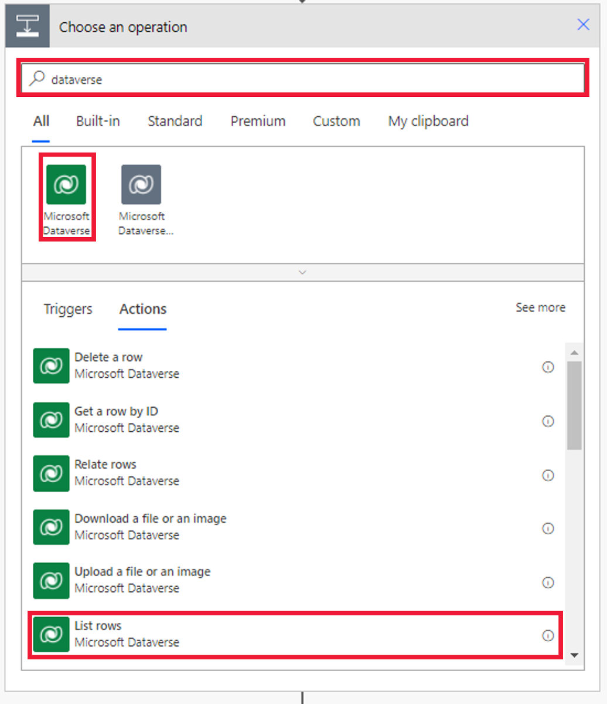
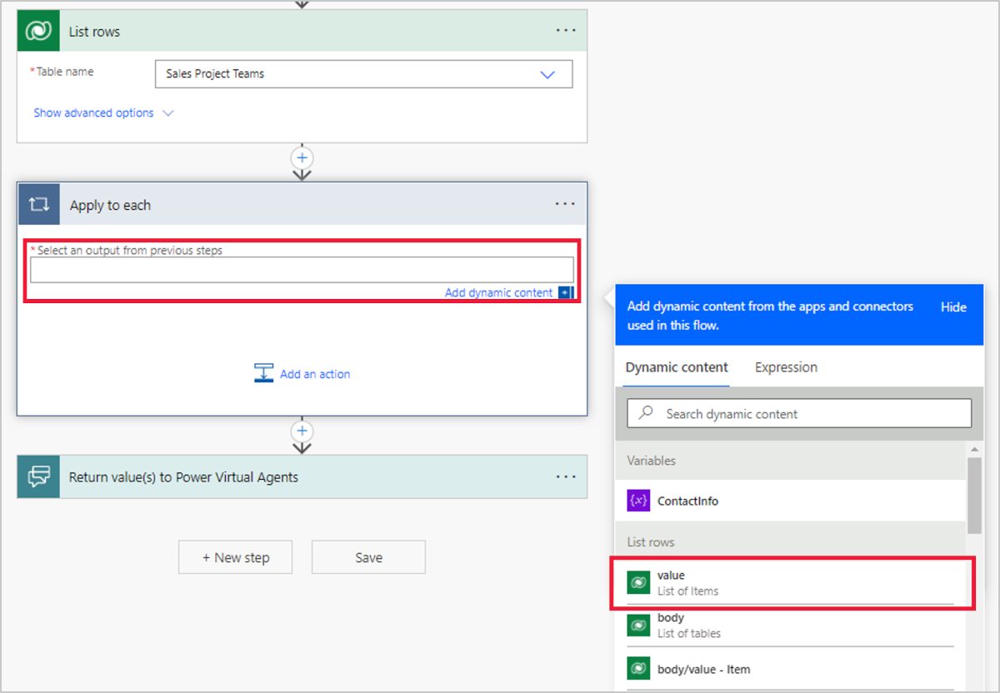
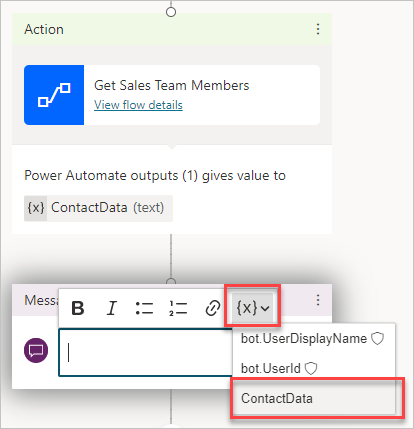

Using the **Call an action** node, chatbots can interact with Power Automate Flows. Use these to trigger automated processes or connect with Dataverse for Teams data, SharePoint lists, or other data sources.

For example, the Event Contacts chatbot could provide the Sales Project Team members from a Dataverse for Teams Table. Instead of editing the chatbot when there are changes to this team, you can just update the table.

## Step 1 - Create Dataverse for Teams table

1. Create a new Dataverse for Teams table in the same Team as the chatbot named "Sales Project Team." The columns and data types to use are:

|     Column           |     Data Type    |
|----------------------|------------------|
|     Name             |     Text         |
|     Email Address    |     Email        |

1. Add new rows for each of the four contacts.
    
	> [!div class="mx-imgBorder"]
	> 

1. Close the table when finished.

## Step 2 - Add an action 

1. Open the Event Contact chatbot in Power Virtual Agents for editing.

1. Create a new topic.

    **Name:** Sales Project Team

    **Trigger phrases:** sales project team, sales project info, sales team info, sales project members, sales project info
    
	> [!div class="mx-imgBorder"]
	> 

1. Select **Save topic,** then select **Go to authoring canvas**.

1. Type in "Let me look up the Sales Project Team!" in the **Message Node**.

1. Select **Save** to save the bot at this point. When the Power Automate Flow is created, we will switch to a Power Automate editor. Any changes not saved to the chatbot could be lost.

1. Add a new node after the message node, select **Call an action > Create a flow**.
    
	> [!div class="mx-imgBorder"]
	> 
    
    There are three templates to choose from. Each of the templates allows you to pass information to the flow when it is triggered. Once the flow is finished, information can be passed back to the chatbot.
    
    **Power Virtual Agents Flow Template:** This template only has the steps to receive and send information to the chatbot

    **Send a message to a Teams channel:** Trigger a Teams message from the chatbot

    **Send an adaptive card to a Teams channel:** Trigger an adaptive card to provide information into a Teams channel
    
	> [!div class="mx-imgBorder"]
	> 

1. Select **Power Virtual Agents Flow Template**.

1. The tile of the new flow is **Power Virtual Agents Flow Template**. Select the title of the Flow to rename it to **Get Sales Team Members**.
    
	> [!div class="mx-imgBorder"]
	> 

1. We need to create a **Variable** to hold the information we want to provide back to the chatbot. Select the **Insert new step** icon and select **Add an action**.
    
	> [!div class="mx-imgBorder"]
	> 

1. In the search box, type in **variable,** then under **Actions** select **Initialize variable**.

1. Type in **ContactInfo** for the **Name**, select **String** for the type.

1. To access Dataverse for Teams table information, search for the **Common Data Service (Current Environment)** connector. Select **List rows** for the trigger.
    
	> [!div class="mx-imgBorder"]
	> 

1. From the pull-down list, select the **Sales Project Team** table.
    
    The **List rows** action pulls all of the table rows into an array. An **Array** is a type of variable that can hold more than one value at a time. In order to work with the data in the array, we need to go through each row and add the data to our **ContactInfo** variable.

1. Select the **Insert new step** icon after the **List rows**. Select **Add an action**.

1. In the search box, type in **Control,** then under **Actions** select **Apply to each**.

1. In the **Select an output from previous steps**, click in the text box and then select **value** under the **List rows** section**.** Select **Add an action** to continue.
    
	> [!div class="mx-imgBorder"]
	> 

1. In the search box type in **variable,** then under **Actions** select **Append to string variable**.

1. For the **Name**, select **ContactInfo** for the variable that we created earlier in the flow.

1. We want a bulleted list with the name and email of each person. Power Automate uses **Markdown** syntax when formatting text. To indicate a bulleted list in markdown, we need to use the asterisk character \* at the line's start. To learn more about markdown, please refer to the Summary section at the end of this module.
    
    In the **Value** text box:
    
    1. type in an asterisk \* then add a **SPACE**.
    1. Under dynamic content **List rows**, select **Name** then add a **SPACE**.
    1. Under dynamic content **List rows**, select **Email Address**.
    1. Press **SHIFT-ENTER** to start a new line.
    
	> [!div class="mx-imgBorder"]
	> 

1. Select the **Return value(s) to Power Virtual Agents,** then **+Add an output**.

1. Select **Text** as the type of output.

1. In the **Enter Title** text box, type in ContactData. This is the variable name that the chatbot used to receive the information.

1. For the **Enter value to respond**, we need to provide the variable we have been using in the flow. Click in the text box and then select **ContactInfo** under the **Variables** section.
    
	> [!div class="mx-imgBorder"]
	> 

1. Select **Save** to finish editing the flow. Power Automate runs the **Flow Checker** to look for any problems. You may see a warning about "...OData filter queries..." which can be ignored. Select **Close** to return to the chatbot editor.

1. Select the **Add node** icon after the **Message** node, then select **Call an action**.

1. The flow we created appears in the list. Select **Get Sales Team Members**.

1. Add a **Message** node after the **Action** node.

1. Click inside the text box to bring up the menu. Select **ContactData** under **Insert variable {X}**.
    
	> [!div class="mx-imgBorder"]
	> 

1. Select **Save**. If the **Test bot** pane is not visible, select **Test bot** menu option.

Type in one of the trigger phrases to test the chatbot.

	> [!div class="mx-imgBorder"]
	> 

Advanced flows are available to look up a single record in Dataverse for Teams based on the users need. For example, a user might want the contact information for a particular person based on their job title. While outside the scope of this module, the Common Data Services List Rows can use **OData** filters based on choices the user has made in the chatbot. For more information regarding OData queries, see the summary section at the end of this module.