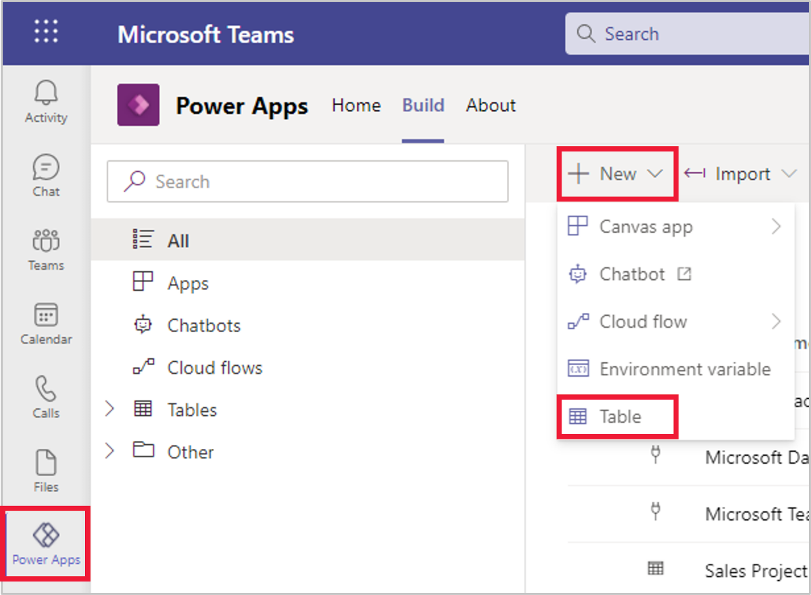
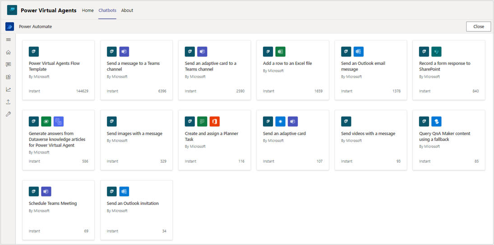
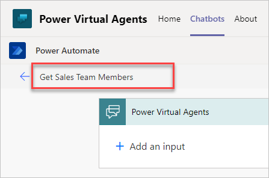
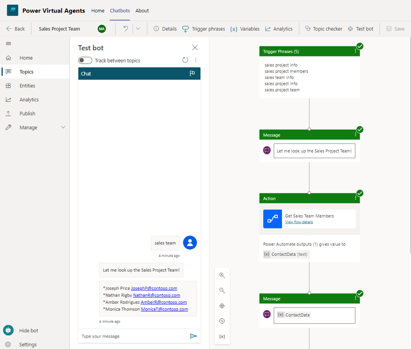

With the **Call an action** node, chatbots can interact with Power Automate flows. You can use these flows to trigger automated processes or connect with Dataverse for Teams data, Microsoft Lists, or other data sources.

For example, the **Event Contacts** chatbot could provide the Sales Project team members from a Dataverse for Teams table. Instead of editing the chatbot when changes are made to this team, you can update the table.

## Step 1 - Create a Dataverse for Teams table

To create a Dataverse for Teams table, follow these steps:

1. Create a new Dataverse for Teams table in the same team as the chatbot. Remember that you'll need to create it by using **Power Apps for Teams**.  In Power Apps for Teams, select the **Build** tab, select **See all**, select **New**, and select **Table**.  

	> [!div class="mx-imgBorder"]
	> 

   Name your new table **Sales Project Team** and select **Save**.  The columns and data types to use are as follows:

	|     Column           |     Data type    |
	|----------------------|------------------|
	|     Name             |     Text         |
	|     Email Address    |     Email        |

1. Add new rows for each of the four contacts.
    
	> [!div class="mx-imgBorder"]
	> 

1. Close the table when you're finished.

## Step 2 - Add an action 

To add an action, follow these steps:

1. Open the **Event Contact** chatbot in Power Virtual Agents for editing.

1. Create a new topic. To name the topic select **Details**. Enter Sales Project Team into the **Name** field and select **Save**.

	> [!div class="mx-imgBorder"]
	> 

    Select **Trigger phrases** and enter each of the following, press **+** after each entry:  sales project team, sales project info, sales team info, sales project members, and sales project info.
    
	> [!div class="mx-imgBorder"]
	> 

1. On the authoring canvas inside the **Message** node, enter **Let me look up the Sales Project Team!**

1. Select **Save** to save the bot at this point. When the Power Automate flow is created, you'll switch to a Power Automate editor. Changes that aren't saved to the chatbot could be lost.

1. Add a new node after the message node and then select **Call an action > Create a flow**.
    
	> [!div class="mx-imgBorder"]
	> 
    
    There are various templates available for you to choose from. Each template allows you to pass information to the flow when it's triggered. After the flow has finished, information can be passed back to the chatbot.  To look at some more template options, you can select **See more templates**.  Some notables include:
    
    **Power Virtual Agents Flow Template** - This template only has the steps to receive and send information to the chatbot.

    **Send a message to a Teams channel** - Trigger a Teams message from the chatbot.

    **Send an adaptive card to a Teams channel** - Trigger an adaptive card to provide information into a Teams channel.
    
	> [!div class="mx-imgBorder"]
	> 

1. Select **Power Virtual Agents Flow Template**.

1. The title of the new flow is **Power Virtual Agents Flow Template**. Select the title of the flow to rename it to **Get Sales Team Members**.
    
	> [!div class="mx-imgBorder"]
	> 

1. Create a variable to hold the information that you want to provide back to the chatbot. Select the **Insert new step** icon and select **Add an action**.
    
	> [!div class="mx-imgBorder"]
	> 

1. In the search box, enter **variable** and then, under **Actions**, select **Initialize variable**.

1. Enter **ContactInfo** for the **Name** and then select **String** for the type.

1. Now we need a step to access the data from Dataverse from Teams. Under the **Initialize variable** step, select the **Insert new step** icon and select **Add an action**. Search for the **Common Data Service (Current Environment)** connector then select **List Rows** as the trigger. 
    
	> [!div class="mx-imgBorder"]
	> 

1. From the drop-down list, select the **Sales Project Team** table.
    
    The **List rows** action pulls all table rows into an array. An array is a type of variable that can hold more than one value at a time. To work with data in the array, you need to go through each row and add the data to your **ContactInfo** variable.

1. Select the **Insert new step** icon after **List rows**. Select **Add an action**.

1. In the search box, enter **Control** and then, under **Actions**, select **Apply to each**.

1. In the **Select an output from previous steps** field, select the text box and then select **value** under the **List rows** section. Select **Add an action** to continue.
    
	> [!div class="mx-imgBorder"]
	> 

1. In the search box, enter **variable** and then, under **Actions**, select **Append to string variable**.

1. For the **Name**, select **ContactInfo** for the variable that you previously created in the flow.

1. Using the **Append to string variable** action, we're going to create a bulleted list with the name and email of each person. Power Automate uses Markdown syntax when formatting text. To indicate a bulleted list in Markdown, you need to use the asterisk character \* at the line's start. To learn more about Markdown, see the Summary section at the end of this module.
    
    In the **Value** text box:
    
    1. Enter an asterisk \* and then add a space.
    1. Under dynamic content **List rows**, select **Name** and then add a space.
    1. Under dynamic content **List rows**, select **Email Address**.
    1. Press **Enter** to start a new line.
    
	> [!div class="mx-imgBorder"]
	> 

1. Select **Return value(s) to Power Virtual Agents** and then select **+ Add an output**.

1. Select **Text** as the type of output.

1. In the **Enter Title** text box, enter **ContactData**, which is the variable name that the chatbot used to receive the information.

1. For the **Enter value to respond** field, provide the variable that you have been using in the flow. Click in the text box and then select **ContactInfo** under the **Variables** section.
    
	> [!div class="mx-imgBorder"]
	> 

1. Select **Save** to finish editing the flow. Power Automate runs the **Flow Checker** to look for problems. You might see a warning about "...OData filter queries..." that can be ignored. Select **Close** to return to the chatbot editor.

1. Select the **Add node** icon after the **Message** node and then select **Call an action**.

1. The flow that you created will appear in the list. Select **Get Sales Team Members**.

1. Add a **Message** node after the **Action** node.

1. Click inside the text box to bring up the menu. Select **ContactData** under **Insert variable {X}**.
    
	> [!div class="mx-imgBorder"]
	> 

1. Select **Save**. If the **Test bot** pane isn't visible, select the **Test bot** menu option.

Enter one of the trigger phrases to test the chatbot.

> [!div class="mx-imgBorder"]
> 

Advanced flows are available to help you look up a single record in Dataverse for Teams based on the user's needs. For example, a user might want the contact information for a particular person based on their job title. While outside the scope of this module, Dataverse List Rows can use OData filters based on choices that the user has made in the chatbot. For more information regarding OData queries, see the Summary section at the end of this module.
