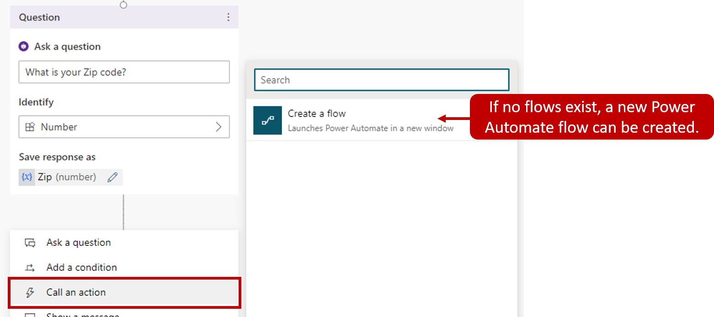
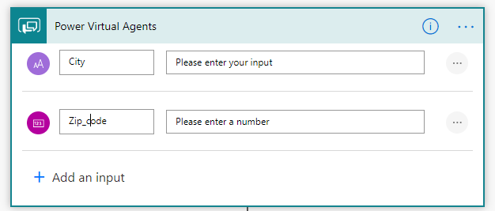
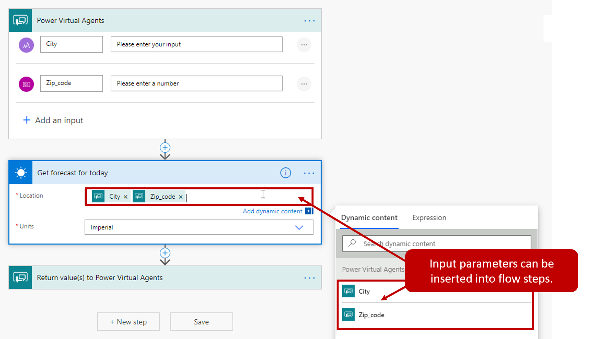
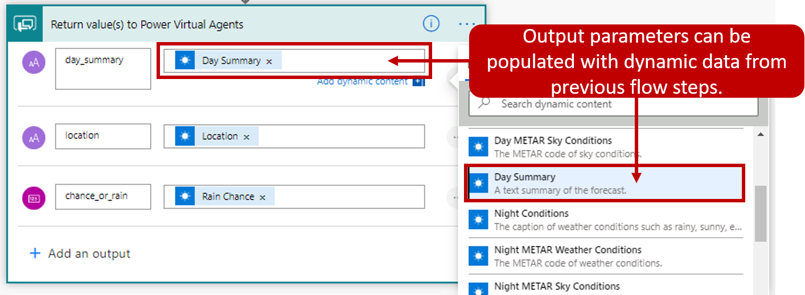
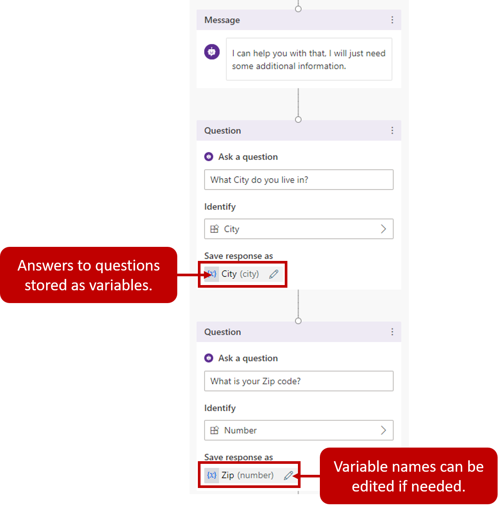
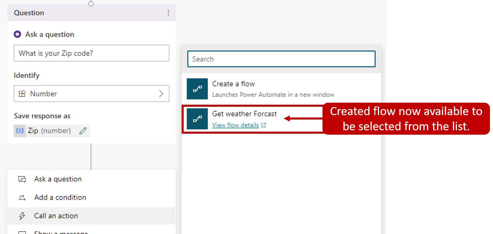
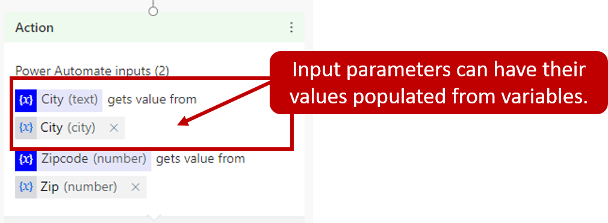

Many times, when a bot interacts with customers, it may require information for other applications to provide the customer with a personalized experience. For example, if a customer asks about the weather for their location, the bot could pass the location details such as the customers city and postal address to a weather service that will get the forecast for their location. The forecast details can be sent back to the bot which can include those values in a message that is provided back to the customer.

Power Virtual Agent (PVA) bots perform these types of actions by calling Microsoft Power Automate flows. Flows can help automate activities, call backend systems, or engage with external application. For example, Power Automate would pass the location information captured in the bot to an external service, and send the forecast details back to the PVA bot.

Power Automate flows are called from within topics using the call an action node. You can use a flow that already exists in your [Power Apps environment](https://docs.microsoft.com/power-virtual-agents/environments-first-run-experience/?azure-portal=true), or you can create one from within the PVA [authoring canvas](https://docs.microsoft.com/power-virtual-agents/authoring-create-edit-topics/?azure-portal=true). To allow a Power Automate flow to interact with a PVA bot, it requires a special PVA trigger. This trigger will capture data from the bot, and send response information back to the bot.

Power Automate provides the following PVA trigger and action:

- **Power Virtual Agents:** Trigger that specifies input parameters that will be captured from the PVA bot.

- **Return value(s) to Power Virtual Agents:** Action that defines output parameters sent back to the PVA bot.

When a new flow is created from a PVA bot, a starter template is loaded that includes the Power Virtual Agents trigger and Return value(s) to Power Virtual Agents action. You will only need to define the necessary input and out parameters and complete the structure of the flow.

> [!div class="mx-imgBorder"]
> 

## Working with input and output parameters

Variables defined in your bot can be to supply values to input parameters, and consume values from output parameters. For example, a customer's response to "what city do you live in?", could be used as the value for a "City" input parameter.

### Input parameters

Input parameters represent values that will be captured in the PVA bot and used by the Power Automate flow steps. There is no limit to the number of input parameters that can be added. However, you can only use Number, String, and Boolean types as Input parameters with Power Automate Flows.

> [!div class="mx-imgBorder"]
> 

Consider what type of data will be required when the input parameter is passed through the flow. For example, if you are intending to send a customer's city and zip code to the MSN weather service, you might configure the input parameters as follows:

|     Name        |     Data   Type    |
|-----------------|--------------------|
|     City        |     Text           |
|     Zip_Code    |     Number         |

City was defined as text because MSN Weather consumes city names as text. Zip_code was set to Number because it is consumed as a number. Each service that Power Automate can interact with will be different, so take some time to understand how it works.

> [!div class="mx-imgBorder"]
> 

When a step to get the weather forecast for today from MSN weather is added, the city and zip_code will be passed to the location, so MSN weather knows what forecast to get.

> [!div class="mx-imgBorder"]
> 

### Output parameters

Output parameters are values from a Power Automate flow that are returned to the Power Virtual Agent bot. Like input parameters, output parameters can be a String, Number, or a Boolean value.

> [!div class="mx-imgBorder"]
> 

Returning to our weather example, once the flow has received the forecast details from the MSN weather service, we will want to create output parameters to store the details returned by the MSN weather service. There values can be consumed by the PVA bot. For example, if you want to present the customer with a summary and chance of rain percentage for their location, you might create the following output parameters.

|     Name              |     Data   Type    |
|-----------------------|--------------------|
|     Day_summary       |     Text           |
|     Location          |     Text           |
|     Chance_of_rain    |     Number         |

The actual details to include will come from the information received in the MSN forecast.

> [!div class="mx-imgBorder"]
> 

All flows created from the Power Virtual Agents authoring canvas are saved in a Default Solution in Power Automate. They can be used by your bots immediately.

### Call a Power Automate flow as an action from a bot

After your flow has been created, it can be initiated from your bot topic using the call an action node. When you call the action, variables can be passed to the flow as input parameters. You will need to make sure that you have created a topic with appropriate trigger phrases. For example, create a Get Weather topic that includes trigger phrases such as "Will it rain?", "What's the weather?", or "Get weather".

> [!div class="mx-imgBorder"]
> 

To pass location information as variables to the Power Automate flow, you will need to capture them. The easiest way to do this is with the **Ask a question** node. You will use the identify field on the question node to define what type of data you want to capture. For example, one would be set to City and the other to Zipcode. The responses to this questions will be stored in variables.

> [!div class="mx-imgBorder"]
> 

After you have defined the questions that you will use to capture the details, you will need to add a new Call an action conversation node to the bot. You will do this by selecting the weather flow that you created earlier.

> [!div class="mx-imgBorder"]
> 

In the flow configuration, you will need to map the flow input blocks to the output variables from the question nodes. For example, **City (text)** gets its value from City (city) and **Zipcode (number)** gets its value from Zip (number).

> [!div class="mx-imgBorder"]
> 

You will be able to see that the get weather flow will be run, and what out parameters will be returned from it.

Under the flow\'s node, add a **Message** node and then enter a message that uses the flow's outputs.

For example:**Today's forecast for** (x)location:{x}day_summary. **Chance of rain is** {x}chance_of_rain%.

> [!div class="mx-imgBorder"]
> 

For more detailed information on triggering a Power Automate Flow, see [Microsoft Docs](https://docs.microsoft.com/power-virtual-agents/advanced-flow/?azure-portal=true)
