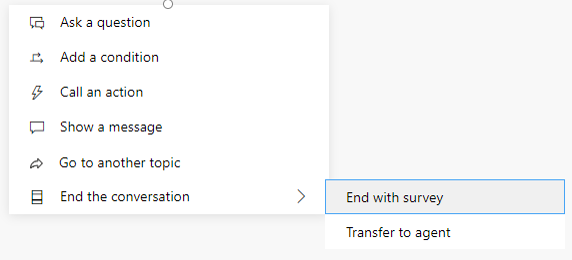
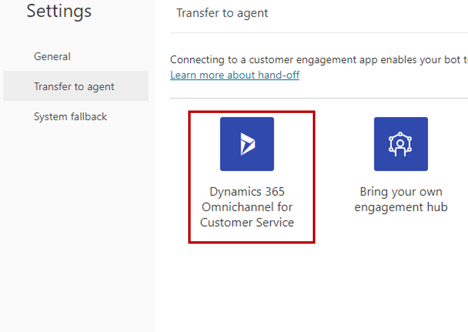

At some point, a bot will likely need to hand off a conversation to a live agent. This often happens when a user is looking for something that the bot does know, or after the bot has captured the necessary information required to ensure the conversation can be routed correctly to a live agent. When a bot hands off a conversation to live agent, it shares the full history of the conversation (the context) as well as any variables with the agent. PVA Bots can be configured to hand off conversations to agents for organizations that are using Omnichannel for Customer Service (OCS). This allows OCS to route incoming escalations to the right live agent queue, and it also allows the live agents to review exactly what occurred in the prior conversation, so they can resume at that point. This prevents agents from potentially asking to information that was previously captured by the bot.

### Transfer conversations to agents

There are two primary components involved when a bot transfers to an agent.

- Telling the bot when to transfer the conversation to an agent.

- Telling the bot where to transfer the conversation to.

### Tell the bot when to transfer the conversation to an agent

The way Power Virtual Agents tells the bot that it is time to transfer a conversation to an agent is always the same. PVA includes what is referred to as a "conversation node," called End the conversation. The end the conversation node signifies the end of the entire conversation and provides two actions that can be initiated.

- **End with survey:** A survey appears that asks the user if their question or issue was answered or resolved correctly.

- **Transfer to agent:** Escalates the conversation [to a live agent](https://docs.microsoft.com/power-virtual-agents/advanced-hand-off/?azure-portal=true).

> [!div class="mx-imgBorder"]
> 

Bot authors can end a conversation and transfer to an agent from within a specific topic. For example, if a customer indicates to the bot that their entire Point of Sale system is down, the bot can automatically call the End the conversation node and transfer it to an agent. Another way this could be done is through the escalate topic. All bots include a conversation topic called Escalate. The escalate topic includes a message that is presented to the customer, and then calls the End the conversation node to transfer to an agent. The escalate topic is automatically triggered when someone types something like speak to agent. It could also be triggered from within another topic by selecting Go to another topic and selecting it.

### Configure where to hand the conversation off to

To facilitate the transfer of a conversation to an agent, you will need to configure the bot to send the conversation to a specific Omnichannel for Customer Service instance. Only published bots can be used to ensure the end-to-end capabilities work as expected. Make sure you have [published your bot](https://docs.microsoft.com/power-virtual-agents/getting-started-deploy/?azure-portal=true) prior to validating the integrated experience.

When you create the connection between PVA and OCS, an Azure Active Directory application registration is use to call the bot. Creating the application registration is done on the [Azure Portal](https://portal.azure.com/?azure-portal=true). App registrations are done by going to Azure Active Directory and creating a new registration under App registrations.

There are three primary areas that can be defined when you create the application registration:

- **Name:** User facing name of the application. This can be changed later if necessary.

- **Account Types:** This Defines who can access the application

- **Redirect URI:** This is the URL for where the app is located.

> [!div class="mx-imgBorder"]
> 

After you have defined everything click the register button.

For additional information on creating an Azure Active Directory Application, see [Microsoft Docs](https://docs.microsoft.com/azure/active-directory/develop/howto-create-service-principal-portal#create-an-azure-active-directory-application/?azure-portal=true).

### Configure transfer to agent

Each bot can only be configured to send conversations to one Omnichannel for Customer Service instance. You define the Dynamics 365 instance in the individual bot itself. If conversations from multiple bots will be sent to your Dynamics 365 instance, each bot will need to be configured individually.

To configure the handoff, select the Settings icon, then Transfer to agent. This screen allows you to define how the bot will facilitate handoff to different applications. Select the Dynamics 365 Omnichannel for Customer Service tile to begin the configuration process.

> [!div class="mx-imgBorder"]
> 

The primary component you need to provide here is the Application ID for the app that you created the Azure Active Directory registration for earlier. Omnichannel for Customer Service models bots as "application users" in the application. By modeling them as application users, this ensures the bot can have conversations set to it like a human agent would. It is important that the Application ID is unique to your organization (your Common Data Service organization or environment). Each bot that will interact with the same OCS environment will need to use a different Application ID. You may need to create multiple application registrations to support multiple bots.

In your Azure portal, navigate to Azure Active Directory and select App registrations. All registered applications will be displayed. Select the application you want to use with the bot. The Application ID will be on the applications overview page. Copy the ID and paste it into the Power Virtual Agents Application ID field.

Power Virtual Agents uses a Microsoft [Teams channel](https://docs.microsoft.com/power-virtual-agents/getting-started-deploy/?azure-portal=true) to communicate with Omnichannel for Customer Service. As you walk through the setup wizard, if there is not a Teams channel enabled, a Teams channel will be enabled automatically.

> [!div class="mx-imgBorder"]
> 

The last part of the configuration process is to select the Omnichannel for Customer environment you want to use with this bot. Make sure that you are selecting an environment where your Omnichannel for Customer Service instance is provisioned. The list shows all available environments, even if OCS is not provisioned.

Once the connection is established, you can select the Go to Omnichannel link to [continue configuring the bot connection in Omnichannel for Customer Service](https://docs.microsoft.com/dynamics365/omnichannel/administrator/configure-bot-virtual-agent/?azure-portal=true).

### Remove Omnichannel for Customer Service connection

As of when this course was published, it was not possible to remove the connection setting once setup. If you erroneously connected to the wrong instance or environment, a new bot will need to be created and then connected to Omnichannel for Customer Service again.

After the hand off has been configured, you will need to finish the remaining configuration in Omnichannel for Customer Service.

More information can be found on [Microsoft Docs](https://docs.microsoft.com/dynamics365/omnichannel/administrator/configure-bot-virtual-agent/?azure-portal=true).
