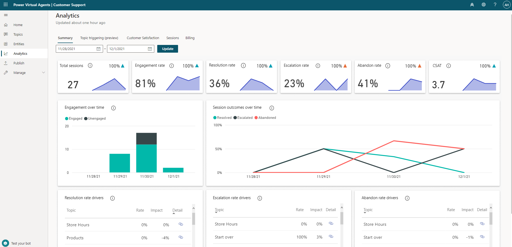
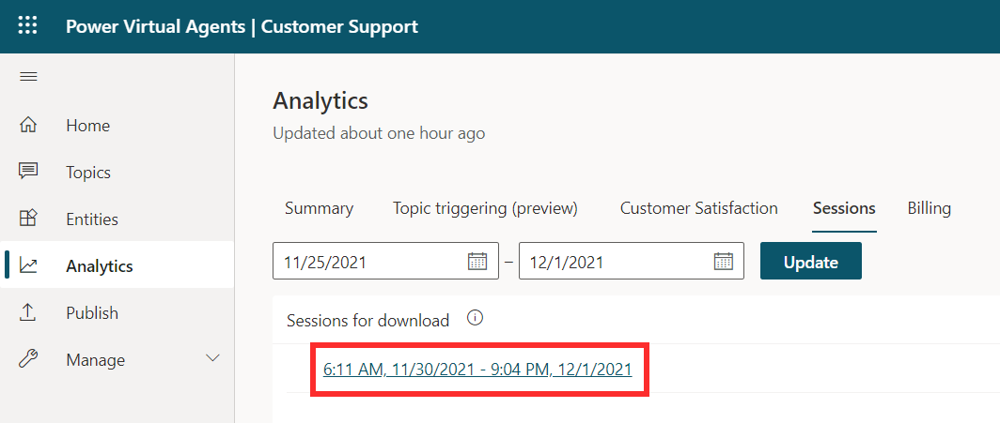

After a bot is deployed and customers are interacting with it, statistics that are related to the bot will become available. You can access this information through the **Analytics** tab in the side navigation pane. On this tab, you can find key performance indicators (KPIs) that show the volume of sessions that your bot has handled, how effectively your bot was able to engage users and resolve issues, escalation rates to human agents, and abandonment rates during conversations. You will also find customer satisfaction information at the KPI level and on the **Customer Satisfaction** tab.

> [!div class="mx-imgBorder"]
> 

You can also view detailed session history and transcripts by selecting **Sessions** from the **Analytics** tab. On the **Sessions** page, you can download a file with the full session transcript, which can be a helpful way for you to adjust the performance of your bot and change the content in your topics to improve your bot's efficiency.

### Analyze bot performance and usage

The **Summary** page gives you a broad overview of your bot's performance. It uses AI technology to show you which topics have the greatest impact on escalation rate, abandon rate, and resolution rate. For more information, see the table under [Summary charts](https://docs.microsoft.com/power-virtual-agents/analytics-summary#summary-charts/).

> [!div class="mx-imgBorder"]
> 

The **Summary** page includes a variety of charts with graphical views of your bot's KPIs:

- **[Summary charts](https://docs.microsoft.com/power-virtual-agents/analytics-summary#summary-charts/)** - Summarize KPIs for a specified period and the percent change over the period.

- **[Engagement over time chart](https://docs.microsoft.com/power-virtual-agents/analytics-summary#engagement-over-time-chart/)** - Graphical view of the number of engaged and unengaged sessions over time.

- **[Session outcomes over time chart](https://docs.microsoft.com/power-virtual-agents/analytics-summary#session-outcomes-over-time-chart/)** - Graphical view of the daily resolution rate, escalation rate, and abandon rate over the specified time period.

- **[Resolution rate drivers chart](https://docs.microsoft.com/power-virtual-agents/analytics-summary#resolution-rate-drivers-chart/)** - Displays topics in order of their impact on the resolution rate over the specified time period.

- **[Escalation rate drivers chart](https://docs.microsoft.com/power-virtual-agents/analytics-summary#escalation-rate-drivers-chart/)** - Displays topics in order of their impact on the escalation rate over the specified time period.

- **[Abandon rate drivers chart](https://docs.microsoft.com/power-virtual-agents/analytics-summary#abandon-rate-drivers-chart/)** - Displays topics in order of their impact on the abandon rate over the specified time period.

For more information, see [Analyze bot performance and usage](https://docs.microsoft.com/power-virtual-agents/analytics-summary/?azure-portal=true).

The **Engagement rate drivers**, **Abandon rate drivers**, and **Resolution rate drivers** charts use natural language understanding to group issues as topics. These charts show you the topics that have the most impact on the performance of your bot.

### Analyze customer satisfaction for Power Virtual Agents bots

The **Customer Satisfaction** page provides a detailed view of customer satisfaction (CSAT) survey data, including the average CSAT score over time and the topics that have the most impact on the CSAT score. The **Customer Satisfaction** page includes a variety of charts with graphical views of your bot's customer satisfaction indicators:

- **[Customer satisfaction drivers chart](https://docs.microsoft.com/power-virtual-agents/analytics-csat#customer-satisfaction-drivers-chart/)** - Uses AI to group related support cases as topics and then displays topics in order of their impact on customer satisfaction over the specified time period.

- **[Scores over time chart](https://docs.microsoft.com/power-virtual-agents/analytics-csat#scores-over-time-chart/)** - Provides a graphical view of the average CSAT score over the specified time period.

- **[Average CSAT score](https://docs.microsoft.com/power-virtual-agents/analytics-csat#average-csat-score-chart/)** - Provides a graphical view of the average of CSAT scores for sessions in which customers respond to an end-of-session request to take the survey.

- **[CSAT survey response rate](https://docs.microsoft.com/power-virtual-agents/analytics-csat#csat-survey-response-rate-chart/)** - Shows the number of CSAT surveys that were presented and the percentage of surveys that were completed.

For more information, see [Analyze customer satisfaction](https://docs.microsoft.com/power-virtual-agents/analytics-csat/?azure-portal=true).

### Analyze topic usage in Power Virtual Agents

The topic details page provides a view into the performance of individual topics and how they can be improved. You can display the topic details page by selecting the **Detail** link in one of the following charts on the [Summary](https://docs.microsoft.com/power-virtual-agents/analytics-summary/?azure-portal=true) and [Customer Satisfaction](https://docs.microsoft.com/power-virtual-agents/analytics-csat/?azure-portal=true) pages:

- **Summary page**

  - [Escalation rate drivers](https://docs.microsoft.com/power-virtual-agents/analytics-summary#escalation-rate-drivers-chart/)

  - [Abandon rate drivers](https://docs.microsoft.com/power-virtual-agents/analytics-summary#abandon-rate-drivers-chart/)

  - [Resolution rate drivers](https://docs.microsoft.com/power-virtual-agents/analytics-summary#resolution-rate-drivers-chart/)

- **Customer Satisfaction page**

  - [Customer satisfaction drivers](https://docs.microsoft.com/power-virtual-agents/analytics-csat#customer-satisfaction-drivers-chart/)

> [!div class="mx-imgBorder"]
> 

The topic details page can also be displayed by opening an individual topic from the **Topics** page and selecting **Analytics** at the top of the page. You can also hover over an item and select the **Go to analytics** icon.

> [!div class="mx-imgBorder"]
> 

The topic details page includes a variety of charts with graphical views of a topic's KPIs:

- **[Topic Summary charts](https://docs.microsoft.com/power-virtual-agents/analytics-topic-details#topic-summary-charts/)** - Summarize topic performance indicators for the specified time period and the percent change over the period.

- **[Impact Summary charts](https://docs.microsoft.com/power-virtual-agents/analytics-topic-details#impact-summary-charts/)** - Summarize the impact of the topic on KPIs for the specified time period.

- **[Topic Volume by Day chart](https://docs.microsoft.com/power-virtual-agents/analytics-topic-details#topic-volume-by-day-chart/)** - Provides a graphical view of the number of sessions for the topic over the specified time period.

For more information, see [Analyze topics usage](https://docs.microsoft.com/power-virtual-agents/analytics-topic-details/?azure-portal=true).

### Analyze session information in Power Virtual Agents

Having access to session information that is related to your bot can help you identify potential changes that need to be made. By default, you can download up to seven days of bot conversation transcript sessions from the past 30 days directly from the Power Virtual Agents portal.

Session transcripts are available by going to **Analytics > Sessions** tab. On the **Sessions** tab, you will be able to see all the different sessions that have been run for the bot. A session represents a conversation that someone had with the bot. If your bot had a high number of sessions, they will be broken down into multiple rows to help make managing the sessions easier. Each row will contain 2500 sessions. You can select each row to download the session transcripts for the specified time frame.

> [!div class="mx-imgBorder"]
> 

The downloaded file contains the following information:

- **SessionID** - A unique identifier for each session.

- **StartDateTime** - Time at which the session started. Entries are sorted by this column in descending order.

- **InitialUserMessage** - First message that is entered by the user.

- **TopicName** - Name of the last authored topic that was triggered in this session.

- **ChatTranscript** - Transcript of the session in the following format:

  - **User says:" "; Bot says:" ";** structure

  - Conversation turns are separated by semicolons

  - **Bot says** doesn't include the options that are presented to the user

- **SessionOutcome** - Outcome of the session (Resolved, Escalated, Abandoned, Unengaged).

- **TopicId** - A unique identifier of the last authored topic that was triggered in this session.

For more information, see [Analyze session information](https://docs.microsoft.com/power-virtual-agents/analytics-sessions/?azure-portal=true).
