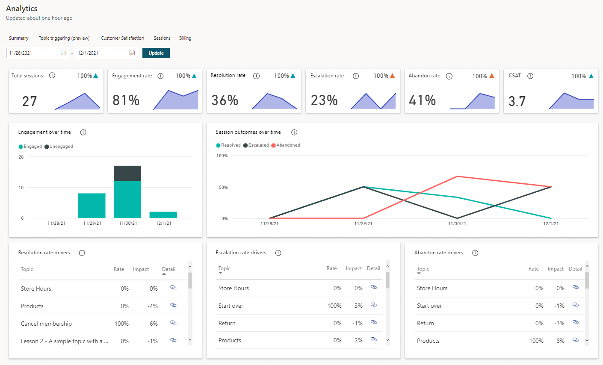
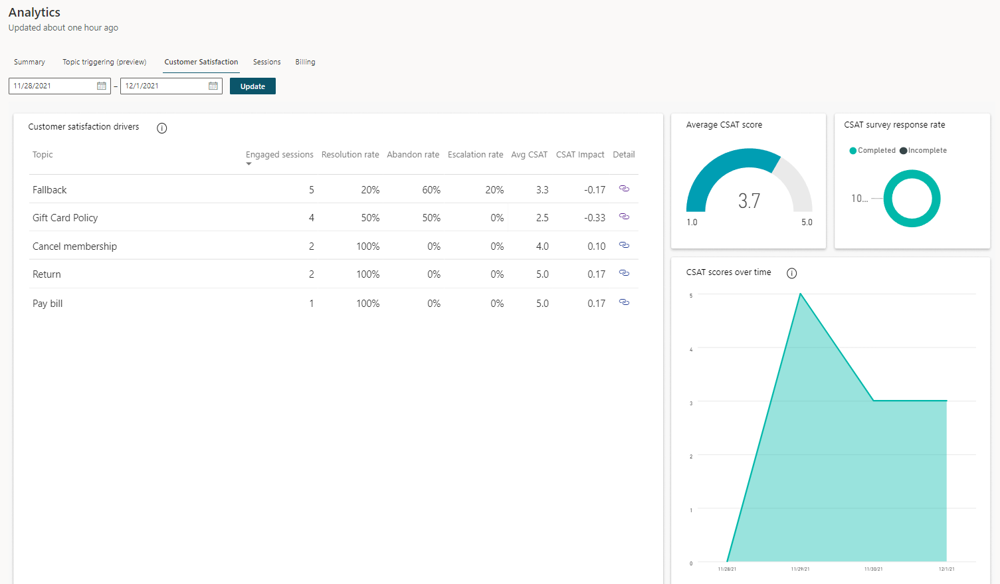
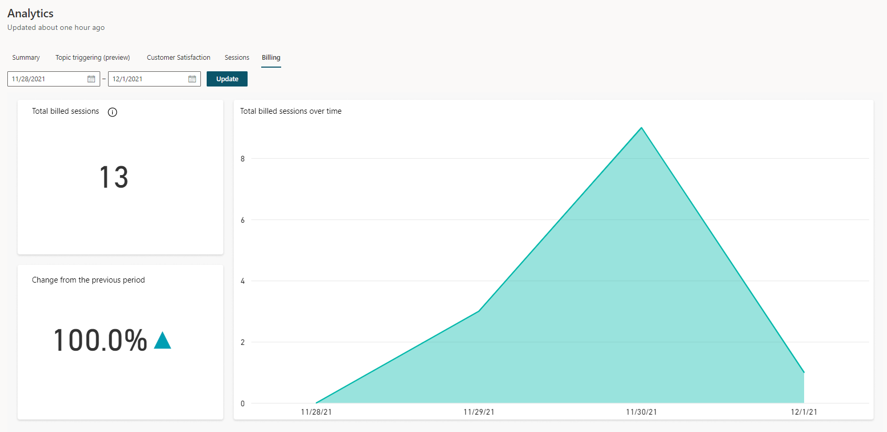
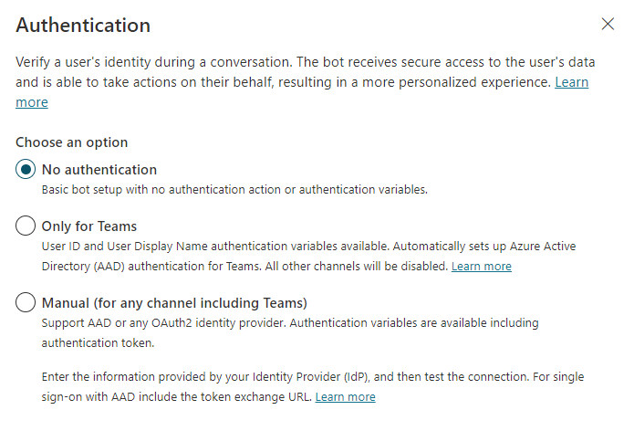
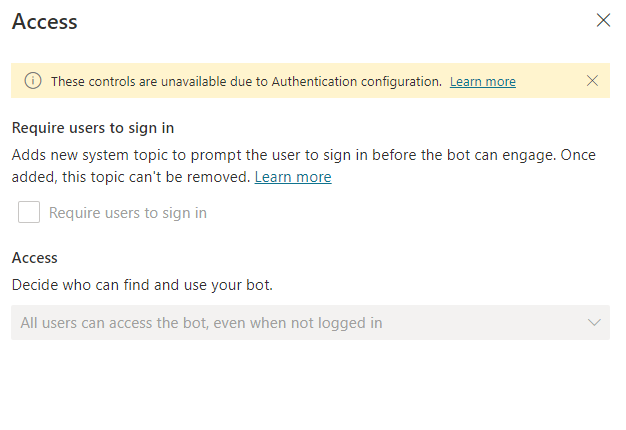
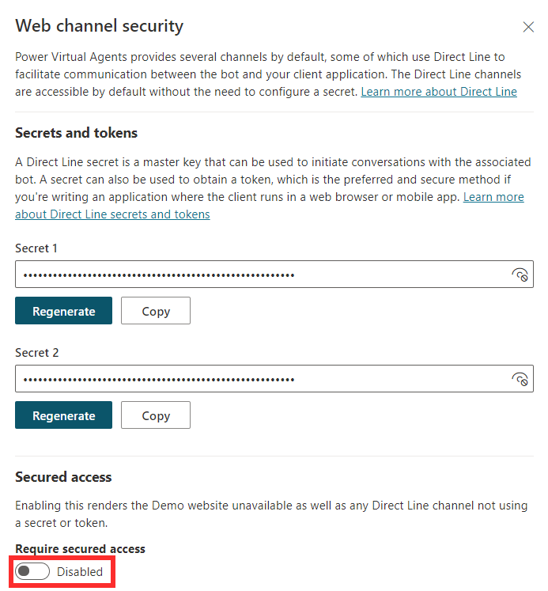

Power Virtual Agents gives you the flexibility to administer analytics and manage security of the chatbots.

## Analytics

The analytics section is divided into numerous pages to give you multiple ways to understand bot performance.

The **Summary** tab provides a detailed overview of how many total chatbot sessions were run over the period that you selected. Information such as total number of sessions, engagement rate, resolution rate, escalation rate, and abandon rate can help you to understand how effective the bot has been and to determine the areas that need improvement.

> [!div class="mx-imgBorder"]
> 

The **Customer Satisfaction** report helps identify which topics are having the most impact and where analysts will go to stay informed.

> [!div class="mx-imgBorder"]
> 

The **Sessions** tab gives you the flexibility to download raw data from all chatbot sessions. This offering includes a complete transcript of the sessions and the outcome.

> [!div class="mx-imgBorder"]
> 

The **Billing** tab shows the billable interaction between a customer and a bot and represents one unit of consumption. The billed session begins when a user topic is triggered.

A session will end for one of the following reasons:

- The user ends the chat session. When the bot doesn't receive a new message for more than 30 minutes, the session is considered closed.

- The session is longer than 60 minutes. The first message that occurs after 60 minutes starts a new session.

- The session has more than 100 turns. A turn is defined as one exchange between a user and the bot. The one-hundred-and-first turn starts a new session.

> [!div class="mx-imgBorder"]
> 

## Security

You can set up other security measures for your bot and your users.

> [!div class="mx-imgBorder"]
> 

### Sharing

You can share your bot with other users so that multiple users can edit, manage, and collaborate on a bot. You can stop sharing with individual users anytime. You do not need to share a bot with another user for them to chat with the bot.

You can view the current access that a user has for your environment, and you have the option to assign security roles to the selected user.

> [!div class="mx-imgBorder"]
> 

**Bot author**, **Bot contributor**, and **Bot transcript viewer** are the three security roles for Power Virtual Agents that you can manage at Microsoft Power Platform admin center.

You can assign the **Environment maker** security role when sharing a bot with a user who doesn't have sufficient environment permissions to run Power Virtual Agents.

When you are sharing the bot, if the specified user doesn't have sufficient permissions to use Power Virtual Agents in the environment, you will be notified that the **Environment maker** security role will be assigned to the person so that they can use the bot.

### Access and authentication

The **Access** and **Authentication** options control who can access your bot. You can select one of two groups:

- **All bot managers** - This selection allows only bot managers to chat with the bot. You can share your bot so that other bot managers can access it.

- **Everyone in my organization (Organization name)** - This selection allows everyone in the organization to access and chat with your bot. Users who are outside of the organization will see an error when chatting with the bot.

The **Authentication** setting impacts how you can manage access to the bot.

Select **Manage** on the side navigation pane and then go to the **Security** tab and select **Authentication**.

> [!div class="mx-imgBorder"]
> 

Three options for authentication are:

- **No authentication** - Any user who has a link to the bot (or can find it, for example, on your website) can chat with it. Therefore, the **Access** setting options will be disabled.

    > [!div class="mx-imgBorder"]
    > 

- **Only for Teams** - The bot will only work on the Teams channel, meaning that the user will always be signed in. Therefore, the **Require users to sign in** option in the **Access** setting will be enabled and can't be changed.

- **Manual (for any channel including Teams)** - This option has the following parameters:

  - If your authentication setting is configured to **Manual**, and the service provider is either Microsoft Azure Active Directory (Azure AD) or Azure Active Directory V2, you can turn off the **Require users to sign in** option and change the access settings for the bot.

  - If your authentication provider is set as **Generic OAuth 2**, you can turn off the **Require users to sign in** option, but you can't control which users can access the bot. That option is only available when you use Azure AD authentication.

### Web channel security

When you create a Power Virtual Agents bot, it is immediately available in the Demo website and Custom website channels to anyone who knows the bot ID. These channels are available by default, and no configuration is needed.

Users can find the bot ID directly from within Power Virtual Agents or by receiving it from someone. Depending on the bot's capability and sensitivity, that scenario might not be desirable.

With Direct Line-based security, you can enable access to only the locations that you control by enabling secured access with Direct Line secrets or tokens. You can enforce the use of secrets and tokens for each individual bot. After this option has been enabled, channels will need the client to authenticate their requests by using a secret or by using a token that is generated by using the secret, which is obtained at runtime. Any access to the bot that doesn't provide this security measure won't work.

On the side navigation pane, select **Manage > Security** and then select **Web channel security**.

> [!div class="mx-imgBorder"]
> 

If you need to disable the **Web channel security** option, you can do so by switching **Require secured access** to **Disabled**. Disabling secured access can take up to two hours to propagate.

> [!div class="mx-imgBorder"]
> 
