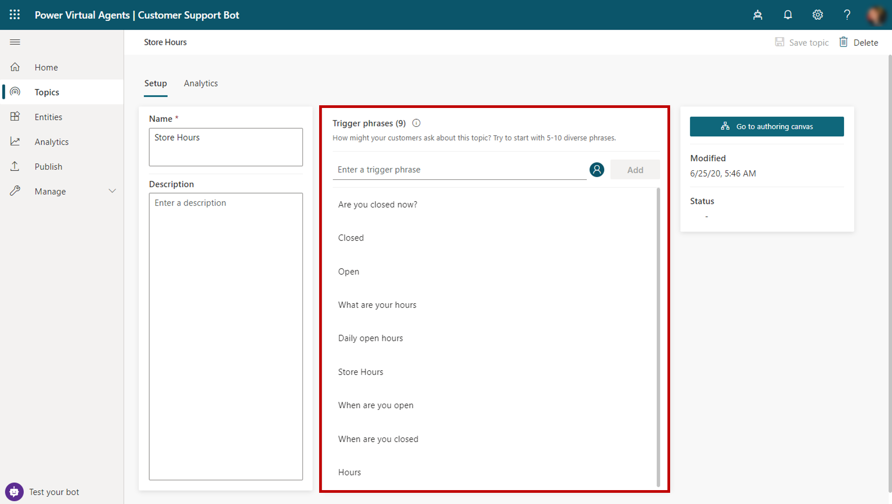
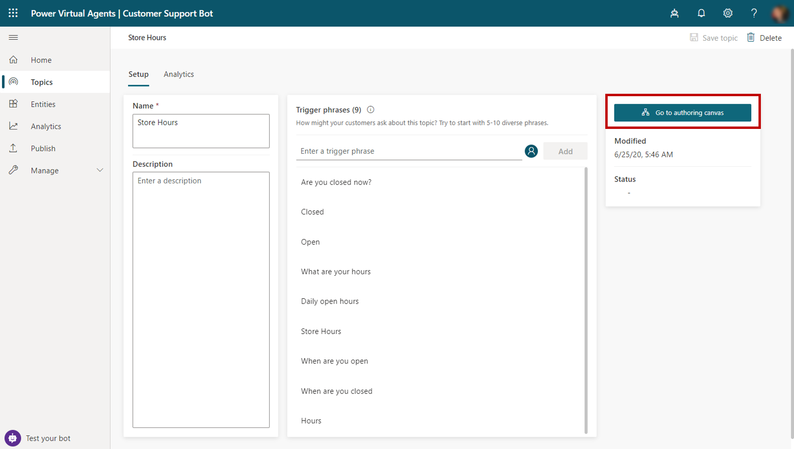
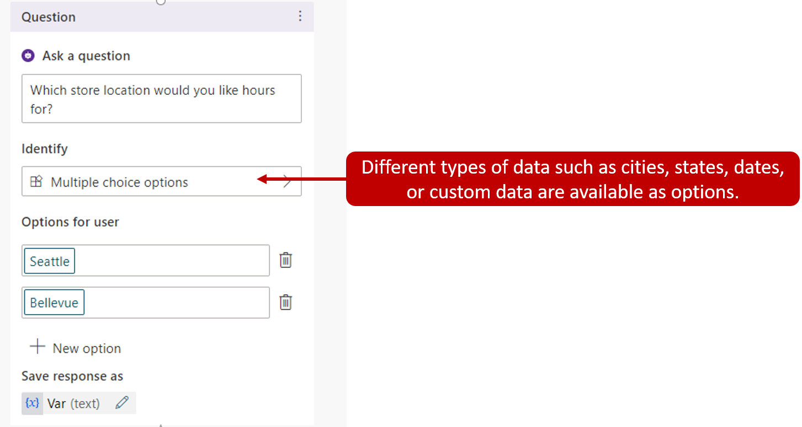
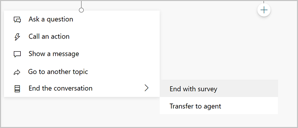

In Power Virtual Agents (PVA), Topics represent paths a customer can be taken on while interacting with a bot. The topic used, as well as the path followed within an individual topic, is in response to the data typed in by customers in the conversation panel. Topics are the primary element that dictates how conversations flow. If a customer asks about the weather, the bot can launch a weather topic. To provide them with the correct weather forecast, the bot can ask questions defined in the topic, such as what city they live in. The bot retains that information so it can be sent to a weather service for forecast details. The forecast can be returned to the customer in a personalized message that includes relevant customer information.

Power Virtual Agent topics consist of two primary elements:

* **Trigger phrases:** Phrases, keywords, or questions entered by users that relate to a specific issue.

* **Conversation nodes:** Define how a bot should respond and what it should do.

As the customer types information, the bots Artificial Intelligence uses natural language understanding to parse what a they are typing and find the most appropriate trigger phrase or node. If a user enters "I need to return a defective product\" into your bot, PVA could match parts of the text such as "return" or "defective product" to return a topic that includes those items as trigger phrases.

Once loaded, different conversation nodes in the topic are used to control and define the path the customer will take during the conversation. Messages presented can provide details or instructions. Questions can be asked to identify the type of product they want to return. Actions can be used to help them create a custom return label that could be sent to them to facilitate the return.

## Work with topic triggers

The first thing you need to define in a topic, is what phrases the bot should look for to trigger the topic. A single topic can have multiple trigger phrases defined for it. Having five to ten trigger phrases is a good starting point but you can add as many as needed. Punctuation can be used in trigger phrases. However, it is best to use short phrases rather than long sentences. Try to think about how a customer might phrase their request. If the topic will be used to communicate store hours, your triggers should relate to being open or closed, time frames, dates, etc. Using phrases like "What are your hours?", "When do you open?", "Store Hours", and "Hours of Operation" would be good starting phrases. Additional trigger phrases can be added over time as you identify additional ones that would be needed.

> [!div class="mx-imgBorder"]
> 

You should also try to make your trigger phrases as unique to the individual topic as possible. This maximizes the likelihood the bot will launch the correct topic as the user types what they need. For example, a bot might contain two topics. One called "Product Returns" and another called "Product Recalls". It would not be uncommon for each topic to have similar verbiage. If you add 'defective product' as a phrase to both, the application may not understand which topic to load.

One way to handle this would be to add more specific trigger phrases to the topics, such as using 'return defective product' in the "Product Returns" topic and 'return recalled product' in the "Product Recalls" topic.

Another approach could be that you only create one topic that is used for both returns and recalls. When the topic is initiated by the bot, additional information could be gathered and used to guide them down either a return or recall path. This becomes increasingly important in scenarios where a bot contains many individual topics. Remember, a single bot can have up to a maximum of 1000 topics in it. Some simple planning early in the process can prevent a lot of frustration in the future.

## Use conversation nodes to design the topic's conversation path

Once you have defined how the topic will be triggered, you will need to design the flow of the topic as users interact with it. This is called a conversation path. A topics conversation path defines how the customer will be interacted with, and what will occur based on customer input. You edit a topic conversation path by selecting the Go to authoring canvas button.

> [!div class="mx-imgBorder"]
> 

When a new topic is created, the initial conversation path includes two items. There will be a trigger phrase node and an empty message node inserted for you by default. Additional nodes can be added by selecting the plus (+) icon on the line or branch between or after a node.

> [!div class="mx-imgBorder"]
> 

## Work with conversation nodes

Conversation nodes represent customer interactions or actions that can be inserted into a topic's conversation path. They might be used to display a message to the customer, ask them for some additional information, trigger an automation, or trigger an escalation to a live agent.

There are five node types available:

* **Show a message:** Displays a message to the user. Messages can include some basic formatting and numbering.

* **Ask a question:** Helps the bot capture information from the user. The captured information can be used to influence the flow of the conversation, or as variables in other parts of the bot.

* **Call an action:** Calls a Power Automate Flow to help interact with external systems or areas. For example, passing customer location details to the MSN weather connector to get the local weather forecast for the customer's location.

* **Go to another topic**: Directs the user to a different topic in the bot. For example, you might want to send the user to a specific topic about the closure of a store if they ask about store hours for that store.

* **End the conversation:** Ends the conversation and provides the ability to display surveys, or hand over to a live agent.

Depending the type of node you select, it may have different options that can be defined.

## Work with the question node

Question nodes are often used in conversation paths. They help capture additional information from customers. Information captured from the question can be stored and used in other parts of the bot or in automation. They can also impact the path the customer is taken on. For example, you might use a question node to capture the city a customer lives in. You could also use a question node to provide the customer with a list of multiple-choice options to choose from, such as a list of cities.

Each question node contains three base fields:

* **Ask a question**: The question text that you want to present to the user.

* **Identify:** Defines what the bot should be listening for in the user's response. For example, multiple choice options, a number, or a specific string.

* **Save response as:** Defines how you want to save the data captured from the questions so it can be used as a variable later.

Depending the type of data that you select in the Identify field, additional field options may be presented to help provide additional details for the item. For example, setting the Identify field to "Multiple choice options", displays "Options for user". Here, you can define the options that you want to have presented to the user. Each option would be presented in the conversation window as a multiple-choice button.

> [!div class="mx-imgBorder"]
> 

Another advantage to the question node is separate conversation paths can be leveraged based on the customer\'s response. We will look at branching in the next unit. This helps lead to the appropriate resolution for each user response.

## Display messages with the show a message node

Message nodes are used anytime you want to provide some details or information back to the user. Each message can include some basic formatting such as bold and italics. You can also include bullet and numbers, as well as insert links to other content as needed.

Message nodes can also include variables in message content. Variables can be used to store information captured from a question. Inserting a variable allows you to provide more personalized messages. For example, the answer to what city are you in could be stored as a variable and used later in a message to the customer such as "currently the weather in "city" is...

We will examine variables more later.

## Work with the go to another topic node

Each topic that you include in your bot is likely going to be specific. For example, a "current weather" topic is only going to provide weather related data, and a "hours of operation" topic is going to focus on when a business is open. Just because they are separate topics does not mean that they cannot not be related or dependent on each other. For example, let's go back to our "Product Returns" and "Product Recalls" example from earlier. Rather than coming up with multiple unique triggers for both topics, we could create a "Recall or Return" topic. The purpose of the topics is to determine which topic to load next. It contains a question node that asks if this is a return or recall. Based on what the user selects, the go to topic node loads either the "Product Returns" or "Product Recalls" topic.

> [!div class="mx-imgBorder"]
> 

## Use the call an action node

One of the many advantages to Power Virtual Agents, is the ability to execute actions such as sending emails, locating external data, or creating activities based on data entered in the bot. The call an action node helps to facilitate this by allowing you to call a Power Automate Flow from the bot.

For more information on calling a Power Automate Flow from a topic, see [Microsoft Docs](https://docs.microsoft.com/power-virtual-agents/advanced-flow/?azure-portal=true).

## Use the end the conversation node

Many times, the end of a topic also represents the end of the conversation. The end the conversation node signifies the end of the entire conversation and provides actions that can be initiated. You can have a survey appear that asks the user if their question or issue was answered or resolved correctly. This information is collected under the [customer satisfaction analytics page](https://docs.microsoft.com/power-virtual-agents/analytics-csat/?azure-portal=true). You could also elect to escalate the conversation [over to a live agent](https://docs.microsoft.com/power-virtual-agents/advanced-hand-off/?azure-portal=true) if you are using a suitable customer service portal, such as Omnichannel for Customer Service. At the end of a response that resolves the user\'s issue or answers the question, select End the conversation.

> [!div class="mx-imgBorder"]
> 
