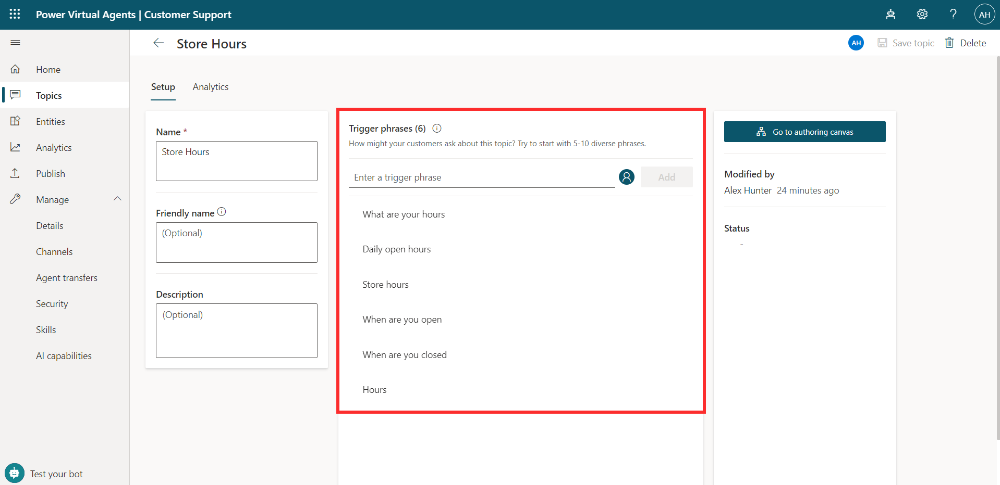
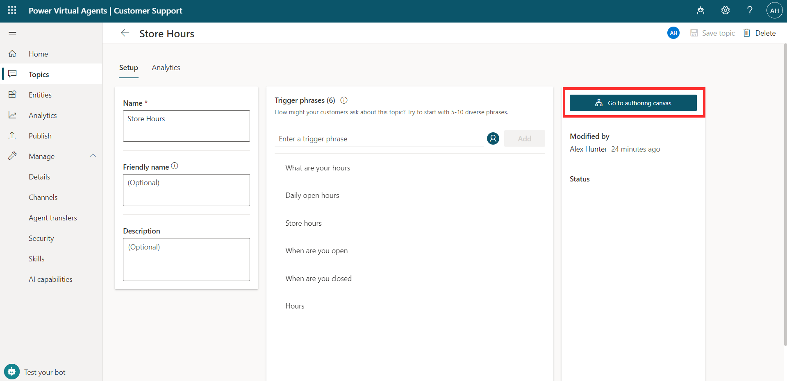
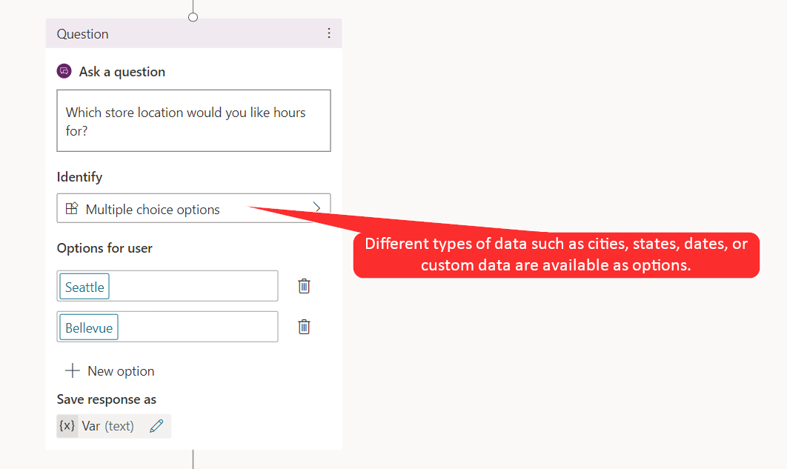
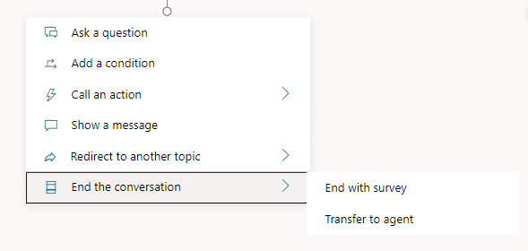

In Power Virtual Agents, topics represent paths that a customer can be taken on while interacting with a bot. The topic that is used and the path that is followed within an individual topic is in response to the data that is entered by customers in the conversation panel. Topics are the primary elements that dictate how conversations flow. If a customer asks about the weather, the bot can launch a weather topic. To provide them with the correct weather forecast, the bot can ask questions that are defined in the topic, such as what city they live in. The bot retains that information so that it can be sent to a weather service for forecast details. The forecast can be returned to the customer in a personalized message that includes relevant customer information.

Power Virtual Agents topics consist of two primary elements:

- **Trigger phrases** - Phrases, keywords, or questions that are entered by users and relate to a specific issue.

- **Conversation nodes** - Define how a bot should respond and what it should do.

As the customer enters information, the bot's AI uses natural language understanding to parse what the customer is typing and then find the most appropriate trigger phrase or node. If a user enters, "I need to return a defective product" into your bot, Power Virtual Agents could match parts of the text such as "return" or "defective product" to return a topic that includes those items as trigger phrases.

After they have been loaded, different conversation nodes in the topic are used to control and define the path that the customer will take during the conversation. Messages can provide details or instructions. Questions can be asked to help identify the type of product that they want to return. Actions can be used to help the customer create a custom return label that could be sent to them to facilitate the return.

## Work with topic triggers

Your first task in defining a topic is to determine the phrases that the bot should look for to trigger the topic. A single topic can have multiple trigger phrases that are defined for it. Having five to ten trigger phrases is a good starting point, but you can add as many as needed. Punctuation can be used in trigger phrases. However, it is best to use short phrases rather than long sentences. Try to think about how a customer might phrase their request. If the topic will be used to communicate store hours, your triggers should relate to being open or closed, time frames, dates, and so on. 

Examples of good starting phrases for a Store Hours topic would include: 

- What are your hours? 

- When do you open? 

- Store hours

- Hours of operation

Additional trigger phrases can be added over time as you identify additional phrases that would be needed.

> [!div class="mx-imgBorder"]
> 

You should also try to make your trigger phrases as unique to the individual topic as possible. This approach maximizes the likelihood that the bot will launch the correct topic as the user types what they need. For example, a bot might contain two topics: one called Product Returns and another called Product Recalls. It would not be uncommon for each topic to have similar verbiage. If you add "defective product" as a phrase to both, the application might not understand which topic to load.

One way to handle this issue would be to add more specific trigger phrases to the topics, such as using "return defective product" in the Product Returns topic and "return recalled product" in the Product Recalls topic.

Alternatively, you could create only one topic that is used for both returns and recalls. When the topic is initiated by the bot, additional information could be gathered and used to guide the customer down either a return or recall path. This differentiation becomes increasingly important in scenarios where a bot contains many individual topics. A single bot can have up to a maximum of 1000 topics in it. Early planning in the process can prevent frustration in the future.

## Use conversation nodes to design the topic's conversation path

After you have defined how the topic will be triggered, you can design the flow of the topic as users interact with it, which is called a conversation path. A topic's conversation path defines how the customer will be interacted with and what will occur based on customer input. You can edit a topic conversation path by selecting the **Go to authoring canvas** button.

> [!div class="mx-imgBorder"]
> 

When a new topic is created, the initial conversation path includes two items. A trigger phrase node and an empty message node will be inserted for you by default. Additional nodes can be added by selecting the plus (**+**) icon on the line or branch between or after a node.

> [!div class="mx-imgBorder"]
> 

## Work with conversation nodes

Conversation nodes represent customer interactions or actions that can be inserted into a topic's conversation path. They might be used to display a message to the customer, ask them for additional information, trigger an automation, or trigger an escalation to a live agent.

Five node types are available:

- **Show a message** - Displays a message to the user. Messages can include basic formatting and numbering.

- **Ask a question** - Helps the bot capture information from the user. The captured information can be used to influence the flow of the conversation or as variables in other parts of the bot.

- **Call an action** - Calls a Microsoft Power Automate flow to help interact with external systems or areas, for example, passing customer location details to the MSN weather connector to get the local weather forecast for the customer's location.

- **Go to another topic** - Directs the user to a different topic in the bot. For example, you might want to send the user to a specific topic about the closure of a store if they ask about hours of operation for that store.

- **End the conversation** - Ends the conversation and provides the ability to display surveys or send the customer to a live agent.

Depending on the type of node that you select, it might have different options that you can define.

## Work with the question node

Question nodes are often used in conversation paths. They help capture additional information from customers. Information that is captured from the question can be stored and used in other parts of the bot or in automation. Question nodes can also impact the path that the customer is taken on. For example, you might use a question node to capture the city that a customer lives in. You could also use a question node to provide the customer with a list of multiple-choice options to choose from, such as a list of cities.

Each question node contains three base fields:

- **Ask a question** - The question text that you want to present to the user.

- **Identify** - Defines what the bot should be listening for in the user's response, such as multiple-choice options, a number, or a specific string.

- **Save response as** - Defines how you want to save the data that is captured from the questions so it can be used as a variable later.

Depending on the type of data that you select in the **Identify** field, additional field options might be presented to help you provide additional details for the item. For example, setting the **Identify** field to **Multiple choice options** displays the **Options for user** section, where you can define the options that you want to have presented to the user. Each option would be presented in the conversation window as a multiple-choice button.

> [!div class="mx-imgBorder"]
> 

Another advantage to the question node is that separate conversation paths can be used based on the customer's response. Branching helps lead to the appropriate resolution for each user response. Branching is discussed in more detail later in this module.

## Display messages with the Show a message node

Message nodes are used anytime you want to provide the user with details or information. Each message can include basic formatting such as bold and italic font. You can also include bullet and number formatting and insert links to other content, as needed.

Message nodes can also include variables in message content. Variables can be used to store information that is captured from a question. Inserting a variable allows you to provide more personalized messages. For example, the answer to the "What city are you in?" question could be stored as a variable and used later in a message to the customer, such as "Currently, the weather in **city** is..."

Variables will be discussed in more detail later.

## Work with the Go to another topic node

Each topic that you include in your bot will likely be specific. For example, the Current Weather topic will only provide weather-related data, while the Hours of Operation topic will focus on when a business is open. Regardless of the fact that they are separate topics, they can still be related or dependent on each other. Returning to the previous example of the Product Returns and Product Recalls topics, rather than writing multiple, unique triggers for both topics, you could create a Recall or Return topic. The purpose of the topics is to determine which topic to load next. It contains a question node that asks if the inquiry is a return or recall. Based on what the user selects, the **Go to topic** node loads either the Product Returns or Product Recalls topic.

> [!div class="mx-imgBorder"]
> 

## Use the Call an action node

One of the many advantages to Power Virtual Agents is the ability to implement actions such as sending emails, locating external data, or creating activities based on data that is entered in the bot. The **Call an action** node helps to facilitate this ability by allowing you to call a Power Automate flow from the bot.

For more information, see [Microsoft Docs](https://docs.microsoft.com/power-virtual-agents/advanced-flow/?azure-portal=true).

## Use the End the conversation node

Often, the end of a topic also represents the end of the conversation. The **End the conversation** node signifies the end of the entire conversation and provides actions that can be initiated. You can have a survey appear that asks the user if their question or issue was answered or resolved correctly. This information is collected under the [customer satisfaction analytics page](https://docs.microsoft.com/power-virtual-agents/analytics-csat/?azure-portal=true). You could also elect to escalate the conversation [over to a live agent](https://docs.microsoft.com/power-virtual-agents/advanced-hand-off/?azure-portal=true) if you are using a suitable customer service portal, such as Omnichannel for Microsoft Dynamics 365 Customer Service. At the end of a response that resolves the user's issue or answers the question, select **End the conversation**.

> [!div class="mx-imgBorder"]
> 
