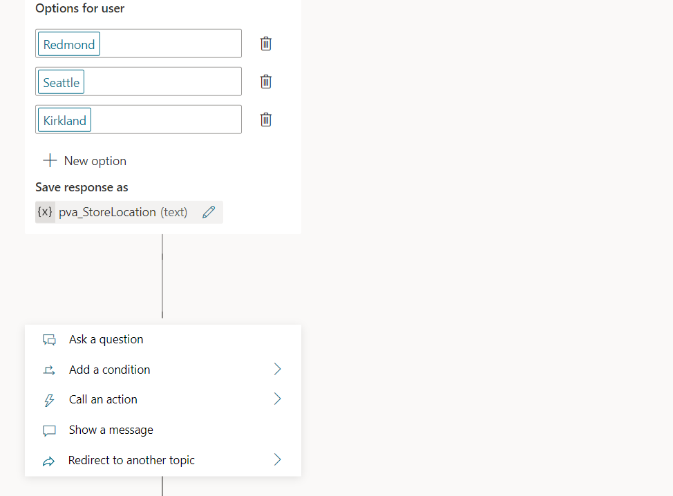
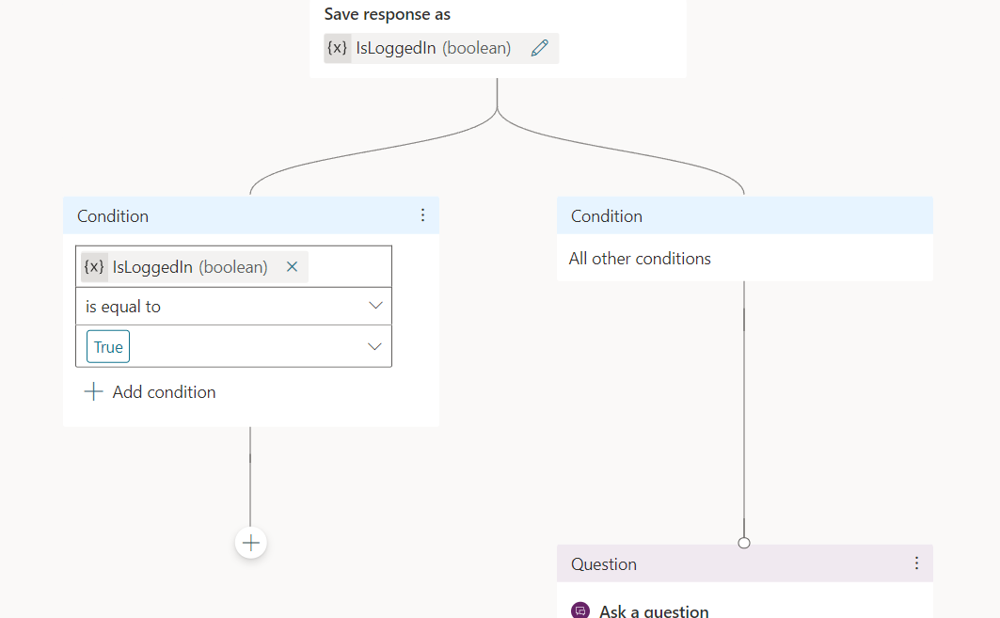
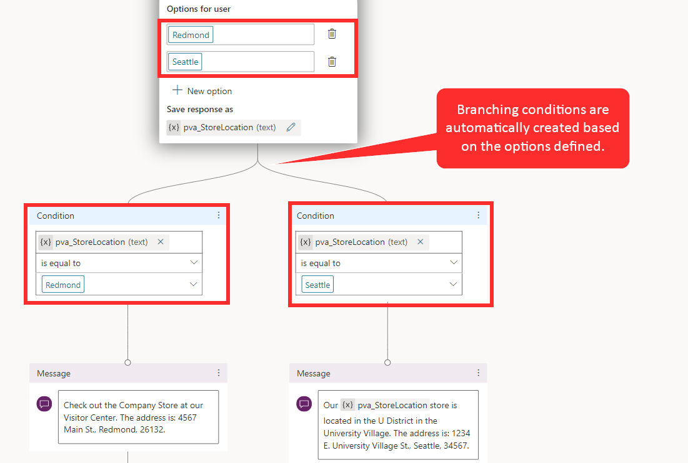

Adding branching into a topic is what truly turns it from a one-way path into a multi-layer conversation. Different forks and paths ensure that the customer is provided data and resolutions based on the current situation.

Branching allows you to evaluate conditions to initiate conversation nodes to launch another topic, display a message node, or trigger a Power Automate flow. You can manually add branching conditions between nodes, such as inserting a branch after you ask a question like "What country do you live in?" The customer's response to the question is stored as a variable, and branch conditions can be built based on that variable. You can add branching by selecting the plus (**+**) icon to add a node and then selecting **Add a condition**.

> [!div class="mx-imgBorder"]
> 

You can select how the bot conversation should branch at this point. For example, if you have set up [end-user authentication](https://docs.microsoft.com/power-virtual-agents/advanced-end-user-authentication/?azure-portal=true), then you might want to specify a different message if the user is signed on (which might have happened earlier in the conversation).

> [!div class="mx-imgBorder"]
> 

Depending on what you select in the **Identify** field of the question node, branching might occur automatically. Automatic branching is always the case when you select **Multiple choice options**. Each option will have a branch created for it. For example, if you have a question node that asks a customer for their preferred store location and then provides them with **Seattle** and **Bellevue** as options, a condition branch for each option will be created. You will need to ensure that you are providing a completed path resolution for both items.

> [!div class="mx-imgBorder"]
> 
