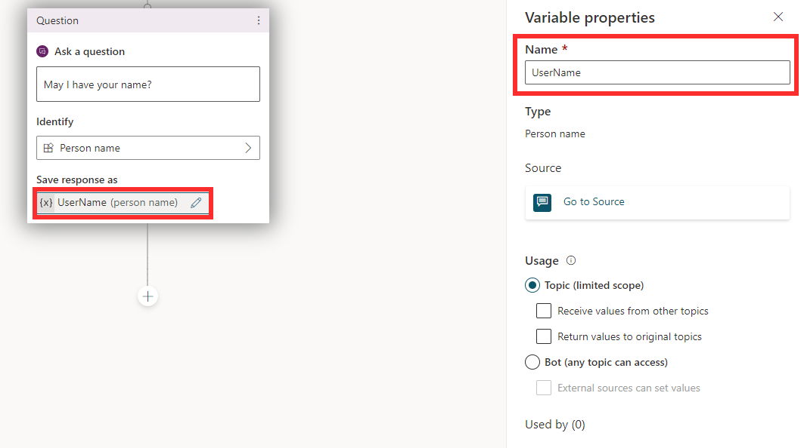
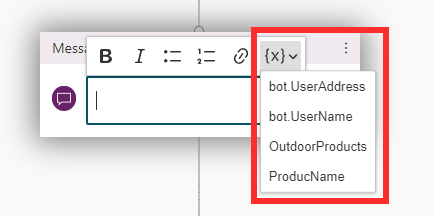
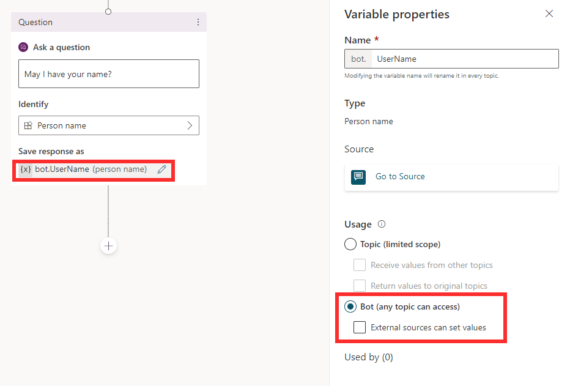

With Power Virtual Agents, you can use variables to store important information that is entered by the customer for later use. For example, you can save a customer's name in a variable called UserName. This variable can be inserted into conversation nodes to create a more personal experience for the customer, such as inserting it into the **Message** node, to allow the bot to address the customer by name as the conversation continues.

Variables can be used to dynamically route customers down different conversation paths. They can also be fed into [Power Automate](https://docs.microsoft.com/power-virtual-agents/advanced-flow/?azure-portal=true) flows or [Bot Framework Skills](https://docs.microsoft.com/azure/bot-service/bot-builder-skills-overview?view=azure-bot-service-4.0/?azure-portal=true) as input parameters. For example, the city that the customer lives in could be stored in a variable. When a Power Automate flow is run, the variable could be passed through as an input parameter to ensure that the weather service is getting the correct forecast.

For a complete list of variable types, see [Entity and variable types](https://docs.microsoft.com/power-virtual-agents/authoring-variables#entity-and-variable-type/?azure-portal=true).

### Create variables

Variables are created automatically when you add a question node to a topic. By default, when a question node is inserted, it will be created by using multiple-choice options. However, any prebuilt or custom entity can be used by selecting it in the **Identify** field.

> [!div class="mx-imgBorder"]
> 

### Rename a variable

When a variable is automatically created, a default name will be given. If desired, you can rename a variable by selecting it and then entering a new name.

> [!div class="mx-imgBorder"]
> 

### Use variables across topics

By default, a variable's value can only be used in the topic where the variable is created. However, scenarios might occur when you will want to use the same value across topics. Bots can remember the necessary variable context when a conversation spans multiple topics. For example, a **Welcome** topic could ask for the customer's name and email address. When the conversation goes to another topic, such as **Appointment Booking**, you might want the bot to remember the customer's name and email address. In Power Virtual Agents, these variables are referred to as bot variables because they apply across the entire bot.

Bot variables apply during the current chat session; they cannot be carried over from one customer chat session to another. You can specify which variables should be treated as bot variables to distinguish them from topic-level variables.

### Set bot variables

After you set a bot variable, it will be available to all topics. When you are composing a bot message, if you select the **{x}** button in a message node or question node, you will see that the bot variable is available. Variables are sorted in alphabetical order, so you will find that all bot variables are grouped together in the variable menu because they all begin with the word "bot."

> [!div class="mx-imgBorder"]
> 

When you use a condition node, a flow action node, or a skill node, you will also see available bot variables in those sections.

### Reuse a variable across topics

To define a variable as a bot variable, open it in the authoring canvas. You can accomplish this task by opening the **Ask a question** node that is storing the variable that you want to work with. On the **Variable Properties** pane, under **Usage**, select **Bot (any topic can access)**. The variable name will be given a prefix string of **bot** to differentiate it from the topic-level variables. For example, the variable UserName is now shown as bot.UserName. When you convert a variable to a bot variable, make sure that the variable is unique across all topics. If a conflict is encountered, you will need to rename the variable before saving your change.

> [!div class="mx-imgBorder"]
> 

### Manage bot variables

After you have created a bot variable, you can see where it is first defined and what other topics are using it. This feature can be useful if you are working on a new bot or if you have multiple variables and complex topic branching.

Two primary items that are available from the **Variable Properties** pane are:

- **Go to the source** - Goes to the node where the variable was initially created.

- **Used by** - Displays all topics where the variable is used so that you can go straight to that topic and node.

For additional information, see [Microsoft Docs](https://docs.microsoft.com/power-virtual-agents/authoring-variables-bot).
