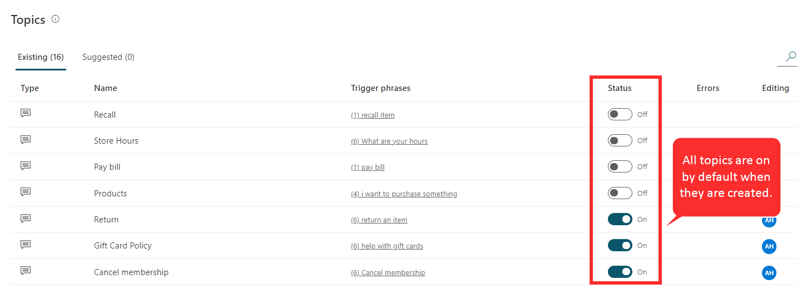
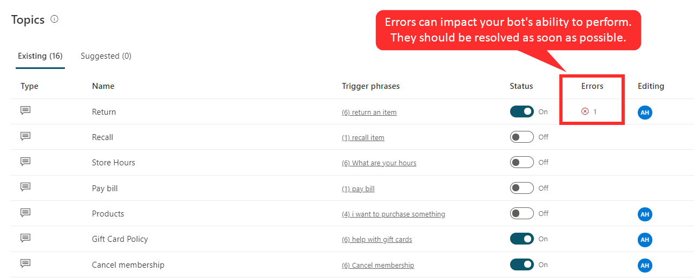
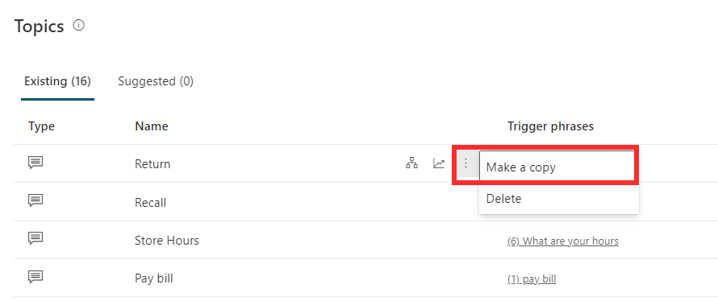

As the number of topics expands in your bot, being able to effectively manage them becomes more imperative. Managing your topics includes understanding which topics are active and can be used by the bot and knowing which ones are still being worked on. Topic management also includes identifying errors that could impact a topic's ability to be used. To help you effectively manage topics, Power Virtual Agents provides multiple features to help ensure that topics are working as intended and are visible to users only after they have been tested and are considered ready.

## Manage topic status

Each topic has a status that indicates if the topic can be used in conversation. A topic can be in either the **On** or **Off** state. When a topic is **On**, it will trigger as expected. This result could be because of its trigger phrases or because another topic was redirected to it. Most topics will be in the **On** state. All topics are set to **On** when they are created.

> [!div class="mx-imgBorder"]
> 

Topics that are in the **Off** state will not trigger at all, and their trigger phrases will not work. Additionally, topics that are in the **Off** state will not be redirected to, even if another topic has specified it. The topic is treated as if it does not exist. In most scenarios, a topic is set to **Off** while it's being worked on until it's ready to go live. When a bot is published, every topic, regardless of whether it's set to **On** or **Off**, will be published. However, any topics that are set to **Off** will not be triggered.

## Work with topic errors

While working on a topic, the Topic Checker feature in Power Virtual Agents will validate your topic and show errors or warnings. Errors or warnings can occur for any number of reasons. Warnings indicate that something is not ideal, but it will not prevent the bot from functioning. Because warnings do not prevent the bot from functioning, they are ignored during processing. Errors, however, need be addressed to avoid unexpected behavior or failure during the chat experience. Errors might occur if a node in your topic is incomplete. Instances that would cause errors include a **Message** node that doesn't provide a message or an authentication issue that occurs with a Power Automate flow that is being launched in an action. The Topic Checker feature provides details that are related to the warning or error to help make your task of resolving these issues easier.

> [!div class="mx-imgBorder"]
> 

Four types of errors that appear in the Topic Checker feature and in the authoring canvas are:

- **Node** - The entire node is erroneous and is highlighted in red.

- **Field** - The field might be missing required data and is highlighted in red.

- **Expression** - The expression might be invalid and is highlighted in red.

- **Variable deletion** - A variable in a topic was deleted and is highlighted in red wherever it was used. This action causes the variable to become "orphaned," and it must be removed or replaced.

You can also see the error state of a topic on the **Topics** list page by selecting the **Topics** tab. The **Errors** column indicates the number of errors that were found during validation. This section only indicates errors and does not include warnings because they do not prevent the bot from functioning. As you fix the errors, they will disappear from the topic checker, either automatically or after you save the topic. Topics with errors can be saved; however, the errors will persist until they are addressed. You cannot deploy a topic that contains errors to production.

> [!div class="mx-imgBorder"]
> 

## Copy a topic

After you have created a few topics, you might want to use a previous topic as a baseline when you are creating new topics. Copying topics saves time when a conversation path is already defined. When you copy topics, you only need to modify the trigger phrases and tailor the conversation path to fit your needs. On the **Topics** list page, hover over a topic, select the menu icon, and then select **Make a copy**. This action will create a duplicate of the selected topic with *(Copy)* appended to the name. All topic content, such as the description, trigger phrases, and the entire conversation, is copied over to the new topic.

> [!div class="mx-imgBorder"]
> 

All copied topics have a status of **Off** by default to avoid confusion on which topic will trigger because it will have the same trigger phrases as the original topic. After you have finished editing the new topic, you can turn it **On** to [test it in the Test bot](/power-virtual-agents/authoring-test-bot/?azure-portal=true) window and, when ready, publish the new topic.
