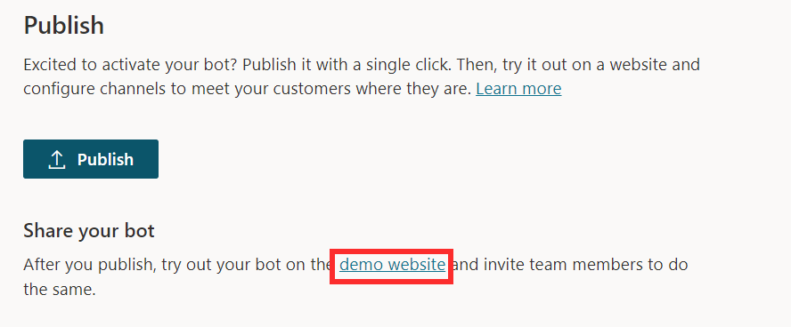
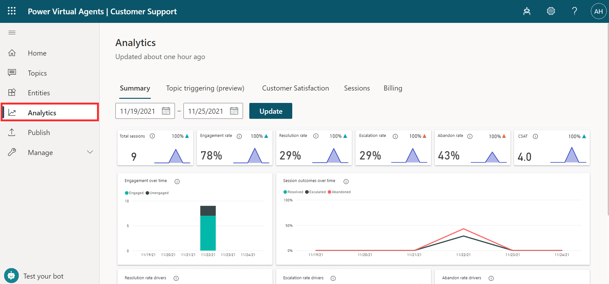

After your bot content has been created, it needs to be published so that customers can engage with it. Published bots can be made available across multiple platforms and channels. Before a bot can be added to channels, interacted with, or used by team members, it will need to be published at least once. For example, a bot can be deployed to organizational websites, mobile applications, and messaging platforms such as Microsoft Teams or Facebook.

Publishing bots as you make changes also ensures that customers are engaging with the latest bot content. For example, if your organization's store hours change, after you have edited the Store Hours topic to reflect the changes, you will need to publish it again from within the Power Virtual Agents portal. After the bot has been published again, the updated content will be used by all channels that the bot is configured on.

## Publish a bot

When you are ready to publish your bot, select the **Publish** tab on the side navigation pane. During the publishing process, the bot will be checked for errors. Bot publishing typically takes a few minutes. When the publish is successful, the top of the page will display a green banner indicating that everything worked correctly. If errors are detected, you will be notified through a message that is displayed in the application.

> [!div class="mx-imgBorder"]
> 

Before the bot is deployed to the different channels that use it, you might want to gain feedback from other team members. When a bot is first published, it can be made available to the demo website. You can provide the demo website's URL to team members or stakeholders to try it out. The advantage of using the demo website is that the experience is different than testing the bot during the design process. Because the test bot experience is only intended to allow bot authors to test it, the demo website link increases the pool of users that can test and provide feedback that is related to the overall experience of the bot.

To add a bot to the demo website, select the demo website link under **Share your bot**. This webpage demonstrates what your bot looks like to a user who comes to your webpage. The bot canvas is at the bottom. You can interact with it by entering text in the window or by selecting a starter phrase from the provided options.

> [!div class="mx-imgBorder"]
> 

Now that the bot is published, you can begin to deploy it to other channels.

For more information, see [publishing your bot](/power-virtual-agents/publication-fundamentals-publish-channels/?azure-portal=true) to other channels. 

## Analyze the performance of your bot

After a bot is deployed and customers are interacting with it, statistics that are related to the bot will become available. You can access this information through the **Analytics** tab in the side navigation pane. This pane provides key performance indicators (KPIs) that show the volume of sessions that your bot has handled, how effectively your bot was able to engage users and resolve issues, escalation rates to human agents, and abandonment rates during conversations. You will also find customer satisfaction information at the KPI level and in the **Customer Satisfaction** tab.

> [!div class="mx-imgBorder"]
> 

You can view detailed session history and transcripts by selecting **Sessions** from the **Analytics** tab. This option enables you to download a file with the full session transcript and can be a helpful way for you to adjust the performance of your bot and change the content in your topics to improve your bot's efficiency.
