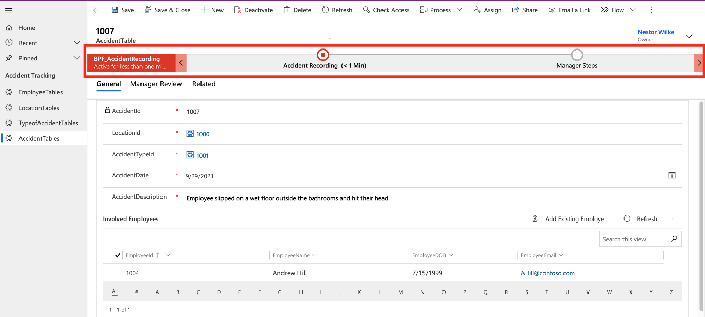

Before delving in let's briefly discuss the main differences between a business process flow and a Microsoft Power Automate flow. A business process flow is a visual guide meant to help users complete a business process by using a set of predefined stages. Users are not limited on how long they run a business process or how long they have a stage open. All data associated with the business process flow can only be in one or more tables in Microsoft Dataverse. Business process flows can only have Dataverse as a data source.

The best way to get familiar with building a business process flow is to create one.

> [!div class="mx-imgBorder"]
> 

A Power Automate flow does not have any visual components like a business process flow. Power Automate flows can be configured to work with many different data sources, and a flow can connect to many different data sources within the same flow. A flow can be configured to time out if it is not completed in a certain time and can be triggered to move between steps based on data or user interaction. Flows support complex logic and looping, and a Power Automate flow can call another Power Automate flow if needed.
