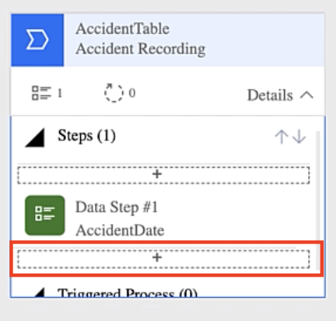
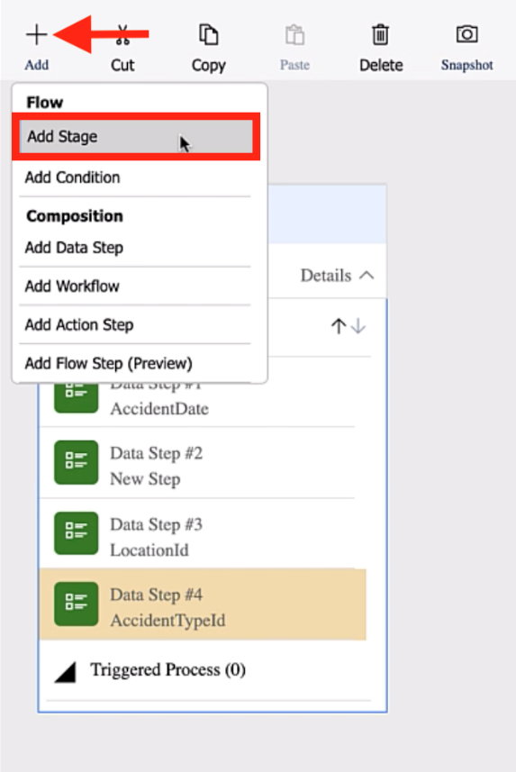

1. To get started, navigate to [make.powerapps.com](https://make.powerapps.com/) and sign in with your Microsoft credentials.

1. Select **Flows**.

1. Select **Business process flows** and then **+New**.

	> [!div class="mx-imgBorder"]
	> 

1. Give your flow a meaningful name. Let's call ours **BPF\_AccidentRecording**.

1. Select the table you want to attach the business process flow to, for our example we will select the **AccidentTable** and select **Create**.

	> [!div class="mx-imgBorder"]
	> 

1. In the business process flow designer, we will create the following:

	-   We want to create a stage to navigate an employee to log an accident.
	
	-   We want to create another stage for managers to enter their comments and approve the accident record.

	> [!div class="mx-imgBorder"]
	> 

1. Give the stage a name by selecting it and then entering a **Display Name.** We will name this stage **Accident Recording**.

	> [!div class="mx-imgBorder"]
	> 

1. Select **Apply**, to update the name.

1. Select the Stage and then select **Details.** This will reveal the first step.

1. Select the Step and on the right under Data Field select **AccidentDate.**

1. The **Sequence** will be left as one because this will be the first field a user will enter when recording a new accident. Check the **Required** box as we want users to always enter a date.

	> [!div class="mx-imgBorder"]
	> 

1. Select **Apply** to save the changes.

1. To add more steps to the stage, select **+Add** and then select **Add Data Step**.

	> [!div class="mx-imgBorder"]
	> 

1. Select the stage and then select the **+** at the bottom of the first step to add it below.

	> [!div class="mx-imgBorder"]
	> 

1. Select the new step and then select the **Data Field** to associate to this step, for this example we will select **AccidentDescription**.

1. Check the **Required** box and then set the Sequence to **2**.

1. Select **Apply**.

	> [!div class="mx-imgBorder"]
	> 

1. Repeat steps 13 to 17 above and add the following fields from our **AccidentTable**:

-   **LocationId:** Users will select a location the accident occurred on.

-   **AccidentTypeId:** Users will select the type accident that occurred.

	Next, we will add another Stage to store the steps managers will complete.

1. Select the **+Add** and then select **Add Stage**.

	> [!div class="mx-imgBorder"]
	> 

1. Select where the stage should be added and give it a name, for our example we will call this stage **Manager Steps**.

1. Repeat steps 9 through 17 above and add the following steps to this stage:

	-   Manager Comments

	-   Manager Reviewed

	> [!div class="mx-imgBorder"]
	> 

1. Once completed, select **Activate**.