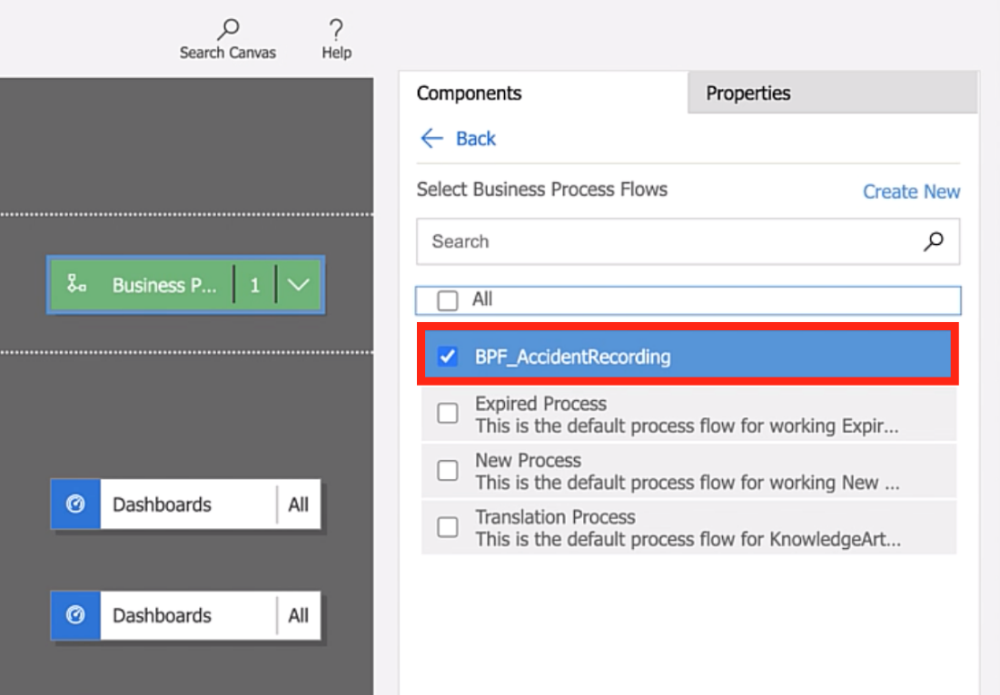
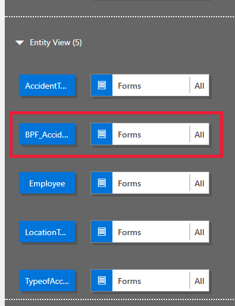
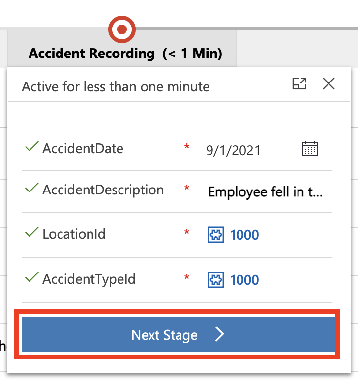
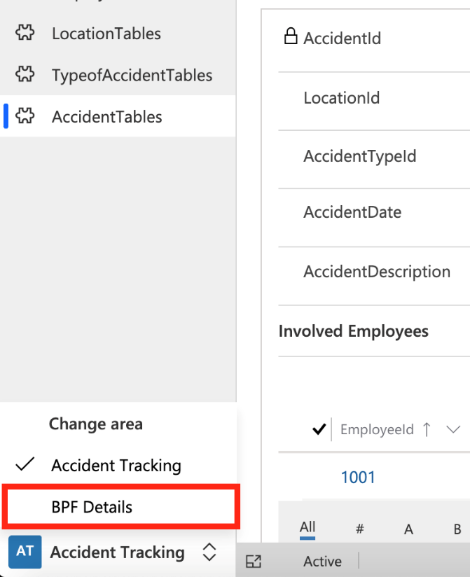

The best way to learn how to attach the business process flow created in the prior unit is to perform the steps.

1. From Power Apps, select **Apps**.

1. To the right of the **Accident Tracking Application** select the ellipsis **...** and then select **Edit**.

1. Once the App designer opens, select **Business Process Flows**.

	> [!div class="mx-imgBorder"]
	> 

1. Select the business process flow we created in the previous exercise, which was **BPF\_AccidentRecording**.

	> [!div class="mx-imgBorder"]
	> 

1. You should notice a new **Entity** (Table) added to the **Entity View**.

	> [!div class="mx-imgBorder"]
	> 

	The next steps will be to add a place inside our model driven app to view the data from the business process flow entity. This will allow users to see the status and other data related to the BPF.

1. Select **Save**, to save the changes before performing the next steps.

1. In the **Site Map,** select **Edit** (pencil icon).

1. Select **+ Add** and then select **Area**.

1. Name this new Area **BPF Details**.

1. Select the new Area and then select **+ Add Group**.

1. Name this new Group the same, **BPF Details**.

1. Select the new Group and then select **+ Add Subarea**.

1. For Type, select **Entity**.

1. For the Entity, select **BPF\_AccidentRecording**, which is the business process flow we created earlier in our example.

	> [!div class="mx-imgBorder"]
	> 

1. Select **Save And Close**.

1. Select **Publish,** to save all changes.

1. Select **Play,** to review the business process flow.

1. Select **AccidentTables** inside the model-driven app and then select **New** to create a new record.

1. In the New AccidentTable form, you will see our business process flow with the two stages added at the top.

	> [!div class="mx-imgBorder"]
	> 

1. Select the **Accident Recording** step and it will reveal the data steps needed to record a new accident.

	> [!div class="mx-imgBorder"]
	> 

1. Enter a new record inside the Business Process Flow:

	-   **AccidentDate:** *9/1/2021*
	
	-   **AccidentDescription:** *Employee fell in the kitchen.*
	
	-   **AccidentTypeId:** Select *Slip and Fall* (Remember to press Enter to reveal a list of the accident type names)
	
	-   **LocationID:** Select *Contoso Main Factory* (Remember to press Enter to reveal a list of the location names)

1. Select **Save**.

1. Add an employee to the accident record, for our example we will be adding **Olive Yew**.

1. To finalize the new accident recording stage, select the **Accident Recording** stage and then select **Next Stage** to send it to the Manger Review stage.

	> [!div class="mx-imgBorder"]
	> 

	The next step is to review the records in the **BPF\_AccidentRecording** table to illustrate how the business process flow data is recorded in a table.

1. At the bottom left select the **BPF Details** Area we created earlier.

	> [!div class="mx-imgBorder"]
	> 

1. In this form, you will see a view showing the record we just entered, and the current business process flow **Active Stage** as **Accident Recording**.

	> [!div class="mx-imgBorder"]
	> 
