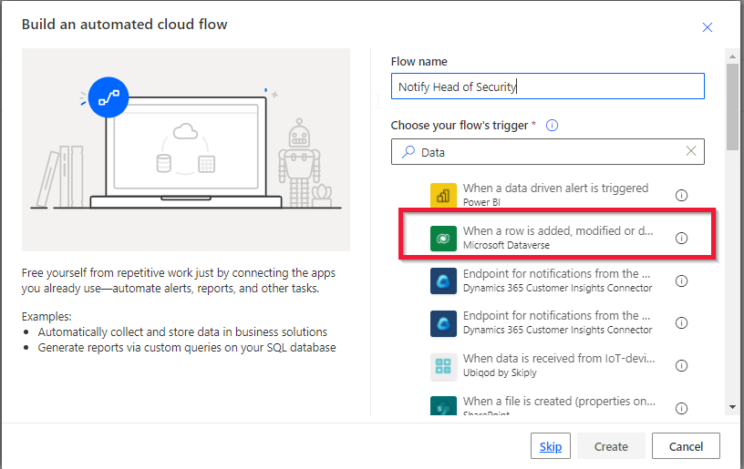
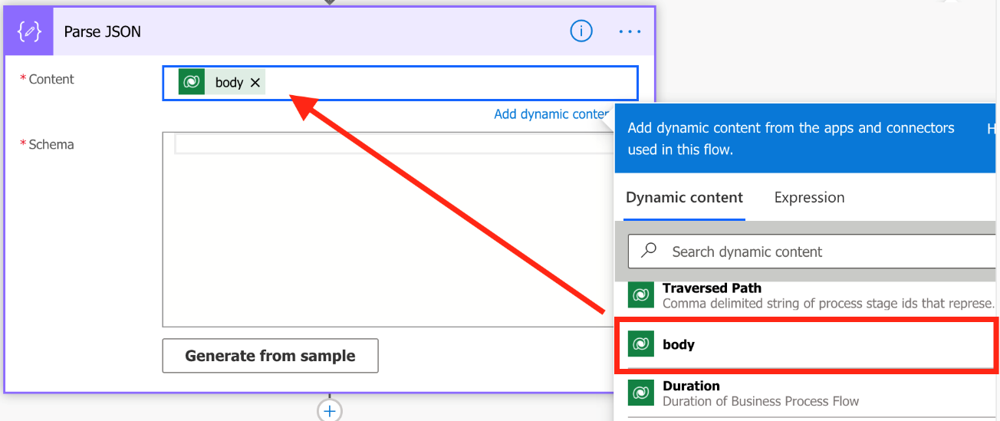
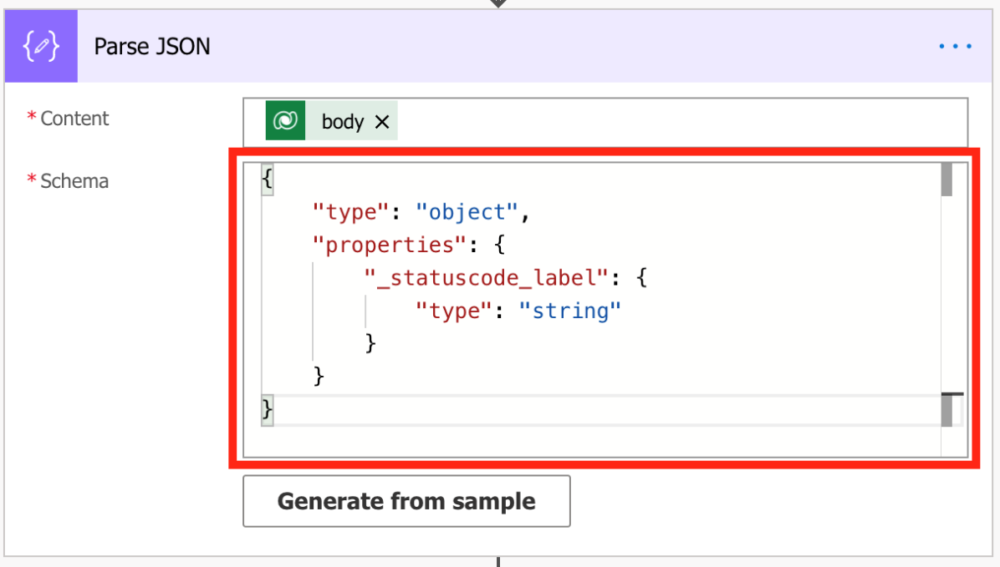
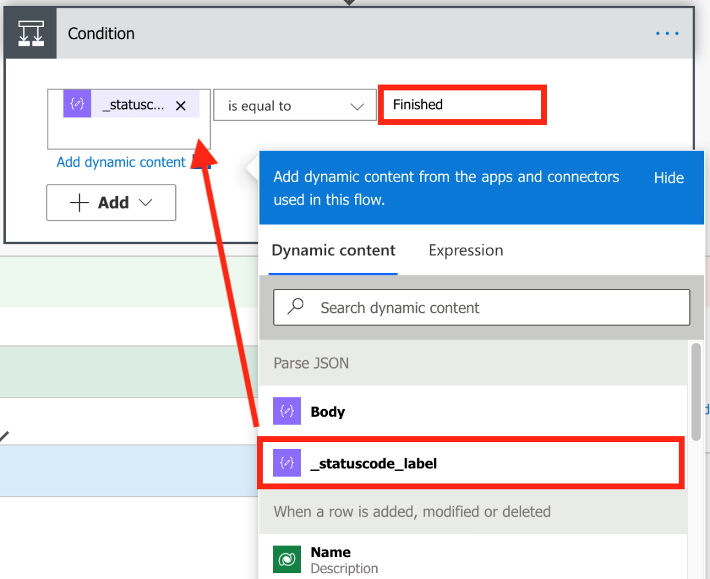
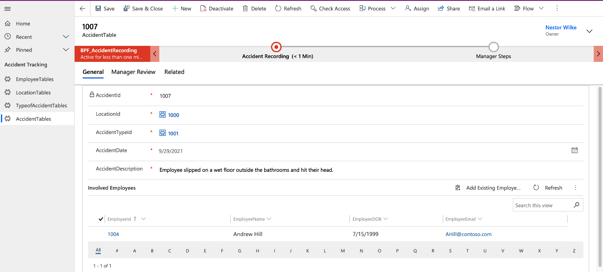
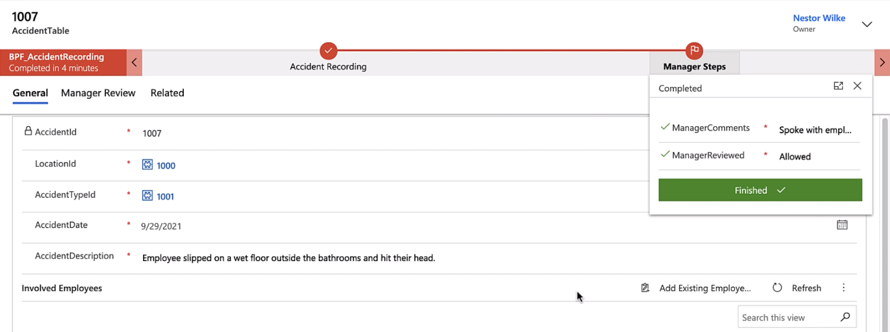

In this scenario, we will want to send an email automatically to the head of security compliance of Contoso when an accident has been reviewed by a manager. We will use Power Automate flows to accomplish this requirement. The next steps assume that you are familiar with Power Automate flows.

1. From Power Apps, select **Flows**.

1. Select +**New Flow** and then select **Automated Cloud Flow**.

1. Give your flow a name, for this example let's call it **Notify Head of Security**.

1. Search for **Data** and select **When a row is added, modified, or Deleted**.

	> [!div class="mx-imgBorder"]
	> [](../media/row-added.png#lightbox)
	
1. Select **Create**.

1. On the trigger select the following:

	-   **Change type:** *Modified*
	
	-   **Table name:** *BPF\_AccidentRecording* (We will use the table created by the business process flow)
	
	-   **Scope:** *Organization*

	> [!div class="mx-imgBorder"]
	> [](../media/trigger-details.png#lightbox)

The trigger above will run the flow every time a business process flow is changed. For example, once a manager completes the accident recording process. The trigger will return information about the business process flow in JSON format. We need to identify when the **Status Reason** of the BPF is *Finished.* To accomplish this, we will parse through the JSON output of our trigger.

	> [!div class="mx-imgBorder"]
	> [](../media/status-reason.png#lightbox)

1. Select **+ New step**.

1. In the Search connector box type "json" and under Actions, select the **Parse JSON** action.

1. For the Content, select in the empty box and under Dynamic content select **body**.

	> [!div class="mx-imgBorder"]
	> [](../media/body.png#lightbox)

1. For the Schema, paste the following code:

	```json```
	{
	    "type": "object",
	    "properties": {
	        "_statuscode_label": {
	            "type": "string"
	        }
	    }
	}
	```

	> [!div class="mx-imgBorder"]
	> [](../media/code.png#lightbox)

1. Then we will want to check whether the status is *Finished.* To do this we will insert a **Condition** action to check.

1. Select **+ New step** and then select **Condition**.

1. For the **Choose a value** box on the left, under Dynamic content select **\_statuscode\_label**, from the Parse JSON output as the condition to test.

1. Leave the default **is equal to** selected.

1. For the **Choose a value** box on the right, type **Finished**, this is the value we want to check if the output is equal to. Below is what your Condition should look like, if it doesn't take a moment to update it accordingly.

	> [!div class="mx-imgBorder"]
	> [](../media/condition.png#lightbox)

1. On the **If yes** branch, we will want to perform actions if the status is equal to **Finished**.

1. Select **Add an action**.

1. In the search box type **Dataverse** and select **Get a row by ID** under Actions.

1. For Table name, select **AccidentTables** form the dropdown.

1. For Row ID, select the **ID** from the trigger of the flow, in our example this is the **Cr533\_Accidenttable (Value)** field.

	> [!div class="mx-imgBorder"]
	> [](../media/row-id.png#lightbox)

1. Select **Add an action,** to add another action.

1. In the search box type **Outlook** and select **Send an email (V2) - Office 365 Outlook**.

1. In the **To** field, enter your email (You can change this later to the head of security).

1. For the **Subject** of the email, enter **New Accident Recorded**.

1. For the Body of the email, enter a combination of Text and Dynamic content, which include the **Accident Description** and the **Manager Comments**. When selecting the Dynamic content, make sure you are selecting fields in the **Get a row by ID section**. See the screenshot below for what information to enter in the email body:

	> [!div class="mx-imgBorder"]
	> [](../media/email.png#lightbox)

1. Once you are finished, select **Save**.

	Now let's test out the new flow.

1.  Navigate back over to Power Apps and select **Accident Tracking Application**.

1.  Once the app opens, proceed with creating a new Accident. Feel free to enter whatever details you would like for this new Accident and when you're finished don't forget to select **Save**.

	> [!div class="mx-imgBorder"]
	> [](../media/new-accident.png#lightbox)

1.  Select the **Accident Recording** stage and then select **Next Stage \>**.

	> [!div class="mx-imgBorder"]
	> [](../media/accident-recording-next.png#lightbox)

1.  For the Manager Steps stage, enter something in **ManagerComments** and in **ManagerReviewed,** select **Allowed**.

	> [!div class="mx-imgBorder"]
	> [](../media/finish.png#lightbox)

1.  Select **Finish** to complete your business flow and trigger the **Notify Head of Security** flow to kick off.

	> [!div class="mx-imgBorder"]
	> [](../media/flow-finished.png#lightbox)

1.  After a few moments, whomever was in the To field of the flow will receive an email notification with the details you entered.

	> [!div class="mx-imgBorder"]
	> [](../media/new-accident-recorded.png#lightbox)