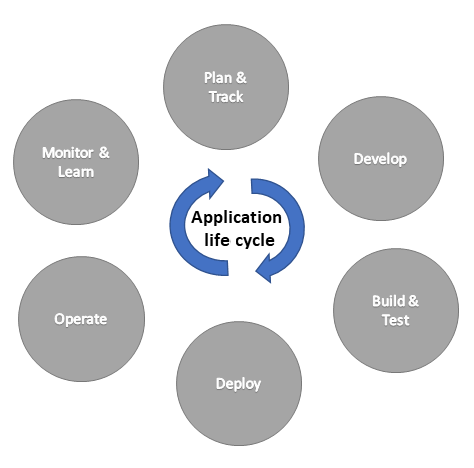

The application lifecycle is the cyclical software development process that involves these areas: plan and track, develop, build and test, deploy, operate, monitor, and learn from discovery.

This module is about defining your environment structure, how you compose your solutions, your application lifecycle management (ALM) strategy, and then how to use Azure DevOps Build and Release pipelines.

## Application Lifecycle Management with the Power Platform

Microsoft uses solutions to package apps and customizations and export from one Dataverse environment as a file and then import that solution package file into another Dataverse environment. The solution packaging supports different scenarios from simple changes to fully automated release management. Microsoft uses the same method for packaging its own first-party apps and updates.

Microsoft also provides tools to enable solutions to be exported from a development Dataverse environment to be imported to test and production environment using Azure DevOps.

The following concepts are important for understanding ALM using the Power Platform.

- Solutions are the mechanism for implementing ALM; you use them to distribute components across environments through export and import. A component represents something that you can potentially customize. Anything that can be included in a solution is a component, such as site maps, apps, entities, fields, charts, or plug-ins.
- Dataverse stores all the artifacts, including solutions.
- Source control should be your source of truth for storing and collaborating on your components.

## Microsoft's vision

Power Platform vision for ALM is to enable apps and customizations to be easily deployed through automated processes.

- Quick Start: Enable app builders to get set up with an environment with the latest build and connected to source control and make a change quickly
- Build: Simplify tooling, consolidate portals and speed up inner loop
- Deploy: Enable an automated repeatable (predictable) deployment methodology
- Manage: Invest in other environment management capabilities to offer more flexibility for app builders to use and dispose pre-configured environments as needed
- Monitor: Application telemetry and feedback loop by design

Solution architects should understand the vision and journey Microsoft is on to shape how ALM is done for Power Platform projects.  As this journey evolves, solution architects should continue to shape their own plans to apply the capabilities provided by the platform and tools.

## Solution Architect’s role

The Power Platform solution architect needs to define the environment strategy and application lifecycle management for transporting work from development to test to production.

The solution architect should:

- Lead the establishment of an application lifecycle management (ALM) plan.
- Evaluate and determine the amount and sophistication of the ALM that is appropriate for the project.
- Work with the various teams to support their efforts to implement execute the plan.
