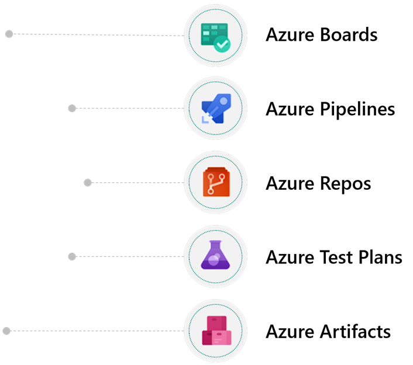
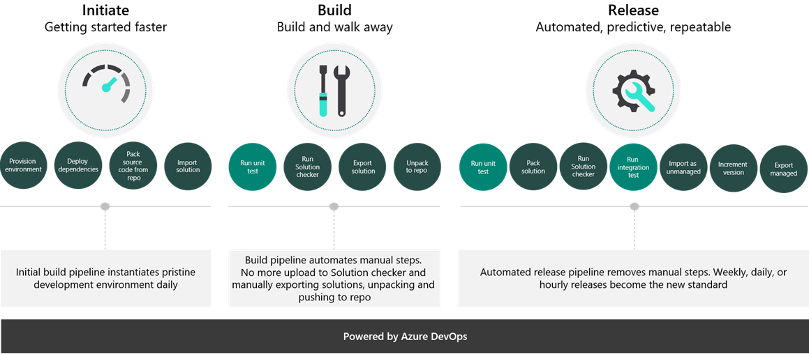

The solution architect leads the effort to define the process for how changes will be promoted from dev to production. This includes defining the number of stages for example, Dev -> Test -> Prod and the processes to do the promotion regardless if manual or automated.

Microsoft is building tools to support doing this with Azure DevOps using continuous integration (CI) and continuous deployment (CD).

This section provides an overview of Azure DevOps and how DevOps can be used with the Power Platform to automate deployments.

## Azure DevOps

Azure DevOps provides developer services for support teams to plan work, collaborate on code development, and build and deploy applications.

Azure DevOps contains many features to help the development of applications:

- Azure Boards: Plan, track, and discuss work across your teams
- Azure Pipelines: Use to automate continuous integration and continuous deployment (CI/CD) builds and releases.
- Azure Repos: Source Control to store and track changes.
- Azure Test Plans: Plan, execute, and track scripted tests.
- Azure Artifacts: Publish solutions built by build pipelines.

## Pipelines

The Power Apps builds tools automate common build and deployment tasks related to Power Apps using Azure Pipelines.

Build pipelines can be used to:

- Create dev environments.
- Commit changes from dev to source control.
- Solution Checker.
- Automated Testing.
- To build output solutions from source control (for example, managed/unmanaged).

Release pipelines can be used to:

- Take solutions from build pipelines and deploy them to one or more test/prod environments.
- Perform automated testing as part of release process.
- Pause for approvals before progressing to next environment.

The Power Platform Build Tools tasks can be used along with any other available Azure DevOps tasks to compose your build and release pipelines. Pipelines that teams commonly put in place include Initiate, Export from Dev, Build, and Release.

## Alternative automation tools

There are alternatives for automating deployments without using Azure DevOps:

- Dataverse and Admin APIs can be used to automate from any supported language.
- PowerShell can be used instead of build tasks for more control.
- Power Automate can also be used with the platform admin connectors to automate deployments.
- GitHub actions are currently in preview.
