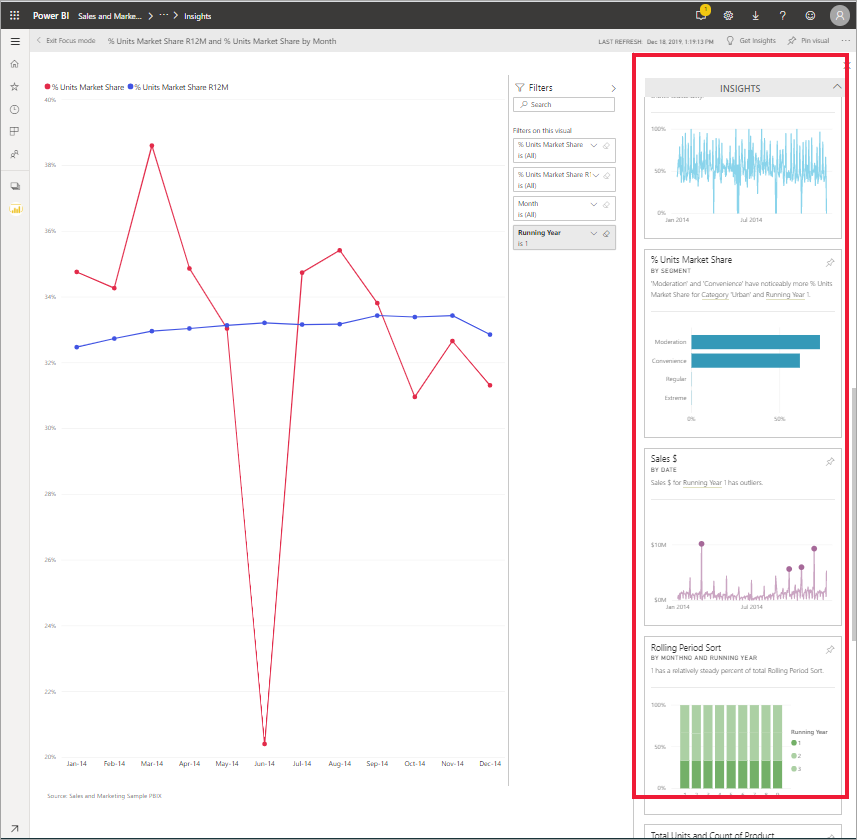
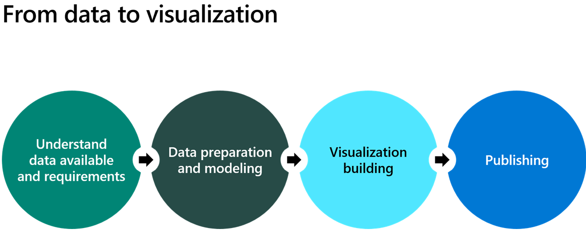

Microsoft Power BI is a collection of software services, apps, and connectors that work together to turn your unrelated sources of data into coherent, visually immersive, and interactive insights. Whether your data is a simple Microsoft Excel workbook, or a collection of cloud-based and on-premises hybrid data warehouses, Power BI lets you easily connect to your data sources, visualize (or discover) what's important, and share that with anyone or everyone you want.

Power BI can be simple and fast, capable of creating quick insights from an Excel workbook or a local database. But Power BI is also robust and enterprise-grade, ready not only for extensive modeling and real-time analytics, but also for custom development. Therefore, it can be your personal report and visualization tool, but can also serve as the analytics and decision engine behind group projects, divisions, or entire corporations

A key advantage of Power BI is the ability to include many data sources such as Salesforce, tables embedded in Web pages, Access, Excel, SQL databases, and Mailchimp. And of course, Microsoft Dataverse.

Power BI is a self-service platform allowing users to interact with prebuilt datasets, reports, and create their own visualizations.

The basic building blocks of Power BI are:

- Datasets: A collection of data from one or more data sources, cleansed, transformed, and modeled.
- Visualizations: A visual representation of data, like a chart, or a color-coded map. Power BI has may types of visualization.
- Reports: A collection of visualizations on one or more pages.
- Dashboards: A collection of visuals in a single page that you can share with others. Dashboards can be embedded in Power Apps.
- Tiles: A single visualization on a dashboard. Tiles can be embedded in Power Apps.
- Apps: A collection of reports and dashboards that can be shared.

## Power BI capabilities

Power BI offers a range of out-of-the-box visualization options that are available directly from the Visualizations pane. When you select the fields that you want to display in a visualization, you can experiment with all the different visualization types to find the one that best suits your needs.

Common Power BI visualization types:

- Bar and column: Various bar and column chart visualizations that present specific data across different categories in a stacked or clustered format.
- Table: A grid that contains related data in a logical series of rows and columns.
- Line and area: Help present trends over time.
- Pie and donut: Divide the data into segments.
- Treemap: Displays data as a set of nested rectangles. Each level of the hierarchy is represented by a colored rectangle (branch) containing smaller rectangles (leaves).
- Waterfall: Shows a running total as values are added or subtracted, which is useful in displaying a series of positive and negative changes.
- Scatter: Effective when comparing large numbers of data points without regard to time. You can add a play axis to animate how the data changes over time.
- Map: Geographic map with data shown as bubbles.
- Card: A single data point.
- Gauge: A circular arc and displays a single value that measures progress toward a goal or target.
- KPI: Help you track progress toward a specific goal over time

The quick insights feature generates visualizations based on your data. Power BI applies a set of sophisticated algorithms to discover potentially interesting trends and patterns and generates visuals that you use.

There are some AI powered visualizations that a solution architect should consider:

- Q&A: Allows users to ask natural language questions and get answers in the form of a visual.
- Key influencers: Helps you understand the factors that are affecting a specific metric. It analyzes your data for you, ranks the factors that matter, and then displays those factors as key influencers. The visual also helps you to contrast the relative importance of these factors
- Decomposition Tree: Automatically aggregates data and lets you drill down into your dimensions so that you can view your data across multiple dimensions. The Decomposition Tree can be used to conduct root cause analysis.

 A common method for sharing Power BI visualizations is to create a Power BI app. Apps can be shared both internally and externally. Power BI apps can be embedded in other applications. You can see an embedded Power BI app in the Analytics tab in the Power Platform Admin Center.

## Working with Dataverse data

There are two options for using Dataverse data in Power BI:

- Common Data Service (legacy) connector. This is the earlier version of the connector and uses the OData connection to Dataverse. You should use this connector for large datasets that are greater than 80 MB. This version also supports paging of the query results and building reports that use the image data type. OData connections import data into a dataset and are refreshed on a regular interval.
- Dataverse connector. This uses the new Tabular Data Stream (TDS) protocol to connect to Dataverse. This connector can either import the data into the dataset or use Direct Query that permits real-time data.

> [!NOTE]
> You can also use Dataflows that are described later in this module.

The process for creating Power BI visualizations is shown in the following diagram.

Once you have connected to a Dataverse environment, there are a series of activities that should be performed to prepare and model the data:

- Select the tables
- Set fields as the right data type
- Filter data
- Clean and transform data
- Manage relationships
- Use DAX (Data Analysis Expressions) to create measures (KPIs)

Cleanup and transformation are required as it makes it easier to consume the data. For instance, column names, using labels for choice columns, using lookup data, and handling dates.

## Handling dates

Power BI makes extensive use of dates in visualizations. Power BI automatically recognizes data columns and creates hierarchies by week, month, and year. You can use these hierarchies as standard. However, the solution architect should consider the creation of a date, or calendar, table, and link dates to this table. This is best practice in Power BI. A date table creates a row for every date within a range.

A calendar table will:

- Allow visuals to show zero values when there is no data for a date.
- Provide more options for slicing and sorting data according to dates.
- Permits different granularity. For instance it allows a comparison between a table that is based on month with another table based on days.
- Provide more options for using DAX date formulas. SAMEPERIODLASTYEAR or LASTQUARTER type calculations will not work without a date table?
- Allow weekends and holidays to be excluded from calculations.

> [!IMPORTANT]
> Dates in Dataverse are stored in Coordinated Universal Time (UTC).

## Security

When using Power BI you need understand how security on rows is applied. The Security model is managed by Power BI; the Dataverse security model with security roles and business unit hierarchy does not apply on data imported into a Power BI dataset.

Power BI uses the concept of Row Level Security (RLS) to restrict data access for given users. Filters restrict data access at the row level, and you can define filters within roles. RLS is configured in Power BI desktop using rules.

Row Level Security:

- Allows different levels of access for different users to the same content.
- Based on DAX formulas.
- Security logic is applied at "Row Level".
- Is a True/False DAX evaluation for each row.

> [!NOTE]
> If you use the TDS endpoint with Direct Query then the Dataverse security model is applied to the data in Power BI.

## Alerts

Power BI can generate alerts from three visuals: Gauge, Card, and KPI on a Power BI dashboard. In the Power BI service, a rule is added that specifies the threshold for the value and how often it is checked. A notification is triggered every time the condition is met.

Alerts show in the Power BI service, on the Power BI mobile app, are sent by email, and optionally can trigger a Power Automate cloud flow.

## Workspaces vs Environments

Power BI does not use Power Platform environments. Power BI uses workspaces to create separate spaces for datasets, reports, and dashboards. Workspaces as similar to environments. Users can be given roles in a Workspace to allow collaboration when building Power BI components. A user does not need to belong to a workspace to have a report or dashboard shared with them.

## Application Lifecycle Management

Power BI resources cannot be included in Power Platform solution packages and deployment needs to be managed separately.

Power BI has its own Application Lifecycle Management (ALM) process (available with Power BI Premium only) to move Power BI components from one workspace to another. There are three stages:

- Development: This stage is used to design, build, and upload new content with fellow creators. This is the first stage in deployment pipelines.
- Test: This is where test your app to see how it will look for your end users with larger volumes of data.
- Production: The production stage is used to share the final version of your content with business users across the organization.
