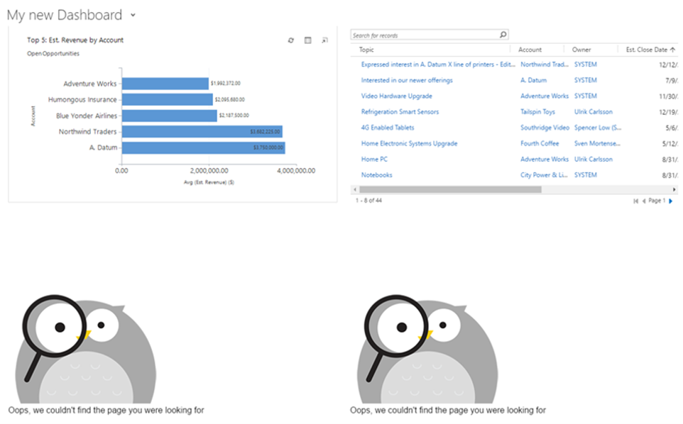
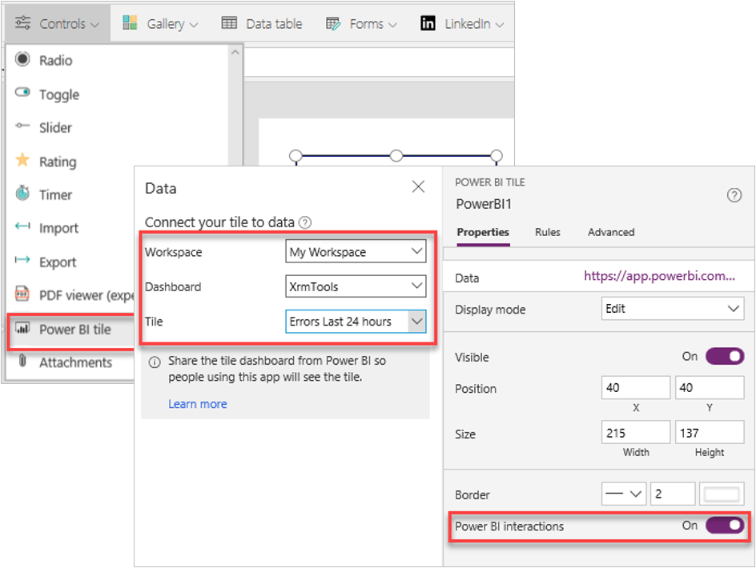
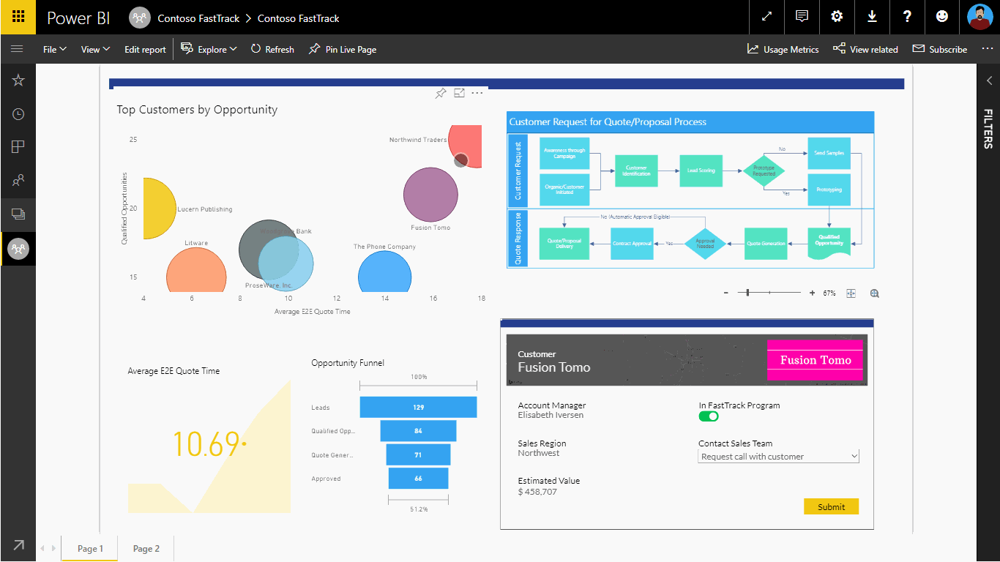

Power BI can be used with the other components of Power Platform.

Power BI content can be:
- Consumed in PowerBI.com. 
- Consumed from Power BI mobile and Power BI data alerts.
- Embedded in Power Apps and Microsoft Teams.

To embed Power BI in a model-driven app, an administrator must first enable Power BI visualization embedding for the environment. You can add an entire Power BI dashboard to a model-driven app, or you can add a tile from a Power BI dashboard to a Dataverse dashboard. To add a Power BI dashboard or tile, the maker will select the workspace, dashboard, and tile.

The Power BI dashboard that is used must be shared with the users of the model-driven app. If the Power BI dashboard is not shared, the user will see errors, as shown in the following screenshot.



> [!NOTE]
> Power BI dashboards and tiles can now be added to system dashboards and user dashboards.

To embed a Power BI tile in a canvas app, the maker will add the Power BI control to the screen and then select the workspace, dashboard, and tile, as shown in the following screenshot.



The Power BI dashboard that the tile is from must be shared with the users of the canvas app. If the Power BI dashboard is not shared, users will see an error.

We do not recommend that you have more than three Power BI tiles loaded at the same time within an app. The **LoadPowerBIContent** property controls the loading of Power BI content. When this property is set to **true**, the Power BI content is loaded and shown. When the property is set to **false**, the Power BI content is unloaded, which releases memory and optimizes performance.

It is possible to pass a parameter of type string to the Power BI tile from the canvas app by modifying the **TileURL** property and appending 

```
&$filter=<TableName>/<ColumnName> eq '<Value>'
```
This action allows the tile to be filtered by a value in the canvas app.

A canvas app can be embedded within a Power BI report. The canvas app can interact with the other visuals in the report. A Power Apps visual can be added to the report. The canvas app uses the **PowerBIIntegration** object to integrate the canvas app with Power BI.



## Alerts and Power Automate

Power BI alerts can trigger Power Automate cloud flows. Power BI alerts are rules that trigger an alert when a value exceeds a threshold value. The Power BI alert must be created first and a Power Automate cloud flow will be linked to the Power BI alert.


## Power Automate visual

The new visual in Power Automate is **Preview**. This new visual allows a report author to add a button to a Power BI report that can trigger a Power Automate cloud flow.
