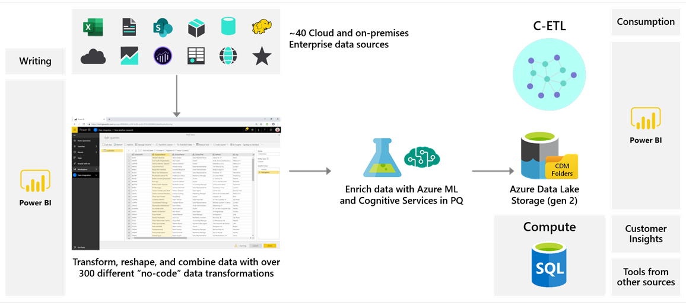

Dataflows are cloud-based extract, transform, and load (ETL) services that help you ingest data from various sources and then convert it into an analysis-ready form. Dataflows can be used by Power BI to process and ingest large volumes of data.

Dataflows are designed to support the following scenarios:

- Create reusable transformation logic that can be shared by many datasets and reports inside Power BI. Dataflows promote reusability of the underlying data elements, preventing the need to create separate connections with your cloud or on-premises data sources.
- Expose the data in your own Azure Data Lake Gen 2 storage, enabling you to connect other Azure services to the raw underlying data.
- Create a single source of the truth by forcing analysts to connect to the dataflows rather than connecting to the underlying systems, providing you with control over which data is accessed and how data is exposed to report creators. You can also map the data to industry standard definitions, enabling you to create tidy curated views, which can work with other services and products in Power Platform.
- If you want to work with large data volumes and perform ETL at scale, dataflows with Power BI Premium scales more efficiently and gives you more flexibility. Dataflows support a wide range of cloud and on-premises sources.
- Prevent analysts from having direct access to the underlying data source. Because report creators can build on top of dataflows, it might be more convenient for you to allow access to underlying data sources only to a few individuals and then provide access to the dataflows for analysts to build on top of. This approach reduces the load to the underlying systems and gives administrators finer control of when the systems are loaded from refreshes.

Dataflows can transform data by using Power Query and enrich data by using Microsoft Azure Cognitive Services and Azure Machine Learning, as shown in the following diagram.

After you’ve created a dataflow, you can use Power BI Desktop and Power BI service to create datasets, reports, dashboards, and apps that use Common Data Model to drive in-depth insights into your business data.

Data that is exported from Dataverse into Azure Data Lake Storage can be imported into Power BI by using dataflows.

## Dataset vs. dataflow

Dataflows are optional but datasets are not. You can't use a dataflow directly; the dataflow populates the dataset.

If you don't use a dataflow and only use datasets, the dataset preparation is done repeatedly in each dataset. With dataflows, the dataflow performs the data preparation once, and then each dataset uses the pre-done prep. Dataflows can also have computed entities that are the needed insights for a report.

You will always use datasets, but you can choose to use a dataflow if it helps.

## Enterprise BI

Enterprise BI, where data is extracted for use in broader enterprise reporting tools, has many benefits:

- Reduces load on operational data stores
- Allows for transformation and historical analytics
- Allows for use with reporting tools from other sources

The following diagram shows use of Data Export Service to extract data from Dataverse and populate a data warehouse that reporting tools such as Power BI can use.

> [!NOTE]
> You could substitute Export to Azure Data Lake in place of Data Export Service.
