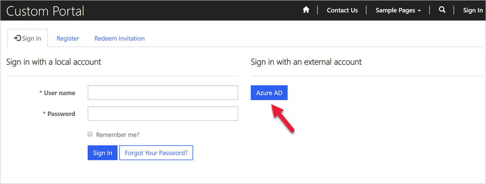
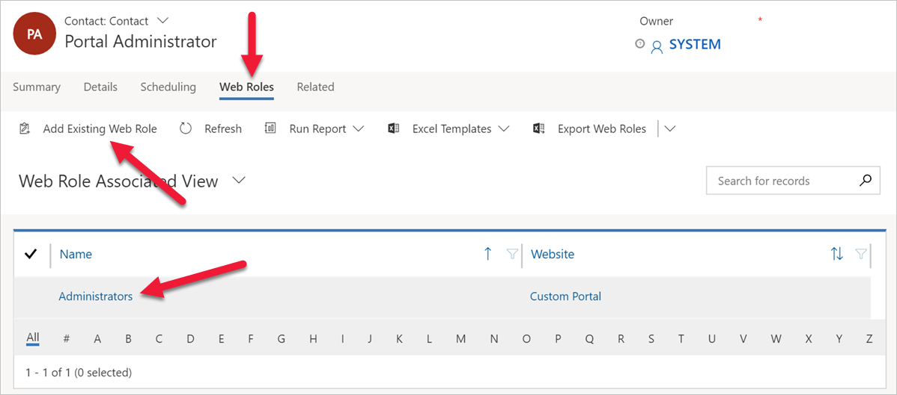

Microsoft Power Apps portals extends model-driven Power Apps solutions to internal and external audiences such as communities, customers, partners, and employees. As part of this process, portal visitors can access portals as anonymous or authenticated users.

For authenticated users, accessing and using the portal involves a two-part process:

- **Authentication** - The process of validating the user's identity. This process is a verification of "they are who they say they are."
- **Authorization** - The process of verifying that a user has access to something, such as a specific portal page or a Microsoft Dataverse record. This process determines if "User A can do X."

The following sections discuss authentication in more detail.

## Track users as contacts

Authenticated users are *always* tracked in Dataverse as contacts, regardless of the portal template that is used to provision the portal. The process is the same whether the user is external or an employee; neither depends on the authentication method that is used.

Portal users can authenticate with the following methods:

- **Local authentication** - Common forms-based authentication with usernames and password hashes that are stored in the Dataverse contact record.
- **External authentication** - Credentials and password management are handled by external identity providers, such as Microsoft Azure Active Directory B2C (Azure AD B2C), Microsoft, Twitter, and so on.

Portal administrators can choose to enable or disable any combination of authentication options through the portal site settings.

All interactions and actions that a portal user takes (for example, leaving comments on a page) are tied to their contact record in Dataverse.

## Contact extensions

To support authentication, Power Apps portals extends the **Contact** entity and adds the **External Identity** entity. Several attributes and specific **Portal Contact** forms are also added to the contact record.

These extensions allow administrators to:

* Control parts of the authentication process, for example, if sign-in is enabled for the contact.
* Access portal-specific contact information.
* Provide registration and profile management forms for the portal.
* Support password-based local authentication.
* Enforce password and lockout policies.
* Manage user's identities when external providers are used.

> [!div class="mx-imgBorder"]
> 

## Administrator as portal user

Portal users are not defined when Power Apps portals is provisioned. You, the person who provisioned the portal, already have access to Dataverse as a system administrator. It's common practice to ensure that you can access the portal as an *external* user as well.

- Sign in to the portal by using Azure AD authentication. If **Open Registration** is enabled (and it is by default), a contact record will be created as required.

   > [!div class="mx-imgBorder"]
   > 

- If it's the first time that Azure AD authentication is being used, you might be prompted to provide consent for the portals web app to access user information. You can consent on behalf of the organization so that individual users won't be prompted.

- Locate and open the contact record that you created. The contact record will have the same email address as the signed in Azure AD user.
- Go to **Related > Web Roles**. Associate the **Administrators** web role with the contact.

> [!div class="mx-imgBorder"]
> 

These steps will ensure that this Azure AD user has full administrative permissions when they are accessing the portal as an *external* user.

> [!VIDEO https://www.microsoft.com/videoplayer/embed/RE4Amwt]
