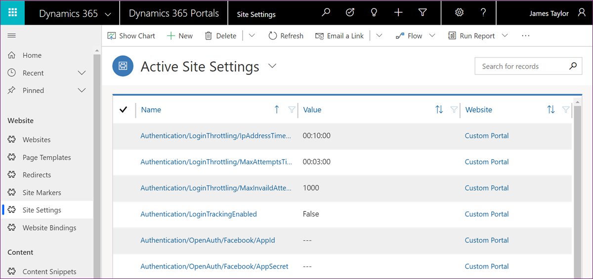

Many authentication options that are supported by Power Apps portals are configured by using site settings. Site settings are stored in the **Site Settings** entity, where each setting is defined as a Name/Value pair.

To view site settings, open the Power Apps portals app by going to [Dynamics 365 Home](https://home.dynamics.com/?azure-portal=true) and selecting **Power Apps portals**. In the app, select **Site Settings** in the navigation panel.

> [!div class="mx-imgBorder"]
> 

Only a few of the many available authentication-related site settings are installed when you provision a starter portal. Settings that are not created assume their documented default values.

## Example of a setting

An example of the need to add a site setting is when you provision a custom portal and the form for registering a new local account requires an email address and a username.

> [!div class="mx-imgBorder"]
> 

To enable a local account sign-in by using an email address instead of a username, you can add the `Authentication/Registration/LocalLoginByEmail` setting and set it to **True**.

> [!div class="mx-imgBorder"]
> 

As a result, the form and the process for registering a new local account now require an email address only.

> [!div class="mx-imgBorder"]
> 

Also, the sign-in form will now refer to **Email** instead of **Username**.

> [!div class="mx-imgBorder"]
> 

> [!NOTE]
> Where a function is enabled by default, a site setting needs to be created to disable that function. For example, adding the `Authentication/Registration/ResetPasswordEnabled = False` setting is required to disable the password reset feature for local authentication.

## Authentication settings categories

All authentication-related site settings start with **Authentication**.

Authentication settings can be grouped into three broad categories, each covering settings to control various aspects of authentication processes.

| Group                                | Description                                                  |
| ------------------------------------ | ------------------------------------------------------------ |
| **Authentication/Registration**      | The most extensive group of settings that cover options such as enabling/disabling specific authentication methods, controlling invitation behaviors, password resets, confirmation emails, two-factor authentication, and more. |
| **Authentication/UserManager**       | [User credential validation](/powerapps/maker/portals/configure/set-authentication-identity#user-credential-validation/?azure-portal=true) are settings for adjusting username and password validation parameters. Validation occurs when users sign up for a new local account or change a password. Also included are [user account lockout settings](/powerapps/maker/portals/configure/set-authentication-identity#user-account-lockout-settings/?azure-portal=true). |
| **Authentication/ApplicationCookie** | It's not uncommon to see enterprise requirements for specific cookie behaviors such as expiration time span. This group defines [Cookie authentication site settings](/powerapps/maker/portals/configure/set-authentication-identity#cookie-authentication-site-settings/?azure-portal=true) for modifying the default authentication cookie behavior. |

For more information, see [Set authentication identity for a portal](/powerapps/maker/portals/configure/set-authentication-identity/?azure-portal=true).
