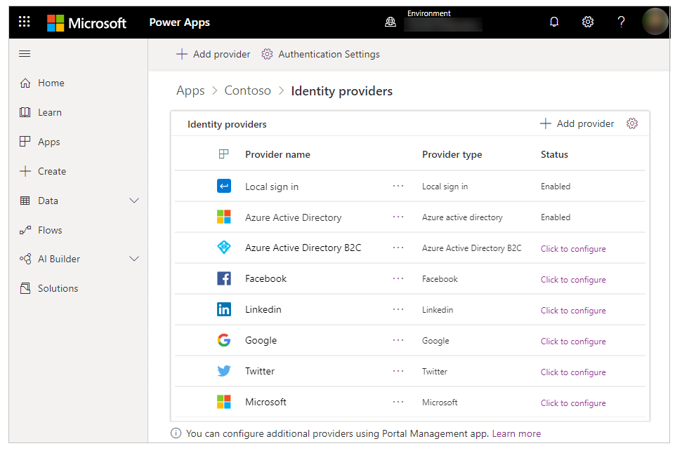

## Local authentication

Local authentication is the common forms-based authentication that uses contact records for authentication. Local authentication settings are configured by using portal site settings, including disabling local sign-in options for the entire portal: [Set authentication identity for a portal](/powerapps/maker/portals/configure/set-authentication-identity/?azure-portal=true).

## External authentication

When external authentication is used, credentials and password management are handled by external identity providers. Supported authentication protocols include:

- WS-Federation and SAML 2.0
- OAuth2 (Microsoft, Twitter, Facebook, Google, LinkedIn, Yahoo)
- OpenID Connect (Azure AD, Azure AD B2C)

## Authentication and provider configuration

Setting up authentication is a core customization in any portal. Simplified identity provider configuration in Power Apps portals provides in-app guidance for identity provider setup and abstract setup complexities. Makers and administrators can configure the portal for supported identity providers by following steps that are documented at [Simplified authentication and identity provider configuration](/powerapps/maker/portals/configure/use-simplified-authentication-configuration/?azure-portal=true).

> [!div class="mx-imgBorder"]
> 

## Azure Active Directory B2C

A portal owner can configure the portal to accept Azure Active Directory B2C (Azure AD B2C) as an identity provider. Azure AD B2C enables external customer sign-ins through local credentials and federation with various common social identity providers.

> [!IMPORTANT]
> Azure AD B2C identity provider is the recommended provider for authentication. If external provider support (such as Facebook) is required, then it can be configured in Azure AD B2C instead of the portal.

The advantages of using Azure AD B2C are that it is:

- Customer identity and access management, not just authentication.
- Customizable, where you can use built-in templates or build sophisticated custom policies.
- Branded experience for your customers.
- Platform-agnostic and supports external providers.
- Identity protection through security controls and multi-factor authentication.
- Supporting open standards and all technology stacks.
- Scalable and reliable, and built and supported by Microsoft, backed by SLA.

### Migration to Azure AD B2C

The portal supports a configurable security system that lets your customers support multiple authentication systems. Going forward, we recommend that you use only Azure AD B2C identity provider for authentication and that you deprecate other identity providers.

You can configure your portal to mark other identity providers as deprecated and allow users to migrate to Azure AD B2C identity provider. If a specific provider (such as Twitter) is required to be supported, it can still be supported by Azure AD B2C instead of the portal.

The steps that are involved in migration are:

- Mark other identity providers as deprecated.
- Migrate deprecated identity providers to Azure AD B2C.
- Disable local sign-in.

Following these steps will ensure an uninterrupted authentication experience for users. For more information, see [Migrate identity providers to Azure AD B2C](/powerapps/maker/portals/configure/migrate-identity-providers/?azure-portal=true).
