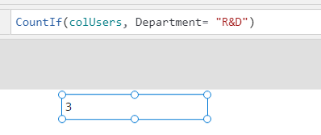

When working with data in Power Apps, there are many reasons to perform
math operations across your data. This math can be counting functions or
aggregate functions. Both support tables of data. Not covered in this
module are additional math functions and operators for non-table data.
For a complete list of all functions, see [Formula reference for
Power Apps](/powerapps/maker/canvas-apps/formula-reference/?azure-portal=true).

## Counting functions

Counting functions are used to compute the number of records in a table
of data based on criteria. They’re often used to provide visual
indicators back to the user.

For example, you could use CountIf(TasksTable, Complete = "No") to count
the number of records in the TasksTable where the column Complete equals
No. Then based on the total, you could conditionally format the Color
property of a label or change the Visible property of an icon. These
types of visual indicators improve the user experience.

Power Apps includes the following counting functions:

- **Count** counts the number of records that contain a
    number in a single-column table.

- **CountA** counts the number of records that aren't
    blank in a single-column table. This function includes empty text
    ("") in the count.

- **CountIf** counts the number of records in a table
    that are true for a logical formula. The formula can reference
    columns of the table.

- **CountRows** counts the number of records in a table.

**Count** and **CountA** only support single-column tables, and that is
the only argument they accept.

**CountIf** accepts a table and then the logical formula to process. It
then returns a count of all the records that match the logical
formula.

> [!div class="mx-imgBorder"]
> 

**CountRows** accepts only a table as an argument and then returns a
count of the number of rows in that table. 

## Aggregate functions

The aggregate functions are used to provide summary information from a table of data. Information like the average sales price or the standard deviation of scores. Think of it as simple reporting on your data that enables a better app experience.

For example, you could use Max(CustomerOrders, SalePrice) to find the
maximum value stored in the SalePrice column of the CustomerOrders
table. With this information, you could confirm that the price entered
in a Form control didn’t exceed that price before letting the user
submit the form.

Power Apps includes the following aggregate functions:

-  **Average** calculates the average, or arithmetic mean,
    of its arguments.

-  **Max** finds the maximum value.

-  **Min** finds the minimum value.

-  **Sum** calculates the sum of its arguments.

-  **StdevP** calculates the standard deviation of its
    arguments.

-  **VarP** calculates the variance of its arguments.

All of these functions support data being passed directly to them,
such as:

> Average(9,10,8)

This formula would return the value 9, which is the average of the three
input values.

Or by passing a table and expression to them such as:

> Average(OrdersTable, OrderAmount)

This formula would return the average of the OrderAmount column from the
OrdersTable. In a later unit, you’ll learn how to split and combine data with
functions. 