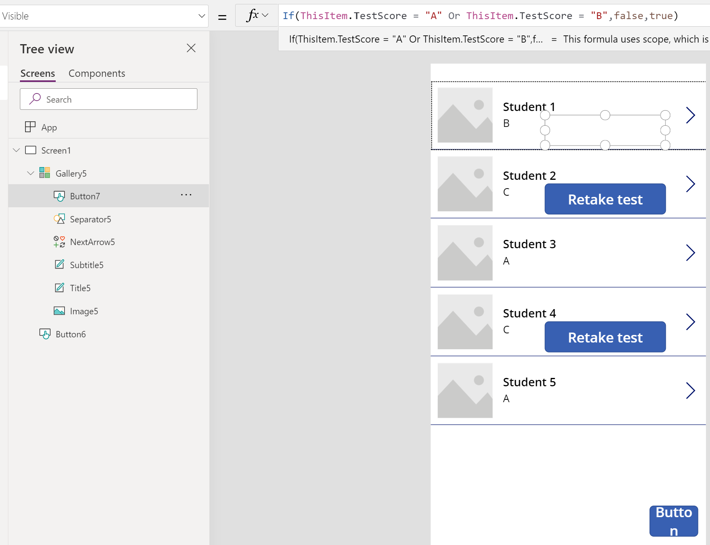

When using formulas, you have the ability to change the way controls
respond and function. For example, in certain scenarios, you can
hide a control on the screen until another action has taken place. This
is done by writing a simple formula to update the **Visible** property
of the control. Or maybe instead of hiding the control, you set the
**DisplayMode** property to **View** which removes the ability to edit
that control. There are many more scenarios where this type of formula
can be implemented in a canvas app. By utilizing these
formulas in your canvas app to modify the **DisplayMode** and or
**Visible** properties of a control, you can develop a more
user-friendly app.

Let's take a look at how you can apply this formula to show and hide a button in a gallery based on the information in our data source. For this example, we will be creating a collection called “TestScoresCollection".

1.	In your canvas app, add a Button control to the screen.

2.	Set the OnSelect property for the button to be
    ```powerappsfl
    ClearCollect(TestScoresCollection,{Name:"Student 1", TestScore:"B"},{Name:"Student 2", TestScore:"C"},{Name:"Student 3",TestScore:"A"},{Name:"Student 4", TestScore:"C"},{Name:"Student 5", TestScore:"A"})
    ```
3.	Hold the alt key on your keyboard and click the Button. (This will generate the TestScoresCollection)

4.	Select **Gallery** from the ribbon **Insert tab**.

5.	From the dropdown, select Vertical. (You may want to reposition the button to the right of the screen so the gallery reaches from the top of the canvas to the bottom)

6.	With the gallery still selected, set the Items property to be TestScoresCollection.

7.	The gallery will update and should now be showing all the information from the TestScoresCollection.

   

8.	Select the first row of the gallery. Add a new button from the ribbon Input drop-down.

9.	Change the Button text property from Button to Retake Test.

   

10.	With the button still selected, click the properties drop down and select Visible.

11.	In the formula box, enter the following code so that this button will only be visible for student grades lower than a B.
    ```powerappsfl
    If(ThisItem.TestScore = "A" Or ThisItem.TestScore = "B",false,true)
    ```

To quickly break this down, if the student gets a test score of an A or a B, they will not be able to see the button or retake the test. But if the student gets anything other than those two tests scores, they will be able to see the button and retake the test. We may be getting ahead of ourselves by using ThisItem as well as Or but doing so is common when building apps and is useful when building your own production apps. 

