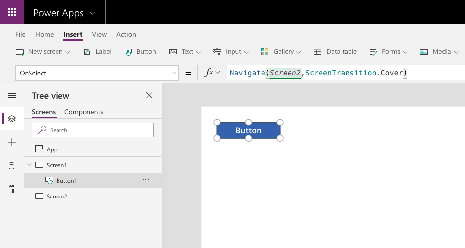

Before developing your production canvas app, try creating a blank test
app or use one of the many great App templates available for free and
play with all the controls. Power Apps has lots of great controls
designed to provide the very best experience for both the maker and the
end user. Controls have a number of different properties that you can modify
to easily enhance the user experience without sacrificing functionality
or performance. As you start to develop your production app, it's very
important to think not only about the purpose of the controls you
incorporate and how they will function but also what action or functionality occurs
when a user interacts with the control.

For example, the **Button** control, when a user selects
the **Button** control, a sequence of actions or behaviors will take
place changing the state of the app. This is done by placing a formula
in the **OnSelect** property of the **Button** control.

-   Change the screen that's displayed -
    [**Back**](https://docs.microsoft.com/powerapps/maker/canvas-apps/functions/function-navigate)
    and
    [**Navigate**](https://docs.microsoft.com/powerapps/maker/canvas-apps/functions/function-navigate)
    functions.

-   Control a
    [signal](https://docs.microsoft.com/powerapps/maker/canvas-apps/functions/signals) -
    [**Enable**](https://docs.microsoft.com/powerapps/maker/canvas-apps/functions/function-enable-disable)
    and
    [**Disable**](https://docs.microsoft.com/powerapps/maker/canvas-apps/functions/function-enable-disable)
    functions.

-   Refresh, update, or remove items in a [data
    source](https://docs.microsoft.com/powerapps/maker/canvas-apps/working-with-data-sources) -
    [**Refresh**](https://docs.microsoft.com/powerapps/maker/canvas-apps/functions/function-refresh),
    [**Update**](https://docs.microsoft.com/powerapps/maker/canvas-apps/functions/function-update-updateif),
    [**UpdateIf**](https://docs.microsoft.com/powerapps/maker/canvas-apps/functions/function-update-updateif),
    [**Patch**](https://docs.microsoft.com/powerapps/maker/canvas-apps/functions/function-patch),
    [**Remove**](https://docs.microsoft.com/powerapps/maker/canvas-apps/functions/function-remove-removeif),
    [**RemoveIf**](https://docs.microsoft.com/powerapps/maker/canvas-apps/functions/function-remove-removeif)
    functions.

-   Update a [context
    variable](https://docs.microsoft.com/powerapps/maker/canvas-apps/working-with-variables#use-a-context-variable) -
    [**UpdateContext**](https://docs.microsoft.com/powerapps/maker/canvas-apps/functions/function-updatecontext)
    function.

-   Create, update, or remove items in a
    [collection](https://docs.microsoft.com/powerapps/maker/canvas-apps/working-with-data-sources#collections) -
    [**Collect**](https://docs.microsoft.com/powerapps/maker/canvas-apps/functions/function-clear-collect-clearcollect),
    [**Clear**](https://docs.microsoft.com/powerapps/maker/canvas-apps/functions/function-clear-collect-clearcollect),
    [**ClearCollect**](https://docs.microsoft.com/powerapps/maker/canvas-apps/functions/function-clear-collect-clearcollect)
    functions.

A very simple but popular example of using the **Button** control is
to change screens when the button is selected. This can be accomplished
using the following formula.

```
Navigate(Screen2,ScreenTransition.Cover)
```




In the example above, the **OnSelect** property for the **Button1**
control triggers the **Navigate** function. Now, when a user selects the
button, the other screen will display, Screen2.
