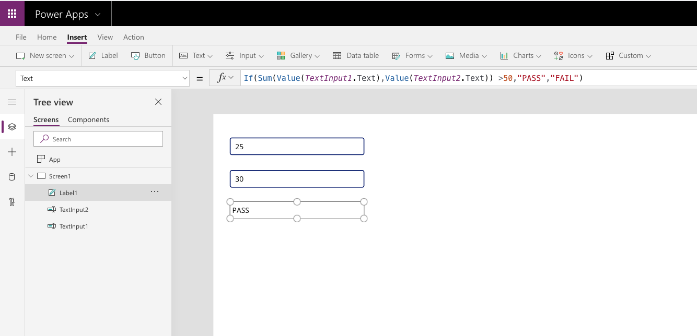

Formulas are designed to enhance functionality, performance, and user
experience in your Power Apps canvas app. Like Excel, in Microsoft Power Apps you can create
single function formulas or combine multiple functions and elements in
the same formula. In Power Apps, you also can modify the way controls
behave and display by defining the control's properties with a formula.
To view all the Power Apps functions, see more information in the
[formula reference for Power Apps](https://docs.microsoft.com/powerapps/maker/canvas-apps/formula-reference).
The following screenshot shows the controls that are available in Power Apps. To view
the full list of controls, see more information in the 
[controls and properties in Power Apps](https://docs.microsoft.com/powerapps/maker/canvas-apps/reference-properties).
This documentation also describes the list of properties available
for each control.


Control properties
------------------

Each control has a specific set of properties. The properties available
are different based on the control type. This is because each control
has a slightly different use case as well as look and feel when users
interact with the app. However, there are a few control properties, such
as Visible, X, Y, and a few others that are present for all controls.
Before developing your app, first try to determine what functionality
you're looking for and then select the control that best fits those needs.

In some cases, depending on the app requirements you can use different controls
interchangeably to get the same results. For example,
**Dropdown** and **Combo box** are similar controls. One key
difference between the two is a **Combo Box** allows you to
search for items as well as select multiple items. The **Dropdown**
control does not support this functionality.

Combining functions
-------------------

As you begin building your app, when possible, combine multiple
functions and elements in a single formula. Creating dynamic formulas is
more efficient and effective, not only for the app developer but also
for the user experience. More single function formulas may mean more
work to maintain, track, and update each formula. By creating
multi-function formulas, updating and maintaining formulas is much
simpler. Also, depending on the size of your app and the number of
single-function formulas, you might encounter performance problems. If possible,
it is more efficient to create
multi-function formulas. The following example combines
multiple functions into a single formula.



The two **Text Input** controls (Textinput1 and Textinput2) have no
formulas or modifications. The **Text** property of the selected
**Label** control (Label1) is a multi-function formula.

```
If(Sum(Value(TextInput1.Text),Value(TextInput2.Text)) >50,"PASS","FAIL")
```

The output of this formula is displayed in **Label1**. The function
converts the text stored in the TextInput1 and TextInput2 controls into
values using the **Value** function. Then those values are added together
using the **Sum** function. In this example, 25 + 30 = 55. The **If**
function then evaluates if the sum of the values (55) is greater than
50. For this example, it evaluates to true (55 is greater than 50), so
the text **PASS** shows in the Label. If the sum had been less than 50,
then the **Label** control would have displayed **FAIL**.

Localization
------------

Power Apps is used to build apps that are used around the globe. Apps can
be written so the user experience is completely in their native language
and regional settings. The portal and other web interfaces
will also reflect your local language.

To help you in your building experience, **Power Apps formulas adapt to
your local language**. For example, you might see the following formula:

```powerappsfl
Filter(DataSource, Price > 12.50)
```

This is the default for languages where the decimal (.) is used to as the decimal
separator. If your language uses the comma (,) as the decimal separator then the
syntax of the formula adapts. The previous formula becomes this.

```powerappsfl
Filter(DataSource; Price > 12,50)
```

Keep this in mind as you start work with formulas and functions. All of
the formulas found in this learning content assume a decimal (.)
separator.

If you need to build apps that support different languages and regions,
see [Build global support into canvas apps](https://docs.microsoft.com/powerapps/maker/canvas-apps/global-apps).
