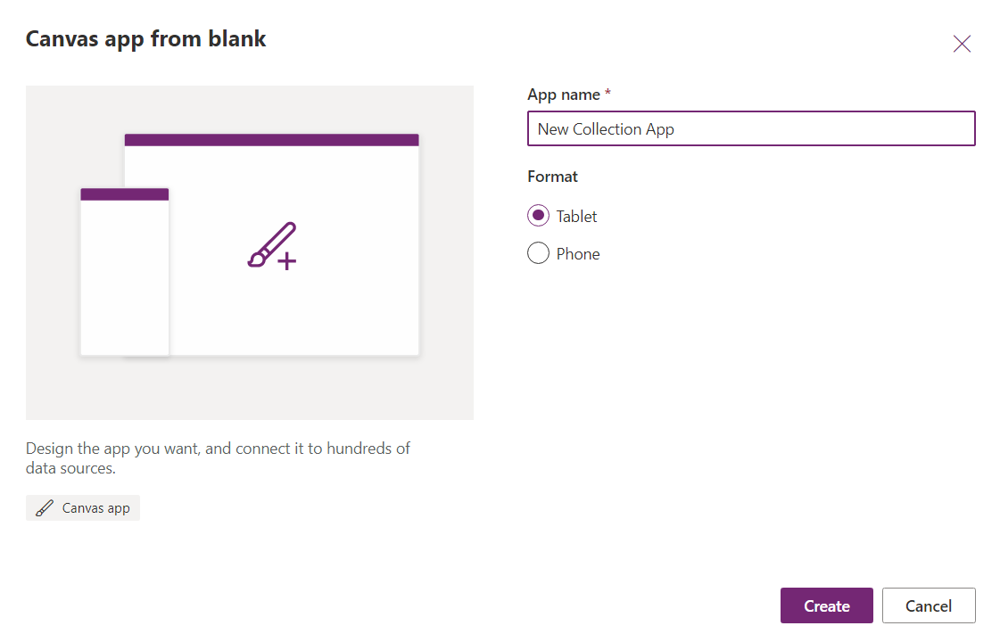
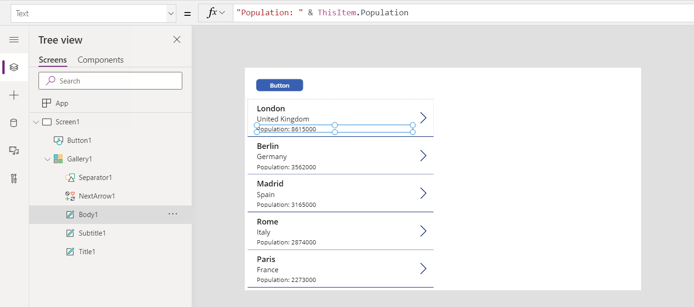
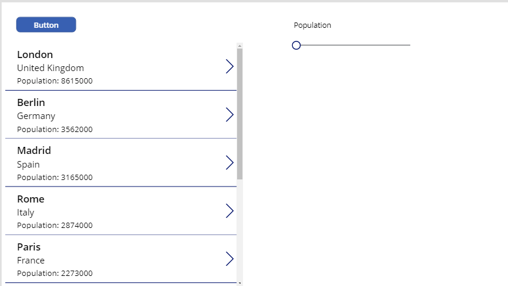
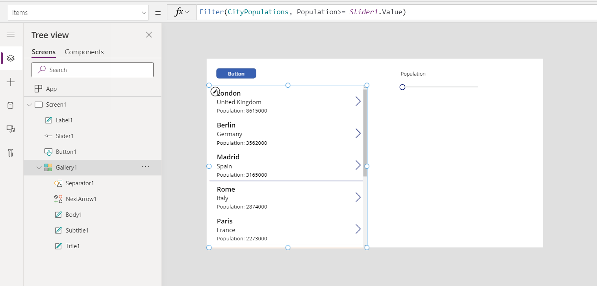
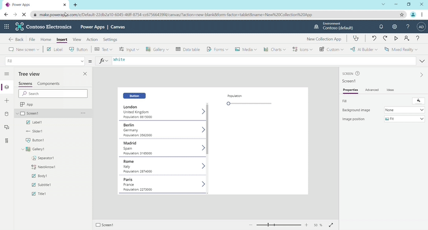
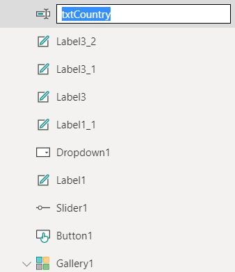
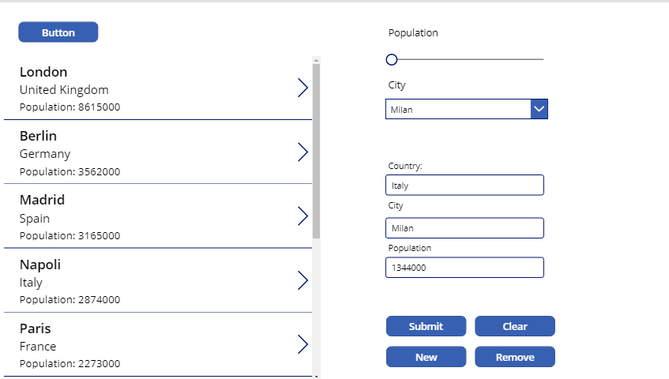
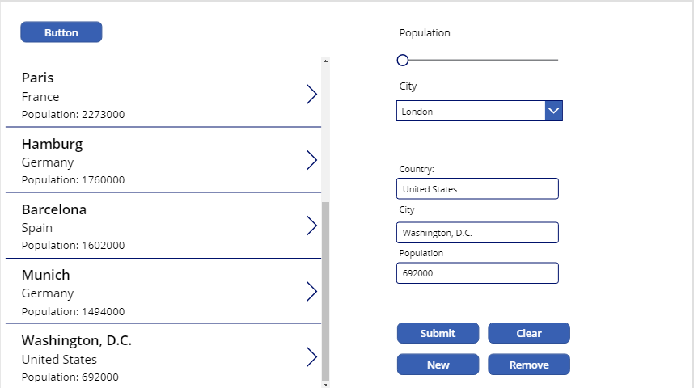

In this exercise, you will practice using tables. You will create a collection, filter the collection, perform a lookup to the collection, edit a record in the collection, add a record to a collection, and remove a record from the collection.


## Create the collection of data

1. Sign-in to [Power Apps](https://make.powerapps.com/?azure-portal=true).

1. On the Home screen, select **Canvas app from blank**.

	> [!div class="mx-imgBorder"]
	> [](../media/canvas-app-blank.png#lightbox)

1. Name your app **New Collection App** and click **Create**.

	> [!div class="mx-imgBorder"]
	> [](../media/new-app.png#lightbox)

1. Select the **Insert** tab and add a button, and set its **OnSelect** property to this formula:

	```powerappsfl
	ClearCollect(CityPopulations, {City:"London", Country:"United Kingdom", Population:8615000}, {City:"Berlin",
	Country:"Germany", Population:3562000}, {City:"Madrid",
	Country:"Spain", Population:3165000}, {City:"Rome",
	Country:"Italy", Population:2874000}, {City:"Paris",
	Country:"France", Population:2273000}, {City:"Hamburg",
	Country:"Germany", Population:1760000}, {City:"Barcelona",
	Country:"Spain", Population:1602000}, {City:"Munich",
	Country:"Germany", Population:1494000}, {City:"Milan",
	Country:"Italy", Population:1344000})
	```

1.  Press and hold **Alt Key**, and select the **Button** control. (This will create your collection and store all the information.).

1.  Select the **Gallery** dropdown at the top and choose **Blank vertical** gallery and choose **CityPopulations** from the data source pop-up.

1.  With the gallery selected, in the right pane, change the layout from blank to **Title, subtitle, and body**.

1.  Select the **Body** of the first gallery item. Change the **Text** property of this control to: 

	```powerappsfl
	"Population: " & ThisItem.Population
	```

	> [!div class="mx-imgBorder"]
	> [](../media/text-property.png#lightbox)

## Filter your collection

1. Add a label that reads "Population" and move it to the right of the gallery.

1. Select the **Input** dropdown at the top and choose **Slider** and put it under the label we created.

	> [!div class="mx-imgBorder"]
	> [](../media/slider.png#lightbox)

1. Select the slider and change the **Min** property to: 

	```powerappsfl
	Min(CityPopulations, Population)
	```

1. Next, change the **Max** property to:

	```powerappsfl
	Max(CityPopulations, Population)
	```

1. Now select the gallery and change the **Items** property to: 

	```powerappsfl
	Filter(CityPopulations, Population>= Slider1.Value)
	```
	> [!div class="mx-imgBorder"]
	> [](../media/filter-text.png#lightbox)

1. Now we will only be seeing records that are greater than the selected slider value. Move the slider around to see this in action. 

	> [!div class="mx-imgBorder"]
	> [](../media/slider-filter.gif#lightbox)

## Use the LookUp and Patch functions

1. Add a label that reads "City" and place it under the slider.

1. Next, select the **Input** dropdown at the top and choose **Dropdown** and move it under the **City** label.

1. In the **Items** property of the dropdown, write the following:
	
	```powerappsfl
	CityPopulations.City
	```

1. In the **OnChange** property of the dropdown, put the following:
	
	```powerappsfl
	Set(varRecord, LookUp(CityPopulations, City=Self.SelectedText.City))
	```

1. Next, we are going to add a label, like before, with the **Text** property reading "Country:". Then select **Input** at the top and add a **Text Input**. 

1. For the **Default** property of the **Text Input**, put **varRecord.Country**.

1. In the **Tree View** on the right-hand side, change the name of the input to **txtCountry**.
	
	> [!div class="mx-imgBorder"]
	> [](../media/labels.png#lightbox)

1. Repeat the previous 3 steps for **City** and **Population** now.

1. Select an option in the dropdown to see this in action.
	
	> [!div class="mx-imgBorder"]
	> [](../media/text-inputs.png#lightbox)

1. Now, add a button to the screen and put it under the Population text input. Change the **Text** property to say "Submit".

1. Change the **OnSelect** property of the button to the following:
	
	```powerappsfl
	Patch(CityPopulations, varRecord, {Country: txtCountry.Text, City: txtCity.Text, Population: Value(txtPopulation.Text)})
	```

	> [!NOTE]
	> We have to wrap **txtPopulation.Text** with Value() because the text input returns a string by default, and our collection expects a number.

1. Now change one of the values and find it in the gallery, you will see that it has changed. 

## Add and remove records

1. Select our "Submit" button and copy it. Paste it three times. 

1. Change the **Text** property of the three buttons to **Clear**, **New**, and **Remove**. 
	
	> [!div class="mx-imgBorder"]
	> [](../media/buttons.png#lightbox)

1. Ctrl-Click the **Clear** and **Remove** buttons. Change the **DisplayMode** property to: 
	
	```powerappsfl
	If(IsBlank(varRecord), DisplayMode.Disabled, DisplayMode.Edit)
	``` 

	Now these buttons will only be clickable if we have a record selected.

1. Ctrl-click the **Remove** button to deselect it. On the **OnSelect** property of the **Clear** button, put: 
	
	```powerappsfl
	Set(varRecord, Blank())
	```

	You can now clear the selected record using this button.

1. Select the **Remove** button now. On the **OnSelect** property put:
	
	```powerappsfl
	Remove(CityPopulations, varRecord)
	```

1. Finally, select the **New** button and change the **OnSelect** property of the button to: 
	
	```powerappsfl
	Collect(CityPopulations, {Country: txtCountry.Text, City: txtCity.Text, Population: Value(txtPopulation.Text)})
	```

	You are now able to add a record to the collection using the previously created text inputs.

	> [!div class="mx-imgBorder"]
	> [](../media/new-record.png#lightbox)

You now know how to work more extensively with tables in Power Apps.
