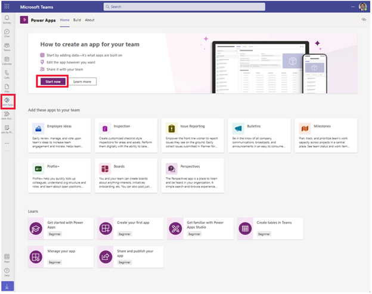
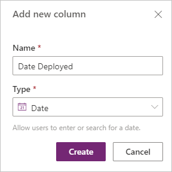
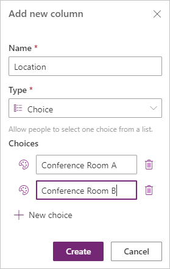

Here are the steps to create an app from Microsoft Teams.

## Step 1: Identify a Microsoft Team 

All Dataverse for Teams apps requires a Microsoft Team to store the Power App data. Only team members will be able to access your app by default.

## Step 2: Add the Power Apps app to Teams

1. Launch Teams or use your browser to open [Teams](https://teams.microsoft.com).

1. In Teams, click **Apps** in the lower-left corner of the screen

1. In the search box, type in **Power Apps** and then select it from the search results

   

1. Select **Open** to install Power Apps

   > [!NOTE]
   > *Pin the Power App app to the app launcher to quickly access it at any time. Just right-click on the Power Apps icon and select **Pin.** You can also run the app as a separate window from Teams by clicking on **Pop out app***.
 
   

## Step 3: Create a new app

Once you have Power Apps installed, you can create your first app.

1. From Teams, open the Power Apps app and select **Create an app**
    
    

1. Select a Team for your app and then click on **Create**

1. Type in the name of your app, then click **Save**

You will now see the hero template for your app. It's currently empty since we haven't connected a Dataverse table to it.

## Step 4: Create and connect a table to your app

1. Open your new app and click **Create new table**

1. Type in a new table name and then click **Create**

1. You can now add new columns to your table by selecting **+ Add column**

For each column, provide a **Name** and then select the **Type** of data it holds. By choosing the appropriate data type, you will be able to access intelligent out-of-the-box features to make your app more manageable for users to use.

For our table, we want to track the date the equipment was deployed, the location, if service is needed, and any relevant notes.

- For tracking the deployment date, use date type **Date**
    
    

- To limit the location options to "Conference Room A" and "Conference Room B", use data type **Choice**. To add more choices use **+ New choice**
    
    

- To indicate if service is needed, use **Yes/No** as the data type as we only need to toggle between two options. This data type limits users to just two choices.
    
    

- Use **Text** data type for the Notes column

  

   Below is a list of data types that are available using the visual table editor. For a complete list of all the data types available and how they work, see the links in the Summary unit at the end of this module.

    |     Data Type    |     Description    |
    |-|-|
    |     Text    |     A single line   of text.    |
    |     Email    |     Text in email   format, will be clickable for the user.    |
    |     URL    |     A hyperlink   in URL format, will be clickable for the user.    |
    |     Auto Number    |     Defines an   auto-generated number sequence.    |
    |     Number    |     An integer.   (e.g. 10 or -10)    |
    |     Date    |     Allows users   to enter or search for a date.    |
    |     Decimal    |     A number with   a decimal point (e.g., 1.5 or -1.5).    |
    |     Lookup    |     References a primary column in another table.    |
    |     Choice    |     Allow people to select one choice from a list.    |
    |     Yes/No    |     Allow people to pick between two choices.    |

4. To add data to your table, select **+ Add row**. Enter data that you want your users to see when they use your app.
    
    Notice how our choice of data type changes the user experience to fit the type of data being stored.

    - Date Deployed: a calendar can be used to select the **Date**\
    - Location: uses a pull-down of options defined in the **Choice** data type\
    - Service Required: the user can select between **Yes/No** with a toggle\
    - Notes: The user can enter **Text**

   

1. Select **Close** to finish editing the table. It may take a few minutes to process the table. Once completed, the Hero Template will appear with the data loaded into the app.

1. Press **Save** in the toolbar to create the first saved version. After the first save, Power Apps will continue to AutoSave every two minutes while you are editing.

## Step 5: Preview and test your app

To preview and test your app, click on the **Preview** button in the upper right.

The hero template automatically creates a functioning app with your data. Once a data source is linked, you can instantly view, edit, and delete existing records or create new ones.

 
