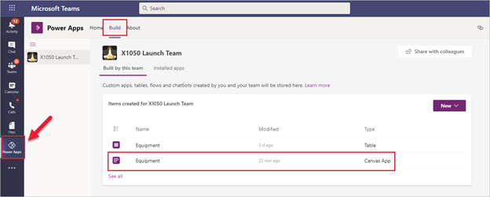
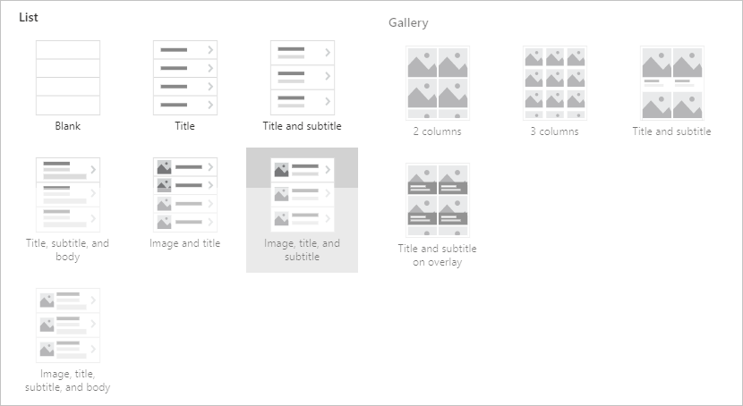

In the previous lesson, you created a new app using your data loaded into Dataverse for Teams. The hero template can make a useful app quickly, but you will often want to customize the app to suit your needs.

For this lesson, we will change the title of the app, the layout of the gallery, and change the order of fields.

To start, open Teams using the desktop client or browsing [Teams](https://teams.microsoft.com/?azure-portal=true) and open the Power Apps app. Select on the **Build** tab at the top and then select your app.

Your app will open in Power Apps studio for editing.

> [!NOTE]
> It's always a good idea when you first start editing to press **Save** in the toolbar. After the first save, Power Apps will continue autosaving every two minutes while editing.

Power Apps are built using various UI elements referred to as **Controls**. Use controls to create the user experience when navigating and interacting with the app. Some common controls are:

- **Label** - Display information to the user as text, numbers, dates, or currency.

- **Edit form** - Allows the user to create and edit records and then save them.

- **Text box** - A box where a user can enter data such as text and numbers.

- **Vertical gallery** - Displays multiple records from a data source in a vertical orientation, can show multiple types of data for each record.

- **Add Icon** - Select from a library of graphical symbols, can be configured to respond when a user selects them.

- **Rectangle** - A border shape that can be placed anywhere on the app.

- **Date Picker** - Allows the user to select a date using a calendar pop-up.

- **Button** - A way for the user to interact with the app.

When editing the app, select between Tree view, Insert, Data, and Media options in the far-left column.

-   Tree view - Displays a visual hierarchy of all the controls in the app.

-   Insert - Insert new controls such as labels, buttons, icons, and forms.

-   Data - Add more tables from Dataverse for Teams or add a connector to other O365 services.

-   Media - Add images, videos, and audio.

In the center of the screen is where you visually move and edit the components that make up your app. When a control is selected from the tree view or in the app view, the properties pane displays the properties. At the top is the formula bar, allowing more editing capabilities.

## Change the text in a label

When editing your app, you need to select the control item so that the properties will appear on the right. To change the title that appears in the app, you first choose the label that has the text. You can either:

-   Select **Tree view** and then browse down to select **AppNameLabel1**.

    or

-   Select on the title in the app and, **AppNameLabel1** will appear in the properties pane.

Once selected, you can edit the **Text** properties on the right. You can also change various other properties such as **Font**, **Font size**, and **Text alignment**. This process can be used to change the text and appearance of any label in the app.

## Change the layout of a gallery

A **gallery** control displays multiple records for the user to view and select. Each record in the gallery can display multiple types of information. For example, a gallery could show a listing of inventory items that show the name, model number, and price for each. Depending on what you need, galleries come in various vertical and horizontal layouts.

To change the layout of the gallery, select the gallery by Selecting on it in the app or finding **BrowseGallery1** in the Tree view. Under the **Properties** pane, select from various **Layout** options.

To change the content of the gallery's fields, go to the **Properties** pane and select **Edit,** next to **Fields.** The areas you can change will depend on the gallery layout you selected. For each field, use the pull-down to choose the data.

## Change the order in which fields appear

1. Select the form by selecting on it in the app or finding **EditForm1** in the **Tree view**.

1. Under the **Properties** pane, select **Edit fields** next to **Fields**.

1. Right-select on the ellipsis next to each field to bring up more options. Select **Move up**, **Move down**, or **Remove**.
    
    