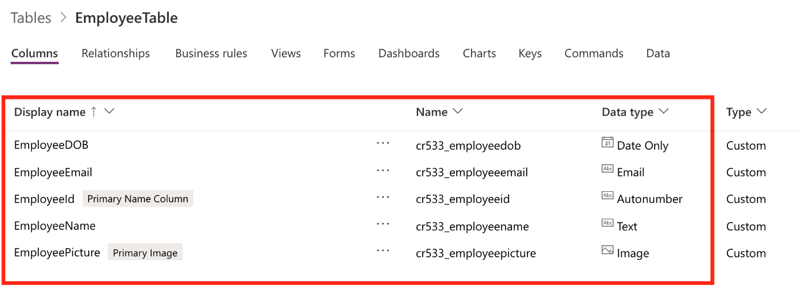
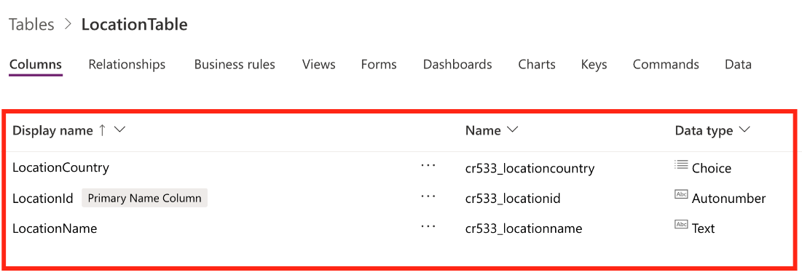
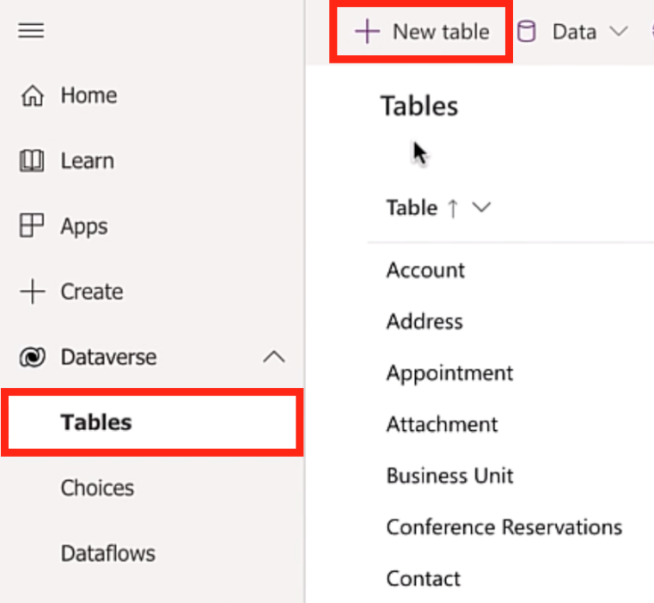
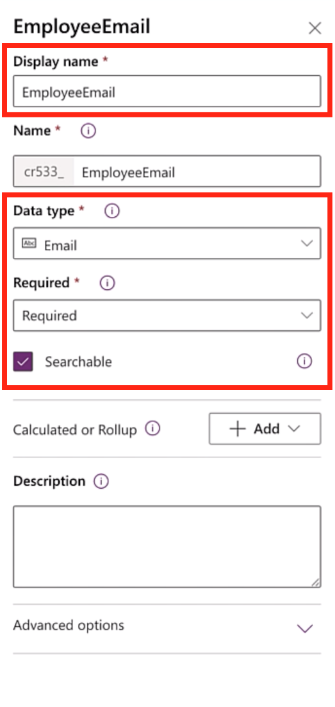

By default, all full Dataverse environments have a set of standard tables that you can use to build business applications. It is a best practice to use those existing tables to build solutions. For example, you can store data about customers in the existing accounts or contacts tables. Though many tables are provided, your app might occasionally require you to create custom tables to store the data. For this module's scenario, none of the existing tables have the metadata to support your app. Therefore, you will create custom tables in Dataverse to accommodate that requirement. 

The following sections describe the tables that you will create in this module.

### EmployeeTable

You will use the **EmployeeTable** to track details about employees of your company. For simplicity in this scenario, you will create only the following fields or attributes to track the employees.

> [!div class="mx-imgBorder"]
> 

- **EmployeeId** - A number-autogenerated column to identify the employee number. It is common to identify employees by using a number ID because it's easier to find or filter by a number rather than text. In this case, having a number ID also helps identify employees who, in some cases, have the same name (last name and first name).

- **EmployeeName** - In this scenario, you will use one column to store the employee's full name. Most databases will use separate columns to store the first, middle, and last names. For simplicity, you will use only one column.

- **EmployeeDOB** - A date-only column to track the date of birth of the employees.

- **EmployeeEmail** - An email column to track the email address of each employee. You can use this column later to send emails to employees when an accident has been logged automatically.

- **EmployeePicture** - An image column type, which you will use to store employee pictures and display the images in your app.

### LocationTable

You will use the **LocationTable** to track details about the different work locations for your company. For simplicity purposes, you will only track a few details about your work locations.

> [!div class="mx-imgBorder"]
> 

- **LocationId** - A number-autogenerated column to identify the work location. As with the **EmployeeId** field, it's a good practice to track locations by a number identifier. Some organizations prefer to use location numbers because it's more efficient to identify and is commonly used in accounting systems.

- **LocationName** - Text column to track the actual name of the work location.

- **LocationCountry** - For this scenario, you will use a custom choice column to track the country or your work locations. Choice columns are excellent for limiting data entry errors, which will help make the task of entering data easier for users, and it's a good practice for data consistency.

- **TypeofAccidentTable** - Use this table to track information about the types of accidents that usually occur at the workplace. For example, you will add a column in this table to rank an accident from one to five to define the severity of the accident. You can use this column later for more reporting based on the number of accidents by severity ranking.

    > [!div class="mx-imgBorder"]
    > 

- **TypeofAccidentId** - A number-autogenerated column to identify the type of accident. Similar to the other IDs, it's common practice to have numbers identifying data.

- **AccidentName** - Text column to describe the type of accident.

- **AccidentSeverity** - You will use a choice column to allow the user to pick a number between one to five, one being of minor severity and five being a catastrophic accident.

### AccidentTable

The **AccidentTable** will be the main table that will store the details about all logged accidents. Consider this table as the one that holds details about each occurrence. In many databases, these tables are known as transactional tables because they contain details about transactions.

> [!div class="mx-imgBorder"]
> 

- **AccidentId** - A number-autogenerated column to identify the type of accident. Similar to the other IDs, it's a common practice to have numbers identifying data.

- **LocationId** - A lookup column that will link the main table back to your **LocationTable**. Table relationships are discussed later in this module.

- **AccidentTypeId** - A lookup column that will link the main table back to **TypeofAccidentTable**.

- **AccidentDescription** - A free text column that will allow users to enter details about the accident.

- **AccidentDate** - A time and date column that will allow users to enter the exact time in which the accident took place.

- **ManagerComments** - A free text column in which managers can enter their comments and resolution of the accident.

- **ManagerReviewed** - You will use a choice column so that managers can denote which cases have been reviewed by management.

### Create a custom table

Follow these steps to create the **EmployeeTable**:

1. To get started, go to [make.powerapps.com](https://make.powerapps.com/) and sign in with your Microsoft credentials.

1. In the left navigation pane, expand the **Dataverse** menu, select **Tables**, and then select **+ New table**.

    > [!div class="mx-imgBorder"]
    > 

1. Under the **New table** menu, enter the following information:

    - **Display name** - EmployeeTable

    > [!NOTE]
    > The *Table* suffix is not required; it's a preference, and you will use it when creating tables throughout this scenario.

    - **Plural display name** - This field will populate automatically. You can choose to modify it, but in this case, you will use the default.

    - **Primary Name Column > Display name** - EmployeeId

    > [!NOTE]
    > The primary name is the column that is shown to users when they select records from this table. Also, it's the column that's shown on the **many** side when a lookup column is used.
    >
    In this example, the fields have a **cr533\_** prefix, which is specific to the demo environment. When testing in your own environment, this prefix might appear differently.
    >
    > [!div class="mx-imgBorder"]
    > 

1. In the lower part of the screen, select **Create**.

    Your next step will be to set the **EmployeeId** field as an autonumber type.

1. Under the **Columns** tab, find and select the **EmployeeId** field.

1. On the **Columns** tab, on the right, change the **Data type** from **Text** to **Autonumber**.

1. On the **Autonumber type** dropdown menu, select **String prefixed number**.

1. In the **Minimum number of digits** field, enter **4**.

1. In the **Seed value** field, enter **1000**.

    > [!div class="mx-imgBorder"]
    > 

1. Select **Done**.

1. In the lower right, select **Save Table**.

### Create custom table columns

Now that you have created your table, you can create the columns that you will use to store your employee data.

1. In the list of tables, find and select **EmployeeTable** that you created in the previous section.

1. On the **Columns** tab, select **+ Add column**, and then in the **Column properties** pane, enter the following information:

    - **Display name** - EmployeeName

    - **Data type** - Text

    - **Required** - Required (you want to prevent users from entering an employee record without a name)

    - **Searchable** - Yes

    > [!div class="mx-imgBorder"]
    > 

1. Select **Done**.

     Repeat the same process to create the remaining columns that you need for **EmployeeTable**. You will create a column for **EmployeeDOB**, **EmployeeEmail**, and **EmployeePicture**.

    - **Display name** - EmployeeDOB

    - **Data type** - Date Only

    - **Required** - Required (you want to prevent users from entering an employee record without a date of birth)

    - **Searchable** - Yes

    > [!div class="mx-imgBorder"]
    > 

    - **Display name** - EmployeeEmail

    - **Data type** - Email (a Dataverse data type that will prevent users from entering data that's not formatted in proper email format)

    > [!div class="mx-imgBorder"]
    > 

    - **Required** - Required (you want to prevent users from entering an employee record without an email address)

    - **Searchable** - Yes

    > [!div class="mx-imgBorder"]
    > 

    - **Display name** - EmployeePicture

    - **Data type** - Image

    - **Primary image** - Yes (This image will be used as the main employee picture)

    > [!div class="mx-imgBorder"]
    > 

1. When you are finished, select **Save Table**.
