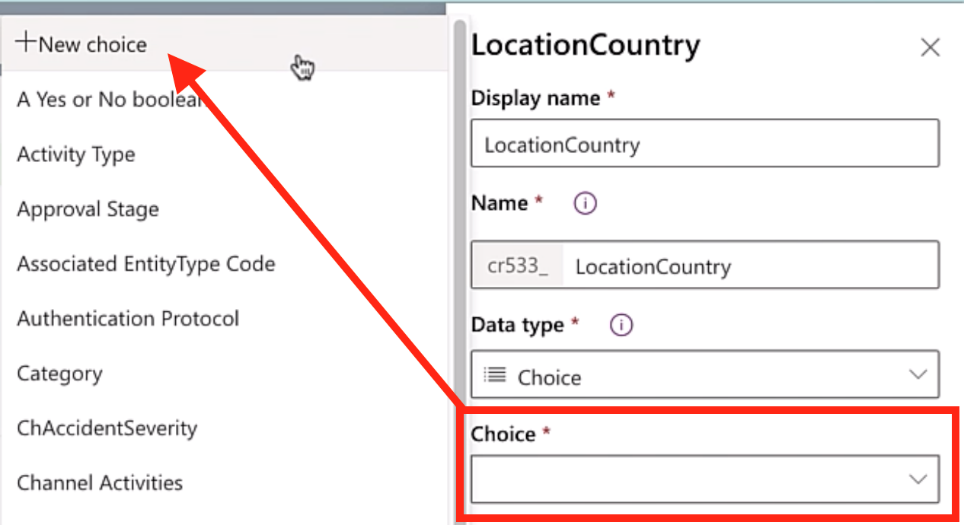
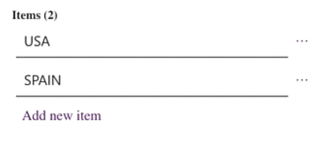

In this exercise, we will create two more custom tables to store additional data for our employee accident tracking application.

### Create Custom LocationTable

1. On the main menu, expand **Dataverse** and select **Tables**.

1. Select **+ New Table**.

1. Enter the following information:

    - **Display Name:** *LocationTable*

    The **Plural display name** will auto populate automatically, you can choose to modify it but, in our case, we will use the default.

    - **Primary Name Column Display Name:** *LocationId* (Note: the primary name is the column showed to users when they select records from this table, also the column shown on the many side when a Lookup column is used)

1. Click **Create**, at the bottom.

1. Under the **Columns** tab, find the *LocationId* field and click on it.

1. On the columns tab, on the right, change the **Data type** from Text to **Autonumber**.

1. On the Autonumber type, select **String prefixed number**.

1. On the Minimum number of digits, enter **4**.

1. For the Seed value, enter **1000**.

1. With our *LocationTable* now created, select **+ Add Column** and create the following columns below:

    - **Display name:** *LocationName*

    - **Data type:** *Text*

    - **Required:** Required (we want to prevent users from entering a location record without a name)

    - **Searchable:** *Yes*

    - **Display name:** *LocationCountry*

    - **Data type:** *Choice*

    - In the **Choice** field click on the **+ New choice** to create a new set of choices to store the different countries Contoso has locations in.

> [!div class="mx-imgBorder"]
> 

It is good practice to name your custom choice with a prefix to help identify it as a choice object later.

1. For the Display name, enter **ChLocationCountry**.

1. Click **View more** and make sure that **Global choice** is selected. (**Global choice** will allow the custom choice to be able to be used in different tables context within the same Dataverse environment, **Local choice** will only allow the choice to be used in this table context only.)

    > [!div class="mx-imgBorder"]
    > 

1. In the Items section, select **Add new item** and enter **USA**.

1. Select **Add new item**, enter **SPAIN**.

    > [!NOTE]
    > You can add additional choices for countries if you would like, but for our example we will just be using USA and SPAIN.

    > [!div class="mx-imgBorder"]
    > 

    > [!NOTE]
    > Choice fields are great when the number of options is small, and the items don't change often or not at all.

1. Click **Save**.

    - **Default value:** *\[No default value\]*

    (This is useful if you want to always display a location as the default, such as the most common country where locations exist.)

    - **Required:** *Required* (we want to prevent users from entering a location record without a location)

    - **Searchable:** *Yes*

1. In the bottom right, click **Save Table**, to ensure your changes are saved.

### Create Custom TypeofAccident Table

1. On the main menu, expand **Dataverse** and select **Tables**.

1. Select **+ New Table**.

1. Enter the following information:

    - **Display Name:** *TypeofAccidentTable* (Note: You don't need to enter the *Table* suffix, just doing as preference for this exercise).

    The **Plural display name** will auto populate automatically, you can choose to modify it but, in our case, we will use the default.

    - **Primary Name Column Display Name:** *TypeofAccidentId* (Note: the primary name is the column showed to users when they select records from this table, also the column shown on the many side when a Lookup column is used).

1. Click **Create**, at the bottom.

1. Under the **Columns** tab, find the *TypeofAccidentId* field and click on it.

1. On the columns tab, on the right, change the **Data type** from Text to **Autonumber**.

1. On the Autonumber type, select **String prefixed number**.

1. On the Minimum number of digits, enter **4**.

1. For the Seed value, enter **1000**.

1. With our TypeofAccidentTable now created, select **+ Add Column** and create the following columns below:

    - **Display name:** *AccidentName*

    - **Data type:** *Text*

    - **Required:** *Required*

    - **Searchable:** *Yes*

    - **Display name:** *AccidentSeverity*

    - **Data type:** *Choice*

    - **Choice:** Create a new choice option called *ChAccidentSeverity* and add five new items. Items are numbers from 1 to 5

    - **Default value:** *\[No default value\]*

    - **Required:** *Required*

    - **Searchable:** *Yes*

1. In the bottom right, click **Save Table**, to ensure your changes are saved.
