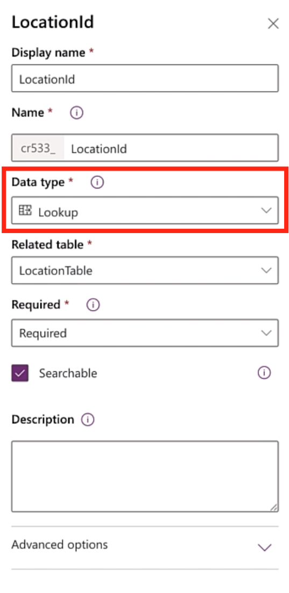
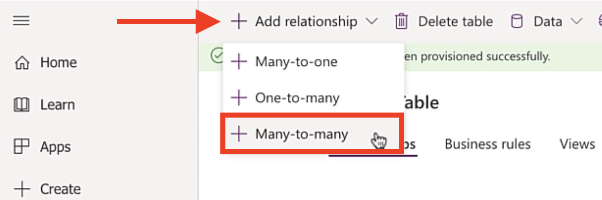
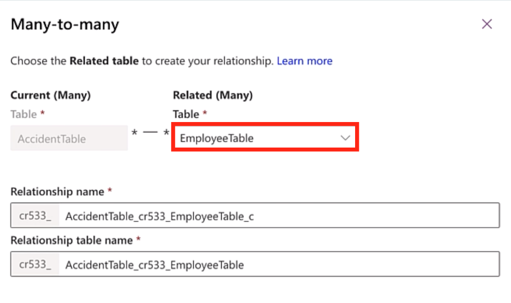

In this exercise, you will build the main **AccidentTable** and build out the relationships with the other tables that you created previously.

1. On the main menu, expand **Dataverse** and then select **Tables**.

1. Select **+ New table**.

1. Enter the following information:

    - **Display name** - AccidentTable (You don't need to enter the *Table* suffix; you're only doing so for this exercise.)

    - **Plural display name** - This field will automatically populate. You can choose to modify it, but for this exercise, you will use the default.

    - **Primary Name Column > Display name** - AccidentId (The primary name is the column that is shown to users when they select records from this table. Also, the column is shown on the **many** side when a Lookup column is used).

1. Select **Create**.

1. Under the **Columns** tab, find and select the **AccidentId** field.

1. On the **Columns** tab, change the **Data type** dropdown menu from **Text** to **Autonumber**.

1. On the **Autonumber type** dropdown menu, select **String prefixed number**.

1. In the **Minimum number of digits** field, enter **4**.

1. In the **Seed value** field, enter **1000**.

1. After **AccidentTable** has been created, select **+ Add column** and then create the following columns:

     - **Display name** - AccidentDescription
     - **Data type** - Text
     - **Required** - Required
     - **Searchable** - Yes

     - **Display name** - AccidentDate
     - **Data type** - Date and Time
     - **Required** - Required
     - **Searchable** - Yes

     - **Display name** - ManagerComments
     - **Data type** - Text
     - **Required** - Optional
     - **Searchable** - Yes

     - **Display name** - ManagerReviewed
     - **Data type** - Choice
     - **Choice** - A **Yes** or **No** Boolean value
     - **Default value** - \[No default value\]
     - **Required** - Optional
     - **Searchable** - Yes

     - **Display name** - LocationId
     - **Data type** - Lookup
     - **Related table** - LocationTable

    > [!NOTE]
    > In the **Related table** dropdown menu, select which table to look up values from. The **LocationTable** that you created in the previous exercise has already been selected. This selection will create a many-to-one relationship: **many** in the **AccidentTable** to **one** in the **LocationTable**.

    > [!div class="mx-imgBorder"]
    > 

    - **Required** - Required
    - **Searchable** - Yes

    After you have saved all changes, the relationships that you created in the table will be visible.

    - **Display name** - AccidentTypeId
    - **Data type** - Lookup

    > [!NOTE]
    > In the **Related table** dropdown menu, select which table to look up values from. Select **TypeofAccidentTable** that you created in the previous exercise. This selection will create a many-to-one relationship: **many** in the **AccidentTable** to **one** in the **AccidentTypeTable**.

    - **Required** - Required
    - **Searchable** - Yes

To create the many-to-many relationship, follow the next steps:

1. In the middle of the ribbon, select **Relationships**.

    > [!div class="mx-imgBorder"]
    > 

1. Select **+ Add relationship** from the top menu and then select **+ Many-to-many**.

    > [!div class="mx-imgBorder"]
    > 

1. In the **Related** dropdown menu, find **EmployeeTable*** that you created in the previous exercise. By default, **Dataverse** will provide a **Relationship name** and a **Relationship table name**. You can choose to update and rename those default names. For this exercise, you can keep the default names.

    > [!div class="mx-imgBorder"]
    > 

1. When you're finished, select **Done**.

1. Make sure that you select **Save Table** to save all changes that you've made.

The **Relationships** tab will show the other many-to-one relationships that were created when you added the lookup columns in the previous steps. You can filter the list to show only the custom relationships by selecting the **Custom** filter in the upper-right corner.

> [!div class="mx-imgBorder"]
> 
